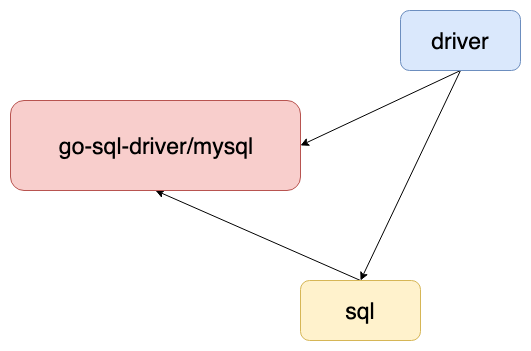
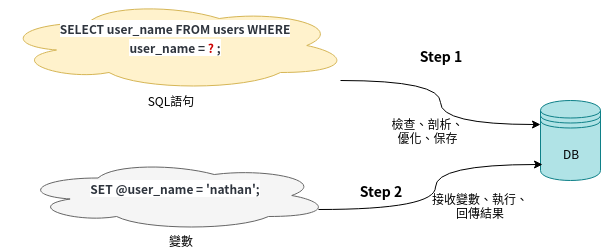

# 資料庫基礎 database
by [@chimerakang](https://github.com/chimerakang)

---

## SQL

在做專案時，都會需要關聯式資料庫做資料的CRUD。Go提供了database/sql包來讓開發者跟資料庫打交道，database/sql包只是定義了一套操作資料庫的接口和抽象層定義，所以還是需要實體的驅動，這裡我選用`MySQL`
開發者幾乎都是在操作database/sql包所提供的接口方法而已，大部分情境，都只要在程式的某地方設定好驅動就好。所以要做出一個好的 Web Service，對於 資料庫的熟悉是必須的，因此今天就來聊聊如何透過 golang 對資料庫進行存取。

## 安裝 mysql
在開始今天的分享前，首先要先安裝 mysql，關於 mysql 的安裝可以參考以下連結

* [Windows](https://jerrynest.io/windows-mysql-installer/)
* [Linux](https://dev.mysql.com/doc/refman/8.0/en/linux-installation.html)
* [MacOS](https://www.ioa.tw/macOS/MySQL.html)
* [Docker(MacOS)](https://myapollo.com.tw/blog/docker-mysql/)
* [Docker(Windows)](https://berglas.github.io/dest/articles/2020/12/learn_docker_2.html)


## 建立使用者與資料庫
使用 mysql 指令進入控制台後，建立一個名為 demo 的資料庫

```
CREATE DATABASE demo CHARACTER SET utf8 COLLATE utf8_general_ci;
```
建立帳號為 demo，密碼為 demo123
```
GRANT ALL PRIVILEGES ON demo.* TO 'demo'@'%' IDENTIFIED BY 'demo123'  WITH GRANT OPTION;
FLUSH PRIVILEGES;
```

## 操作 mysql
要透過程式語言操作資料庫，最常見的方法就是使用 `driver`，`golang` 原生有提供關於 sql 的抽象介面 `database/sql`，後來有人利用他封裝了 mysql 的 driver - `go-sql-driver`，三者的關係如下:



所以sql 只管拿著driver定義好的method做執行和管理，不需知道注入進來的mysql內容實際是如何。接下來我們會利用這個 package 進行練習。

## 連線
首先我們要先匯入 `database/sql` 與 `github.com/go-sql-driver/mysql`，`mysql driver` 前面要加上 `_`，原因是因為要先執行 `init` 方法進行 sql 註冊

```go
import (
	"database/sql"
	"fmt"
	_ "github.com/go-sql-driver/mysql"
	"time"
)
```
接著我們將連線的資訊設定為常數
```go
const (
	USERNAME = "demo1"
	PASSWORD = "demo123"
	NETWORK = "tcp"
	SERVER = "127.0.0.1"
	PORT = 3306
	DATABASE = "demo"
)
```
再來我們將連線字串拼湊出來
```go
conn := fmt.Sprintf("%s:%s@%s(%s:%d)/%s",USERNAME, PASSWORD, NETWORK, SERVER, PORT, DATABASE)
```
之後透過 sql.Open 方法進行連線
```go
db, err := sql.Open("mysql", conn)
if err != nil {
    fmt.Println("開啟 MySQL 連線發生錯誤，原因為：", err)
    return
}
```
檢查資料庫是否連線正常
```go
if err := db.Ping(); err != nil {
    fmt.Println("資料庫連線錯誤，原因為：", err.Error())
    return
}
```
最後關閉連線
```go
defer db.Close()
```
連線的程式最終會像是這樣
```go
package main
import (
	"database/sql"
	"fmt"
	_ "github.com/go-sql-driver/mysql"
)
const (
	USERNAME = "demo1"
	PASSWORD = "demo123"
	NETWORK = "tcp"
	SERVER = "127.0.0.2"
	PORT = 3306
	DATABASE = "demo"
)
func main() {
	conn := fmt.Sprintf("%s:%s@%s(%s:%d)/%s",USERNAME, PASSWORD, NETWORK, SERVER, PORT, DATABASE)
	db, err := sql.Open("mysql", conn)
	if err != nil {
		fmt.Println("開啟 MySQL 連線發生錯誤，原因為：", err)
		return
	}
    if err := db.Ping(); err != nil {
        fmt.Println("資料庫連線錯誤，原因為：", err.Error())
		return
	}
    defer db.Close()
}
```
執行以上的程式如果沒有任何錯誤出現的話，代表已經順利連線到資料庫拉～

---

## 建立 Table
既然已經連線到資料庫了，那麼我們就可以開始對資料庫進行互動了，首先我們要先建立一個名為 `user` 的 `table`，建立的 SQL 如下
```go
CREATE TABLE IF NOT EXISTS users(
	id INT(4) PRIMARY KEY AUTO_INCREMENT NOT NULL,
	username VARCHAR(64),
	password VARCHAR(64)
);
```
我們要透過 mysql 的 driver 建立的話，他有內建 Exec 的方法，可以直接執行原生的 SQL 指令，因此我們只要建立一個方法名為 CreateTable，然後把一開始連線建立好的 db 當作參數傳入，之後再利用 Exec 的指令建立 Table 即可
```go
func CreateTable(db *sql.DB) error {
	sql := `CREATE TABLE IF NOT EXISTS users(
	id INT(4) PRIMARY KEY AUTO_INCREMENT NOT NULL,
        username VARCHAR(64),
        password VARCHAR(64)
	); `
	if _, err := db.Exec(sql); err != nil {
		fmt.Println("建立 Table 發生錯誤:", err)
		return err
	}
	fmt.Println("建立 Table 成功！")
	return nil
}
```
建立完畢之後可以將 CreateTable 的方法於 main 方法呼叫，加入後 main 方法如下
```go
func main() {
	conn := fmt.Sprintf("%s:%s@%s(%s:%d)/%s", USERNAME, PASSWORD, NETWORK, SERVER, PORT, DATABASE)
	db, err := sql.Open("mysql", conn)
	if err != nil {
		fmt.Println("開啟 MySQL 連線發生錯誤，原因為：", err)
		return
	}
	if err := db.Ping(); err != nil {
        fmt.Println("資料庫連線錯誤，原因為：", err.Error())
		return
	}
	defer db.Close()
	CreateTable(db)
}
```
執行出來的結果如果輸出 建立 `Table` 成功！ 代表成功的建立 `Table` 了，我們可以透過任何資料庫管理工具查看結果是否正確。

## 新增資料
既然都已經建立好 `Table` 了，那麼我們就來新增資料吧，一樣透過 `Exec` 的指令即可，新增一筆 user 的 SQL 如下
```go
insert INTO users(username,password) values('test','test');
```
透過 Exec 的方法執行 insert 指令，Exec 的方法支援將 Value 抽出來作為變數，因此我們可以將程式改為以下
```go
func InsertUser(DB *sql.DB, username, password string) error{
	_,err := DB.Exec("insert INTO users(username,password) values(?,?)",username, password)
	if err != nil{
		fmt.Printf("建立使用者失敗，原因是：%v", err)
		return err
	}
	fmt.Println("建立使用者成功！")
	return nil
}
```
建立完畢之後可以將 `InsertUser` 的方法於 main 方法呼叫，加入後 main 方法如下
```go
func main() {
	conn := fmt.Sprintf("%s:%s@%s(%s:%d)/%s", USERNAME, PASSWORD, NETWORK, SERVER, PORT, DATABASE)
	db, err := sql.Open("mysql", conn)
	if err != nil {
		fmt.Println("開啟 MySQL 連線發生錯誤，原因為：", err)
		return
	}
    if err := db.Ping(); err != nil {
        fmt.Println("資料庫連線錯誤，原因為：", err.Error())
		return
	}
	defer db.Close()
	InsertUser(db, "test", "test")
}
```
執行出來的結果如果輸出 建立使用者成功！ 代表成功的新增資料了，我們可以透過任何資料庫管理工具查看結果是否正確

## 查詢資料
新增資料後我們就可以透過 `SELECT` 的 `SQL` 進行查詢，那麼使用 `driver` 的時候，他有提供 `Query` 的語法可以供我們進行查詢，首先，我們提供一個查詢 `user` 的 `SQL` 如下
```go
select * from users where username='test';
```
接著我們要定義搜尋回來的資料結構，user 有 id, username 與 password 三個參數，因此我們可以建立一個 struct 為
```go
type User struct {
	ID       string
	Username string
	Password string
}
```
透過 Query 的方法執行 select 指令，Query 的方法支援將 Where 的值抽出來作為變數，因此我們可以將程式改為以下
```go
func QueryUser(db *sql.DB, username string) {
	user := new(User)
	row := db.QueryRow("select * from users where username=?", username)
	if err := row.Scan(&user.ID, &user.Username, &user.Password); err != nil {
		fmt.Printf("映射使用者失敗，原因為：%v\n", err)
		return
	}
	fmt.Println("查詢使用者成功", *user)
}
```
建立完畢之後可以將 QueryUser 的方法於 main 方法呼叫，加入後 main 方法如下
```go
func main() {
	conn := fmt.Sprintf("%s:%s@%s(%s:%d)/%s", USERNAME, PASSWORD, NETWORK, SERVER, PORT, DATABASE)
	db, err := sql.Open("mysql", conn)
	if err != nil {
		fmt.Println("開啟 MySQL 連線發生錯誤，原因為：", err)
		return
	}
    if err := db.Ping(); err != nil {
        fmt.Println("資料庫連線錯誤，原因為：", err.Error())
		return
	}
	defer db.Close()
	CreateTable(db)
	InsertUser(db, "test", "test")
	QueryUser(db, "test")
}
```
執行出來的結果如果輸出 查詢使用者成功 `{1 test test}` 代表成功的查詢到資料了，我們可以透過任何資料庫管理工具查看結果是否正確

## 預編譯語句 Prepared Statement
資料庫會接收到各種不同的敘述來執行，尤其就以查詢來說，很可能內容都是一樣的，只是`where`條件稍微不同。但是每一次接收到敘述時都還是要 `檢查->解析->執行->回傳`這樣的一套流程，要是我們可以省下`檢查->解析`的過程，每次只要把變數代入就開始`執行->回傳`的動作的話，速度上會快上一些.



```go
SELECT user_name FROM users WHERE user_name = ? ;
```
這個?我們叫做佔位符號`(placeholders)`; 用來避免直接在sql作字串拼接, 可以防止大部分的`sql injection`

| MySQL	 | Postgres	       |     Oracle   |
| --- | --- | --- |
| WHERE col = ?	  | WHERE col = $1       | WHERE col = :col         |
| VALUES(?, ?, ?) |	VALUES($1, $2, $3)   | VALUES(:val1, :val2, :val3) |

預處理過得語句在資料庫中會被存起來，資料庫會對該語句先作`檢查->剖析`, 作執行計畫的判斷跟語句優化，而後我們只要帶入變數資料，就能直接執行了

## 範例程式碼
接下來的幾個小節裡面我們都將採用同一個資料庫表結構：資料庫 test，使用者表 userinfo，關聯使用者資訊表 userdetail。
```go
CREATE TABLE `userinfo` (
    `uid` INT(10) NOT NULL AUTO_INCREMENT,
    `username` VARCHAR(64) NULL DEFAULT NULL,
    `department` VARCHAR(64) NULL DEFAULT NULL,
    `created` DATE NULL DEFAULT NULL,
    PRIMARY KEY (`uid`)
);

CREATE TABLE `userdetail` (
    `uid` INT(10) NOT NULL DEFAULT '0',
    `intro` TEXT NULL,
    `profile` TEXT NULL,
    PRIMARY KEY (`uid`)
)
```
如下範例將示範如何使用 database/sql 介面對資料庫表進行增刪改查操作
```go
package main

import (
    "database/sql"
    "fmt"
    //"time"

    _ "github.com/go-sql-driver/mysql"
)

func main() {
    db, err := sql.Open("mysql", "astaxie:astaxie@/test?charset=utf8")
    checkErr(err)

    //插入資料
    stmt, err := db.Prepare("INSERT userinfo SET username=?,department=?,created=?")
    checkErr(err)

    res, err := stmt.Exec("astaxie", "研發部門", "2012-12-09")
    checkErr(err)

    id, err := res.LastInsertId()
    checkErr(err)

    fmt.Println(id)
    //更新資料
    stmt, err = db.Prepare("update userinfo set username=? where uid=?")
    checkErr(err)

    res, err = stmt.Exec("astaxieupdate", id)
    checkErr(err)

    affect, err := res.RowsAffected()
    checkErr(err)

    fmt.Println(affect)

    //查詢資料
    rows, err := db.Query("SELECT * FROM userinfo")
    checkErr(err)

    for rows.Next() {
        var uid int
        var username string
        var department string
        var created string
        err = rows.Scan(&uid, &username, &department, &created)
        checkErr(err)
        fmt.Println(uid)
        fmt.Println(username)
        fmt.Println(department)
        fmt.Println(created)
    }

    //刪除資料
    stmt, err = db.Prepare("delete from userinfo where uid=?")
    checkErr(err)

    res, err = stmt.Exec(id)
    checkErr(err)

    affect, err = res.RowsAffected()
    checkErr(err)

    fmt.Println(affect)

    db.Close()

}

func checkErr(err error) {
    if err != nil {
        panic(err)
    }
}
```
Go 操作 Mysql 資料庫是很方便的。

幾個函式解釋一下：

`sql.Open()`函式用來開啟一個註冊過的資料庫驅動，go-sql-driver 中註冊了 mysql 這個資料庫驅動，第二個參數是 DSN(Data Source Name)，它是 go-sql-driver 定義的一些資料庫連結和配置資訊。它支援如下格式：

```go
user@unix(/path/to/socket)/dbname?charset=utf8
user:password@tcp(localhost:5555)/dbname?charset=utf8
user:password@/dbname
user:password@tcp([de:ad:be:ef::ca:fe]:80)/dbname
```
`db.Prepare()`函式用來回傳準備要執行的 sql 操作，然後回傳準備完畢的執行狀態。

`db.Query()`函式用來直接執行 Sql 回傳 Rows 結果。

`stmt.Exec()`函式用來執行 stmt 準備好的 SQL 語句

## 小結
使用 `drive` 來操作 `mysql` 真的是非常的方便，可以直接執行 SQL 語法與資料庫進行互動，但如果要使用 `join` 或是 巢狀查詢 時或是要預防 `SQL Injection` 的攻擊等情境時，使用原始的 driver 我們就必須寫更多的程式來處理這些問題，這個時候就有 `orm` 這種方便的東西產生拉。

---

## Next: [資料庫介面](./database-0.md)
