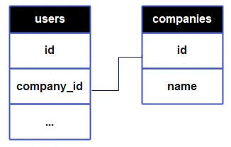
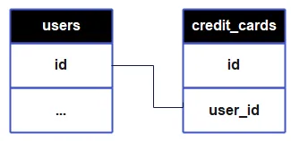
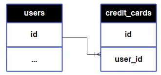
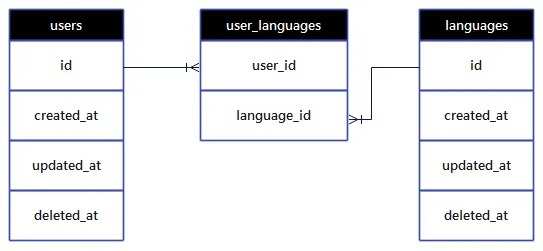
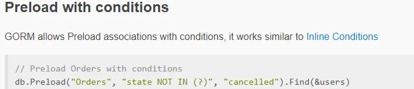

# Gorm 進階使用
by [@chimerakang](https://github.com/chimerakang)

---

## Relation? Association?
`Gorm`官方文件使用 `Association` 這個字來介紹 ORM 的 `"Relation"` 底下的功能， 我起初不是很諒解，但看過他偷偷摸摸做了一堆事情之後，我猜 `Gorm` 大概想表達他們真的不一樣。

`Gorm` 會依照 `Association` 的形式，在背後建立額外的 `hooks`、`constraints` 等等，甚至會建額外的 `table`。

接下來會順著官方文件，介紹 `Association` 章節的內容，並用 `Gorm` 實際送往 DB 執行的指令，來說明表裡差異。

### Belongs To & Has One
`Gorm` 使用這兩個名詞，來區分一對一關係中的主從關係，從 DB 實現上來說，差別只是 `Foreign Key (FK)` 以及 `constraint` 放在哪張 table 的差別而已，放了 FK 並設定了 `constraint` 的那張 table ，就是 "從"，而被 `reference` 的 table 就是 "主" 。

### Belongs To
一個人屬於一間公司，這種一對一關係，`Gorm` 定義為 `Bolongs To`。在 Model 設計上，`Gorm` 必須有個 `overhead` ，如下例，`CompanyID` & `Company` 必須同時放在 `User` 內：
```go
type User struct {
 `Gorm`.Model
 Name      string
 CompanyID int      // Foreign Key
 Company   Company  // referenced Model
}

type Company struct {
 ID   int
 Name string
}
```
`Gorm` 在這個範例的 DB 實作是在使用者的表中加個 FK 去 reference 公司，公司的資料並不存放在使用者的表內，跟 Model 設計是不同的：



```sql
/* 
db.Session(&`Gorm`.Session{DryRun: true}).AutoMigrate(&User{}, &Company{})
*/

CREATE TABLE `companies` (
    `id` INT NOT NULL AUTO_INCREMENT,
    `name` VARCHAR(255),
    PRIMARY KEY (`id`)
);

CREATE TABLE `users` (
    `id` BIGINT NOT NULL AUTO_INCREMENT,
    `created_at` DATETIME NOT NULL DEFAULT CURRENT_TIMESTAMP,
    `updated_at` DATETIME NOT NULL DEFAULT CURRENT_TIMESTAMP ON UPDATE CURRENT_TIMESTAMP,
    `deleted_at` DATETIME NULL,
    `name` VARCHAR(255),
    `company_id` INT,
    PRIMARY KEY (`id`),
    CONSTRAINT `fk_users_company` FOREIGN KEY (`company_id`) REFERENCES `companies`(`id`)
);

CREATE INDEX `idx_users_deleted_at` ON `users` (`deleted_at`);
```

### Has One
一個人有一張卡，這種一對一關係，`Gorm` 定義為 `Has One`。在這種設計中的 `Overhead`，就是明明 `CreditCard` 已經被包在 `User` 中，卻還是得宣告自己屬於誰：
```go
type User struct {
 `Gorm`.Model
 CreditCard CreditCard
}

type CreditCard struct {
 `Gorm`.Model
 Number string
 UserID uint
}
```
`Gorm` 在這個範例的 DB 實作就是在信用卡這邊建一個 FK 去 `reference` 使用者：


```sql
/*
db.Session(&`Gorm`.Session{DryRun: true}).AutoMigrate(&User{}, &CreditCard{})
*/

CREATE TABLE `users` (
    `id` BIGINT NOT NULL AUTO_INCREMENT,
    `created_at` DATETIME NOT NULL DEFAULT CURRENT_TIMESTAMP,
    `updated_at` DATETIME NOT NULL DEFAULT CURRENT_TIMESTAMP ON UPDATE CURRENT_TIMESTAMP,
    `deleted_at` DATETIME NULL,
    `name` VARCHAR(255),
    `company_id` INT,
    PRIMARY KEY (`id`),
    CONSTRAINT `fk_users_company` FOREIGN KEY (`company_id`) 
        REFERENCES `companies`(`id`)
);

CREATE INDEX `idx_users_deleted_at` ON `users` (`deleted_at`);


CREATE TABLE `credit_cards` (
    `id` BIGINT NOT NULL AUTO_INCREMENT,
    `created_at` DATETIME NOT NULL DEFAULT CURRENT_TIMESTAMP,
    `updated_at` DATETIME NOT NULL DEFAULT CURRENT_TIMESTAMP ON UPDATE CURRENT_TIMESTAMP,
    `deleted_at` DATETIME NULL,    
    `number` text,
    `user_id` bigint,
    PRIMARY KEY (`id`),
    CONSTRAINT `fk_users_credit_card` FOREIGN KEY (`user_id`) REFERENCES `users`(`id`)
);

CREATE INDEX `idx_credit_cards_deleted_at` ON `credit_cards` (`deleted_at`);
```
雖然官方文件用了 `one-on-one` 這個詞，但這個範例的 DB 實作並沒有限制一個user可以擁有幾張卡。

### Has Many
一個人有多張卡，這種關係，`Gorm` 定義為 `Has Many`。

可以看到在 `User` 的 `Model` 中，的確給了個 `slice` 來存信用卡資訊，信用卡是被包裝在 `User` 物件中的，`Overhead` 與` Has One `相同：
```go
type User struct {
 `Gorm`.Model 
 CreditCards []CreditCard
}

type CreditCard struct {
 `Gorm`.Model
 Number string
 UserID uint
}
```
但在 DB 實作中，`users` 這張表沒有任何信用卡資訊，反而是信用卡的 `table` 要自行宣告這卡是屬於誰的。


```sql
CREATE TABLE `users` (
    `id` BIGINT NOT NULL AUTO_INCREMENT,
    `created_at` DATETIME NOT NULL DEFAULT CURRENT_TIMESTAMP,
    `updated_at` DATETIME NOT NULL DEFAULT CURRENT_TIMESTAMP ON UPDATE CURRENT_TIMESTAMP,
    `deleted_at` DATETIME NULL,
    `name` VARCHAR(255),
    `company_id` INT,
    PRIMARY KEY (`id`),
    CONSTRAINT `fk_users_company` FOREIGN KEY (`company_id`) 
        REFERENCES `companies`(`id`)
);

CREATE INDEX `idx_users_deleted_at` ON `users` (`deleted_at`);

CREATE TABLE `credit_cards` (
    `id` BIGINT NOT NULL AUTO_INCREMENT,
    `created_at` DATETIME NOT NULL DEFAULT CURRENT_TIMESTAMP,
    `updated_at` DATETIME NOT NULL DEFAULT CURRENT_TIMESTAMP ON UPDATE CURRENT_TIMESTAMP,
    `deleted_at` DATETIME NULL,    
    `number` text,
    `user_id` bigint,
    PRIMARY KEY (`id`),
    CONSTRAINT `fk_users_credit_card` FOREIGN KEY (`user_id`) REFERENCES `users`(`id`)
);

CREATE INDEX `idx_credit_cards_deleted_at` ON `credit_cards` (`deleted_at`);

```

### Many To Many
一個人會多種語言，一種語言被許多人所使用，這就是 `Gorm` 所謂的多對多，所以 Model 的部分就會有兩個：人 & 語言：
```go
// User has and belongs to many languages, `user_languages` is the join table
type User struct {
  `Gorm`.Model
  Languages []Language ``Gorm`:"many2many:user_languages;"`
}

type Language struct {
  `Gorm`.Model
  Name string
}
```
`Gorm` 在這種情況下會多建一張對照表：


```sql
/* 
執行 db.Session(&`Gorm`.Session{DryRun: true}).AutoMigrate(&User{}, &Language{})
*/

-- Companies table
CREATE TABLE `companies` (
    `id` INT NOT NULL AUTO_INCREMENT,
    `name` VARCHAR(255),
    PRIMARY KEY (`id`)
);

-- Users table
CREATE TABLE `users` (
    `id` BIGINT NOT NULL AUTO_INCREMENT,
    `created_at` DATETIME NOT NULL DEFAULT CURRENT_TIMESTAMP,
    `updated_at` DATETIME NOT NULL DEFAULT CURRENT_TIMESTAMP ON UPDATE CURRENT_TIMESTAMP,
    `deleted_at` DATETIME NULL,
    `name` VARCHAR(255),
    `company_id` INT,
    PRIMARY KEY (`id`),
    CONSTRAINT `fk_users_company` FOREIGN KEY (`company_id`) 
        REFERENCES `companies`(`id`) ON DELETE SET NULL
);

CREATE INDEX `idx_users_deleted_at` ON `users` (`deleted_at`);

-- Languages table
CREATE TABLE `languages` (
    `id` BIGINT NOT NULL AUTO_INCREMENT,
    `created_at` DATETIME NOT NULL DEFAULT CURRENT_TIMESTAMP,
    `updated_at` DATETIME NOT NULL DEFAULT CURRENT_TIMESTAMP ON UPDATE CURRENT_TIMESTAMP,
    `deleted_at` DATETIME NULL,
    `name` VARCHAR(255),
    PRIMARY KEY (`id`)
);

CREATE INDEX `idx_languages_deleted_at` ON `languages` (`deleted_at`);

-- User_Languages table (junction table)
CREATE TABLE `user_languages` (
    `user_id` BIGINT NOT NULL,
    `language_id` BIGINT NOT NULL,
    PRIMARY KEY (`user_id`, `language_id`),
    CONSTRAINT `fk_user_languages_user` FOREIGN KEY (`user_id`) 
        REFERENCES `users`(`id`) ON DELETE CASCADE,
    CONSTRAINT `fk_user_languages_language` FOREIGN KEY (`language_id`) 
        REFERENCES `languages`(`id`) ON DELETE CASCADE
);
```
這張對照表有時候是個隱患，users * m，languages * n，對照表就有 m * n 的潛力。

早期 DB 沒有 Array 這種欄位，所以會使用這種設計方式；就我所知，MSSQL & PostgreSQL 後來都有 array 類型的欄位，但我目前還不確定 `Gorm` 能否支援。

---
## 查詢
以為痛苦結束了，沒想到是開始。

`Gorm` 在面對查詢的時候，常常必須用"字串"來指名要查詢的欄位，或是查詢的條件；並且文件對於"字串"的寫法出現混亂，有時候使用資料庫中的命名，有時使用 Model 的命名 (驚)，ORM 精神在此蕩然無存。



我也試圖妥協用字串來指名查詢欄位這件事，但查詢只要稍稍複雜，就無法用 `Gorm` 提供的功能以純ORM精神兜出合適的 SQL，不如使用 db.raw(“select col1 from table where col2 = ? ”, "?帶入值").Scan(&save) 直接寫 SQL 代入參數。
```go
 type Company struct {
  ID   int
  Name string
 }
 type User struct {
  `Gorm`.Model
  Name      string
  CompanyID int     // Foreign Key
  Company   Company // referenced Model
 }

 users := []User{}
 companies := []Company{}
```
```sql
//db.InnerJoins("User").Find(&companies)
SELECT 
  "companies"."id"
  ,"companies"."name" 
FROM "companies" User -- what the ?

//db.InnerJoins("Company").Find(&users)
SELECT "users"."id"
  ,"users"."created_at"
  ,"users"."updated_at"
  ,"users"."deleted_at"
  ,"users"."name"
  ,"users"."company_id"
  ,"Company"."id" AS "Company__id"
  ,"Company"."name" AS "Company__name" 
FROM "users" 
  INNER JOIN "companies" "Company" ON "users"."company_id" = "Company"."id" 
WHERE "users"."deleted_at" IS NULL

//db.InnerJoins("User", db.Where(&User{Name: "Gary"})).Find(&companies)
SELECT 
  "companies"."id"
  ,"companies"."name" 
FROM "companies" User -- what the ?

//db.InnerJoins("Company", db.Where(&Company{Name: "Edimax"})).Find(&users)
SELECT 
  "users"."id"
  ,"users"."created_at"
  ,"users"."updated_at"
  ,"users"."deleted_at"
  ,"users"."name"
  ,"users"."company_id"
  ,"Company"."id" AS "Company__id"
  ,"Company"."name" AS "Company__name" 
FROM "users" 
  INNER JOIN "companies" "Company" 
    ON "users"."company_id" = "Company"."id" AND "Company"."name" = 'Edimax' 
WHERE "users"."deleted_at" IS NULL

//db.Joins("User").Find(&companies)
SELECT  
  "companies"."id"
  ,"companies"."name" 
FROM "companies" User -- what the ?

//db.Joins("Company").Find(&users)
SELECT 
  "users"."id"
  ,"users"."created_at"
  ,"users"."updated_at"
  ,"users"."deleted_at"
  ,"users"."name"
  ,"users"."company_id"
  ,"Company"."id" AS "Company__id"
  ,"Company"."name" AS "Company__name" 
FROM "users" 
  LEFT JOIN "companies" "Company" -- 還會自動幫我變 Left Join
    ON "users"."company_id" = "Company"."id" 
WHERE "users"."deleted_at" IS NULL

//db.Joins("User", db.Where(&User{Name: "Gary"})).Find(&companies)
SELECT 
  "companies"."id"
  ,"companies"."name" 
FROM "companies" User -- what the ?

//db.Joins("Company", db.Where(&Company{Name: "Edimax"})).Find(&users)
SELECT 
  "users"."id"
  ,"users"."created_at"
  ,"users"."updated_at"
  ,"users"."deleted_at"
  ,"users"."name"
  ,"users"."company_id"
  ,"Company"."id" AS "Company__id"
  ,"Company"."name" AS "Company__name" 
FROM "users" 
  LEFT JOIN "companies" "Company" -- 還會自動幫我變 Left Join
    ON "users"."company_id" = "Company"."id" AND "Company"."name" = 'Edimax' 
WHERE "users"."deleted_at" IS NULL
```
在`Gorm`的設計，擁有 Foreign Key 的 Model 才能用比較純的ORM方式去 Join 別張 table；想要反向來查，必須自己多寫SQL的部分 :
```go
db.Table("users").Joins("INNER JOIN companies on users.company_id = users.company_id").Where("users.name = ?", "Gary").Find(&companies)
```
---

## 後記
`Gorm`的設計思路就是希望以最低的成本從零建立整套資料庫，所以默默做了很多事，挺精妙的，各種功能也做得很細，值得使用；但若是要對已經有自己一套規則的資料庫使用，必須深入了解 `Gorm` 究竟默默做了哪些事，畢竟`Gorm` 屬於 code-first。

---
## NEXT:[資料庫的挑戰](./database-4.md)
## [`Gorm`番外篇](./database-3plus.md)
