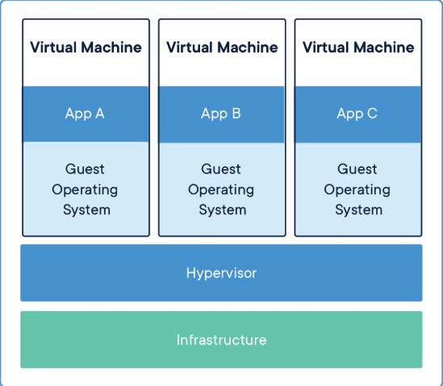
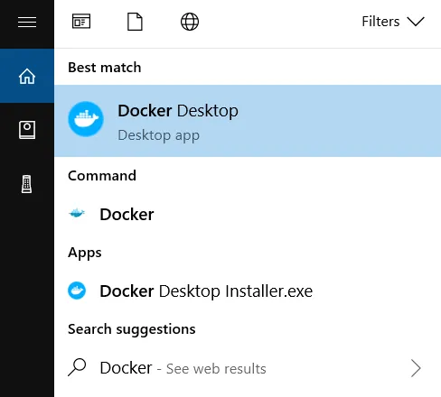

# Docker 初步介紹
by [@chimerakang](https://github.com/chimerakang)

---
## 簡介


以不太準確的講法是：輕量化的虛擬機。

如果有玩過VM，就知道VM實際上是模擬整個主機環境，有各自的 OS 環境，因此除了佔用的空間大，通常要以 GB 起跳，啟動速度也較緩慢。

而 Docker 是建立 Container，Container 是應用程式的抽象，多個 Container 可以在同一台主機上運行，並且跟其他容器共享 OS 核心。每個 Container 占用的空間少於 VM，通常才幾十 MB。

所以其實 VM 跟 Docker 其底層一開始設計就不一樣了！

我們看 Docker 官網提供的 VM 及 Docker 結構圖會更清楚：

* VM


* Docker


## 為什麼要使用 Docker？
舉個簡單例子，如果要開發一個網站，並且將這個網站架設一台主機上，首先可能要先各自安裝程式語言環境 (Java、Golang、Python)、資料庫環境 (PostgreSQL、MySQL)、資料庫管理系統 (pgAdmin、WorkBench)、網頁伺服器 (nginx、apache) 等等。這些安裝完也都測試過版本的問題，才可以進行架設網站的動作。

試想當網站不斷擴充，有可能會有伺服器搬遷的情況，這時候重新搬遷到新的伺服器，又要做同樣的設定，更提高出錯的可能。

這也就是為什麼 Docker 的構想是推廣 Build, Ship and Run Any App, Anywhere，簡單來說就是簡單化佈署的難度，並且只要第一次設定檔寫好，之後用同樣的設定檔就可以了，不需要再多做其他煩人的設定。

除了最後上線佈署，對於開發過程也提供了以下好處：

開發人員可以使用映像檔 (image)，快速構建一套標準的開發環境。在開發完成後，寫好設定檔，就可以讓別人來快速佈署來測試。

例如 Frontend 跟 Backend 要合作的時候，當 Backend 寫好了 API，總不可能叫 Frontend 在自己開發主機上裝好 Backend 所需要的環境，最後還要自己佈署上去才能測試。因此 Backend 只要將 Dockerfile 寫好，也就是佈署設定檔寫好，而 Frontend 主機上只要有安裝 Docker 就可以無痛佈署並且測試，非常便利。

事實上，對於自己開發上也有一定的好處，如果電腦是 Windows，可是之後佈署環境在 Linux，以前的做法還要在自己電腦上裝好虛擬機然後再去下載容量大的虛擬機映像檔，才可以測試佈署環境。今天只要在自己電腦上裝好 Docker，而且裝 Docker 的過程十分快速，然後寫好設定檔，就可以一鍵佈署，非常省時省力。

Docker 使用類似 Git 設計的操作方式，方便開發者進行操作。

Docker 佈署、更新、刪除非常快速及方便，比起虛擬機操作真的差太多了。

另外還有一個例子，如果你的主機在寫程式時不想裝程式語言環境或其他依賴環境，也許容量不夠等問題，就可以透過 Docker 裝程式語言環境，讓主機存取 Docker 上的程式語言環境來進行寫程式，這樣是可以實現出來的。

## 安裝 Docker
### Ubuntu 安裝
Docker 安裝是需要 Linux 環境的，因此在 Ubuntu 環境下安裝非常簡單：

1. 安裝 docker
    ```
    sudo apt-get install docker.io
    ```
2. 檢查 docker 服務有無正常啟動
    ```
    service docker status
    ```
    如果沒意外的話會在前面幾行看到：
    ```
    Active：active(running)
    ```

3. 將自己使用者帳號加入 docker 群組
    ```
    sudo usermod -aG docker <username>
    ```
    這個動作主要是因為權限的關係，如果沒有加這個，會導致沒有權限使用 Docker。

4. 登出後再重新登入
    ```
    docker version
    ```
    會出現 Client、Server 的訊息，但如果最下面出現了：
    ```
    Cannot connect to the Docker daemon. Is the docker daemon running on this host?
    ```

    這就是可能因為沒做第三個步驟，通常是權限的問題。

沒錯，就是這麼簡單就安裝好了～

### Windows10 安裝
首先 Windows 安裝有兩種方式：

* Docker Desktop for Windows
* Docker Toolbox on Windows

個人建議裝第一種，但是要前提，首先你的 Windows10 要有 Hyper-V 功能，如果不理解什麼是 [Hyper-V](https://learn.microsoft.com/zh-tw/virtualization/hyper-v-on-windows/quick-start/enable-hyper-v)，請點擊這裡

或是如果你的 Windows10 是專業版的話那就一定有 Hyper-V 的功能，就可以安裝 Docker Desktop。

這邊安裝只會介紹第一種，不建議使用第二種方式，因為它還會幫你裝 Virtual Box，沒有錯，前面說過 Docker 只原生支持 Linux，因此 Windows 環境要用，等於是在 Windows 上裝了一個 Linux 虛擬機，而在這個虛擬機上面再裝 Docker。

但其實第一種安裝方式也是透過ㄧ個 Linux 虛擬機來裝 Docker，只是這個虛擬機是用 Windows 是用原生的 Hyper-V 服務，管理方便，功能也很好用，可參考剛剛那篇文章。

接著按照下面的步驟安裝:

1. 使用頁面頂部的下載按鈕或從https://www.docker.com/products/docker-desktop/下載安裝程式。
2. 雙擊Docker Desktop Installer.exe運行安裝程式。預設情況下，Docker Desktop 安裝在C:\Program Files\Docker\Docker.
3. 出現提示時，請確保選擇或不選擇「設定」頁面上的「使用 WSL 2 而不是 Hyper-V」選項，具體取決於您選擇的後端。如果您的系統僅支援這兩個選項之一，您將無法選擇使用哪個後端。
4. 依照安裝精靈上的指示授權安裝程式並繼續安裝。
5. 安裝成功後，選擇關閉以完成安裝程序。

如果你安裝完成後，並沒有開啟 Hyper-V 的服務，那麼它會通知你並且自動幫你開啟，開啟完後就會自動重開機就搞定啦～

看有沒有安裝成功
```
docker --version
```
會秀出安裝的版本：
```
Docker version 27.0.3, build 7d4bcd8
```
這樣就安裝完成了！

### 啟動 Docker Desktop
Docker Desktop 安裝後不會自動啟動。啟動 Docker Desktop：

1. 搜尋 Docker，然後在搜尋結果中選擇 Docker Desktop。


2. 點選 Docker Desktop 圖示啟動應用程式。

3. Docker Desktop 可能需要一些時間才能啟動，尤其是在安裝後或系統重新引導後第一次運行它時。

4. Docker Desktop 啟動後，您應該在系統匣中看到它的圖示（螢幕右下角，時鐘附近）。該圖示通常看起來像鯨魚。您可能需要按一下向上箭頭才能顯示隱藏的圖示。

5. 現在，您可以開始在命令提示字元、PowerShell 或終端機中使用 Docker 命令來管理容器和映像。


## Hello Docker！
運行官方的 Hello World 映像檔：
會出現以下訊息：
```
docker run hello-world
Unable to find image 'hello-world:latest' locally
latest: Pulling from library/hello-world
c1ec31eb5944: Download complete
Digest: sha256:53cc4d415d839c98be39331c948609b659ed725170ad2ca8eb36951288f81b75
Status: Downloaded newer image for hello-world:latest

Hello from Docker!
This message shows that your installation appears to be working correctly.

To generate this message, Docker took the following steps:
 1. The Docker client contacted the Docker daemon.
 2. The Docker daemon pulled the "hello-world" image from the Docker Hub. 
    (amd64)
 3. The Docker daemon created a new container from that image which runs the
    executable that produces the output you are currently reading.
 4. The Docker daemon streamed that output to the Docker client, which sent it
    to your terminal.

To try something more ambitious, you can run an Ubuntu container with:
 $ docker run -it ubuntu bash

Share images, automate workflows, and more with a free Docker ID:
 https://hub.docker.com/

For more examples and ideas, visit:
 https://docs.docker.com/get-started/
```
這樣就是成功運行 Container，歡迎踏入 Docker 的世界！

## 指令介紹
接著介紹一些 Docker 的指令，

Docker 的指令真的很多，這裡就介紹我比較常用的或是實用的指令

### 查看目前 images
```
docker images
```
### 建立 image
```
docker create [OPTIONS] IMAGE [COMMAND] [ARG...]
```
詳細的參數可參考 https://docs.docker.com/engine/reference/commandline/create/

範例 ( 建立一個名稱為 busybox 的 image )
```
docker create -it --name busybox busybox
```
### 刪除 Image
```
docker rmi [OPTIONS] IMAGE [IMAGE...]
```
### 查看目前運行的 container
```
docker ps
```
### 查看目前全部的 container（ 包含停止狀態的 container ）
```
docker ps -a
```
新建並啟動 Container
```
docker run [OPTIONS] IMAGE[:TAG|@DIGEST] [COMMAND] [ARG...]
```
舉個例子
```
docker run -d -p 80:80 --name my_image nginx
```
-d 代表在 Detached（ 背景 ）執行，如不加 -d，預設會 foreground ( 前景 ) 執行

-p 代表將本機的 80 port 的所有流量轉發到 container 中的 80 port

--name 設定 container 的名稱

再舉一個例子
```
docker run -it --rm busybox
```
--rm 代表當 exit container 時，會自動移除 container。 ( incompatible with -d )

更詳細的可參考 https://docs.docker.com/engine/reference/run/

### 啟動 Container
```
docker start [OPTIONS] CONTAINER [CONTAINER...]
```
如果想讓他在前景跑順便觀看輸出 , 可以使用以下指令
```
docker start -a [OPTIONS] CONTAINER [CONTAINER...]
```
--attach 或 -a 代表 Attach STDOUT/STDERR and forward signals.

更詳細的可參考 https://docs.docker.com/engine/reference/commandline/start/

（ container ID 寫幾個就可以了，和 Git 的概念是一樣的 ，

不了解 Git 可以參考 Git-Tutorials GIT基本使用教學 ）

### 停止 Container
```
docker stop [OPTIONS] CONTAINER [CONTAINER...]
```
### 重新啟動 Container
```
docker restart [OPTIONS] CONTAINER [CONTAINER...]
```
### 删除 Container
```
docker rm [OPTIONS] CONTAINER [CONTAINER...]
```
--volumes , -v 加上這個參數，會移除掉連接到這個 container 的 volume。

可參考 https://docs.docker.com/engine/reference/commandline/rm/

### 進入 Container
```
docker exec [OPTIONS] CONTAINER COMMAND [ARG...]
docker exec -it <Container ID> bash
```
### 使用 root 使用者進入　
```
docker exec -u 0 -it <Container ID> bash
docker exec -u root -it <Container ID> bash
```

當我們進入了 Container 之後，有時候想看一下裡面 Linux 的版本，

這時候可以使用以下指令查看
```
cat /etc/os-release
```
### 查看 Container 詳細資料
```
docker inspect [OPTIONS] NAME|ID [NAME|ID...]
```
### 查看 log
```
docker logs [OPTIONS] CONTAINER
```
--follow , -f , Follow log output

更詳細的可參考 https://docs.docker.com/engine/reference/commandline/logs/

### 儲存 (備份) image 成 tar 檔案

[OPTIONS] IMAGE [IMAGE...]
範例
```
docker save busybox > busybox.tar
```
或
```
docker save --output busybox.tar busybox
```
或 ( 也可以一次備份多個 )
```
docker save -o images.tar postgres:9.6 busybox
```
更多可參考 https://docs.docker.com/engine/reference/commandline/save/

### 載入 image

docker load [OPTIONS]
範例
```
docker load < busybox.tar
```
或
```
docker load -i busybox.tar
```

其他指令

### 刪除所有 dangling images
```
docker image prune
```
移除全部 unused images (不只 dangling images)
```
docker image prune -a
```

### 停止所有正在運行的 Container
```
docker container stop $(docker ps -q)
```

### 移除全部停止的 containers
```
docker container prune
```


---
## Next : [撰寫第一個Dockerfile](./docker-2.md)
