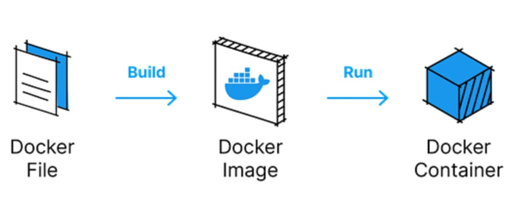
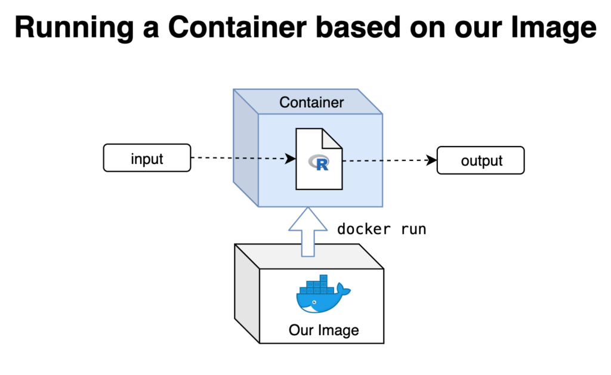
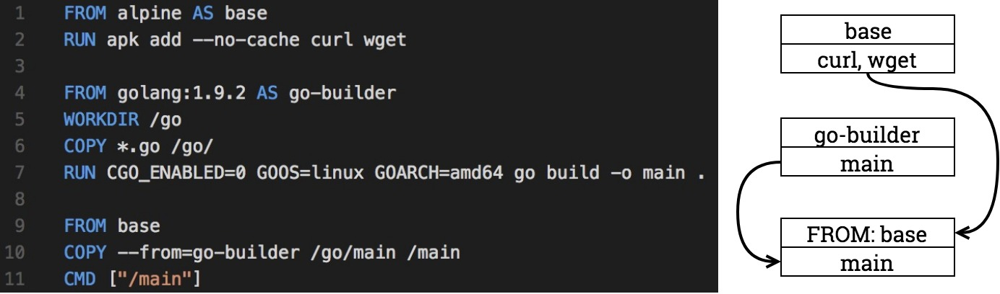

# 撰寫第一個Dockerfile
by [@chimerakang](https://github.com/chimerakang)

---
## 建立一個Dockerfile

```
FROM golang:1.9.2

WORKDIR /go

ADD *.go /go/

ENV PORT=9999

CMD ["go", "run", "main.go"]
```

分解 Dockerfile：

* 它使用官方 Golang image 建立容器。
* 將目前目錄掛載到容器的標準 Go 路徑上。
* 將工作目錄設定為我們應用程式的 Go 路徑。
* 定義環境變數“PORT”，預設值為“9999”。
* 指定建置和運行我們的應用程式的命令。

## 建置和運行容器


1. 建置 Docker image：
```
docker build . -t go-demo-image
```

2. Run a container from the image:

```
docker run -p 3030:9999 -it --rm --name go-demo-run go-demo-image
```

在這裡，我們指示 Docker 運行一個新容器，將主機連接埠 3030 綁定到容器的內部連接埠 9999，在目前終端中顯示 stdout 輸出，在進程終止後刪除容器，並為容器指派自訂名稱。

在瀏覽器中訪問 `http://localhost:3030/hello?name=john`，您應該看到文字 `hello, john`，若要停止容器，請按 `Ctrl + C` 即可停止

## Multi-stage Docker image
開發到後期，Docker image 可能會變成像大象一樣的容量，幸運的是，Golang 具有出色的的交叉編譯功能。

首先，讓我們將 Docker image 拆分為多階段 Docker。我們這樣做是因為如果我們做第一個 docker，我們會將所有原始程式碼放入 Docker 映像中，這可能會在以後造成問題。這不是一個好主意。

```
# stage 0
FROM alpine AS base
RUN apk add --no-cache curl wget

# stage 1
FROM golang:1.9.2 AS go-builder
WORKDIR /go
COPY *.go /go/
RUN CGO_ENABLED=0 GOOS=linux GOARCH=amd64 go build -o main .

# stage 2
FROM base
COPY --from=go-builder /go/main /main
CMD ["/main"]
```
我們用示意圖解釋整個建構流程中間到底發生什麼事


### Stages 
#### Stage 0 (Stage base) 
```
FROM alpine AS base
RUN apk add --no-cache curl wget
```
* 利用 as <NAME> 將 stage 0 命名為 base
* 以 alpine 為 parent image 建立中間映像檔，並在裡面安裝所需的套件 (curl, wget)

#### Stage 1 (Stage go-builder) 
```
FROM golang:1.9.2 AS go-builder
WORKDIR /go
COPY *.go /go/
RUN CGO_ENABLED=0 GOOS=linux GOARCH=amd64 go build -o main .
```
* 將 stage 1 命名為 go-builder
* 編譯 packages & dependencies

#### Stage 2 
```
FROM base
COPY --from=go-builder /go/main /main
CMD ["/main"]
```
* 利用 stage 0 (stage base) 建立好的中間映像檔作為 parent image
* 利用 COPY 取得剛剛在 stage 1 (stage go-builder) 產生的 artifacts
    * COPY --from=1
    * COPY --from=<intermediate_image_name>

### 重新建立 docker image
```
docker build -t go-demo-image -f Dockerfile.stage .
```

因此，我們最終的 Docker image 將是 10 到 30 MB！如果開發人員沒有 Docker 經驗，常規 image 會超過 1000 MB。使用這種方法之後，可以將其減少到 100 到 200MB。

為什麼尺寸很重要？因為可以讓你的 Docker 運作得更快並且使用更少的資源。如果您運行一兩個實例，您不會注意到差異，但如果您有數百或數千個實例…

### 進行交叉編譯：讓多架構建置變得簡單
如果我們需要一個與目標平台相容的二進位文件，並製作出對應的 image 該怎麼作呢?

我們可以這麼做，因為Go可以交叉編譯，只要我們需要考慮目標平台的架構。

```
# stage 0
FROM alpine AS base
RUN apk add --no-cache curl wget

# stage 1
FROM --platform=$BUILDPLATFORM golang:1.9.2 AS go-builder
WORKDIR /go
COPY *.go /go/

ARG TARGETOS TARGETARCH
#RUN CGO_ENABLED=0 GOOS=linux GOARCH=amd64 go build -o main .
RUN CGO_ENABLED=0 GOOS=$TARGETOS GOARCH=$TARGETARCH go build -o main .

# stage 2
FROM base
COPY --from=go-builder /go/main /main
EXPOSE 9999
CMD ["/main"]
```

只需要改變兩處：
```
ARG TARGETOS TARGETARCH
RUN CGO_ENABLED=0 GOOS=$TARGETOS GOARCH=$TARGETARCH go build -o main .
```

正如您所看到的，我們從 docker 命令中使用 TARGETOS 和 TARGETARCH，然後將它們與環境變數一起提供給 Go 編譯器。 Go 可以針對不同的作業系統和架構進行建置。

它之所以有效，是因為 Docker 將在本機架構上運行建構器平台。

當 Docker 遇到這一行時：
```
ARG TARGETOS TARGETARCH
```

Docker 中的一行程式碼用於在所有請求的作業系統和架構之間指派執行
它將在所有請求的作業系統和架構之間分割執行。在我們的例子中，「go build」將運行兩次：對於 amd64 和對於 arm64。
```
docker buildx build . -t go-demo-image -f .\Dockerfile.platform --platform=linux/amd64,linux/arm64

[+] Building 1.3s (18/18) FINISHED                                                                                                                                docker:desktop-linux
 => [internal] load build definition from Dockerfile.platform                                                                                                                     0.0s
 => => transferring dockerfile: 466B                                                                                                                                              0.0s 
 => [linux/amd64 internal] load metadata for docker.io/library/golang:1.9.2                                                                                                       0.9s 
 => [linux/arm64 internal] load metadata for docker.io/library/alpine:latest                                                                                                      0.9s 
 => [linux/amd64 internal] load metadata for docker.io/library/alpine:latest                                                                                                      0.9s 
 => [internal] load .dockerignore                                                                                                                                                 0.0s
 => => transferring context: 2B                                                                                                                                                   0.0s 
 => [linux/arm64 base 1/2] FROM docker.io/library/alpine:latest@sha256:0a4eaa0eecf5f8c050e5bba433f58c052be7587ee8af3e8b3910ef9ab5fbe9f5                                           0.0s 
 => => resolve docker.io/library/alpine:latest@sha256:0a4eaa0eecf5f8c050e5bba433f58c052be7587ee8af3e8b3910ef9ab5fbe9f5                                                            0.0s 
 => [linux/amd64 base 1/2] FROM docker.io/library/alpine:latest@sha256:0a4eaa0eecf5f8c050e5bba433f58c052be7587ee8af3e8b3910ef9ab5fbe9f5                                           0.0s 
 => => resolve docker.io/library/alpine:latest@sha256:0a4eaa0eecf5f8c050e5bba433f58c052be7587ee8af3e8b3910ef9ab5fbe9f5                                                            0.0s 
 => [linux/amd64 go-builder 1/4] FROM docker.io/library/golang:1.9.2@sha256:947826b5b6bc42f6f25c8fae9fe89d5e2bf18ac87264856742c3baebb150ea9f                                      0.1s 
 => => resolve docker.io/library/golang:1.9.2@sha256:947826b5b6bc42f6f25c8fae9fe89d5e2bf18ac87264856742c3baebb150ea9f                                                             0.0s 
 => [internal] load build context                                                                                                                                                 0.0s 
 => => transferring context: 29B                                                                                                                                                  0.0s 
 => CACHED [linux/arm64 base 2/2] RUN apk add --no-cache curl wget                                                                                                                0.0s 
 => CACHED [linux/amd64 go-builder 2/4] WORKDIR /go                                                                                                                               0.0s 
 => CACHED [linux/amd64 go-builder 3/4] COPY *.go /go/                                                                                                                            0.0s 
 => CACHED [linux/amd64->arm64 go-builder 4/4] RUN CGO_ENABLED=0 GOOS=linux GOARCH=arm64 go build -o main .                                                                       0.0s
 => CACHED [linux/arm64 stage-2 1/1] COPY --from=go-builder /go/main /main                                                                                                        0.0s 
 => CACHED [linux/amd64 base 2/2] RUN apk add --no-cache curl wget                                                                                                                0.0s 
 => CACHED [linux/amd64 go-builder 4/4] RUN CGO_ENABLED=0 GOOS=linux GOARCH=amd64 go build -o main .                                                                              0.0s 
 => CACHED [linux/amd64 stage-2 1/1] COPY --from=go-builder /go/main /main                                                                                                        0.0s 
 => exporting to image                                                                                                                                                            0.1s 
 => => exporting layers                                                                                                                                                           0.0s 
 => => exporting manifest sha256:356e76fbfec6e5a1cbda3529c691658f315064cbbc4c0a49d797fb91d040f183                                                                                 0.0s 
 => => exporting config sha256:a36e70a7aa2061e4f6ce1646c39af4fe62871dec0afd686c913878e93d9fe5c5                                                                                   0.0s 
 => => exporting attestation manifest sha256:86caa2e5d3a9377263088742058402d5036e8df05d36a6f6c1156512862b2917                                                                     0.0s 
 => => exporting manifest sha256:6385b3229f1ac4db5938eb991aea31b4081f64b6439c2a2c70ad0abb5b5897bf                                                                                 0.0s 
 => => exporting config sha256:54be18b290b8ea8c961006cce9ac3e9550eedd6d1c839327e878ab777608e326                                                                                   0.0s 
 => => exporting attestation manifest sha256:53e320e7a0052c1b4487d6d8913c7fd86406f96a9fdfa1fbb3f3077e59c705df                                                                     0.0s 
 => => exporting manifest list sha256:0d65726ceca33fd54b515d222df993ad362cc941f7668c4f24679de91aff8cca                                                                            0.0s 
 => => naming to docker.io/library/go-demo-image:latest                                                                                                                           0.0s 
 => => unpacking to docker.io/library/go-demo-image:latest   
```

一旦我們有了該目標的基礎鏡像，第二階段就會針對每個目標進行打包：Alpine 支援七種主要架構，但僅支援一個平台：Linux。主要原因是因為Alpine本身就是Linux。 

[Alpine images](https://hub.docker.com/_/alpine/tags)

就我個人而言，我還沒有看到針對 Windows 非 Linux 平台的 Docker 映像，但有一些特定於 Windows 的應用程序，例如 sqlserver 或 Unix 平台。因此它可能適用於其他作業系統。

也要注意的是，當你建立Go時，CGO是啟用的，但是當你交叉編譯Go時，CGO預設是停用的。這是有原因的：CGO 不是 Go。

如果需要 CGO，只需在 Docker 中新增一行:
```
ENV CGO_ENABLED=1
```

## 順利航行的最後提示
Docker 是 DevOps 的超級明星，但它也並非沒有怪癖。為了讓生活更輕鬆：

1. 使用多階段編譯對 Docker image 進行分層處理。

2. 讓 Go 來完成交叉編譯的繁重工作 - 這就像為每個人烘焙不同的蛋糕！

3. 如果必須使用的話，不要忘記CGO。


有了這些技巧，Docker 部署將變得輕而易舉。

---
## NEXT : [docker-compose](./docker-compose-1.md)