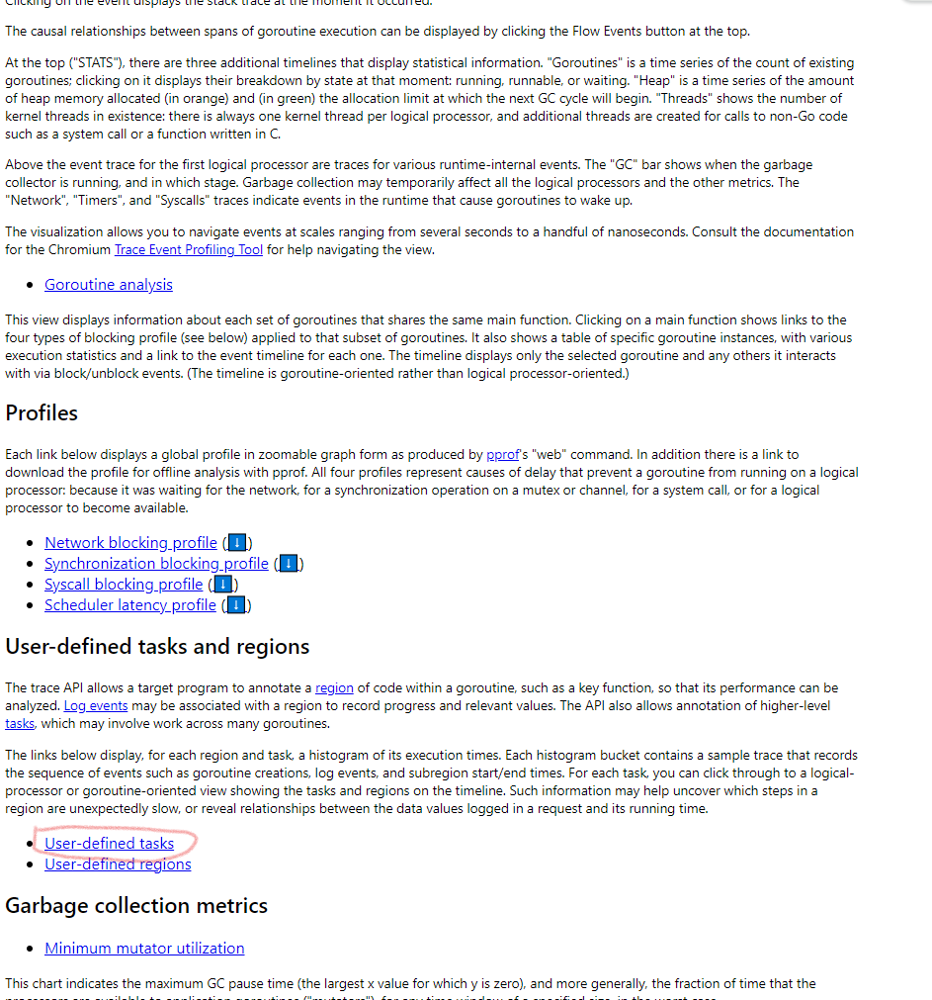
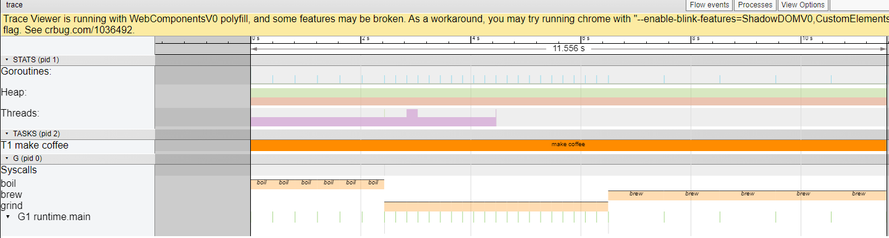

# 挑戰 沖泡咖啡
by [@chimerakang](https://github.com/chimerakang)

---
## 步驟1:不使用協程(goroutine)來處理
### 開發一個沖泡咖啡的程序
在這個實作中,我們將以沖泡咖啡作為主題來創建一個程序。雖然我們不會真的沖泡咖啡,但我們可以學習如何通過並行處理來提高一系列步驟的效率。
沖泡咖啡需要以下步驟:

* 燒開水
* 研磨咖啡豆
* 沖泡咖啡

### 定義數據類型
沖泡咖啡需要熱水和研磨過的咖啡粉。燒開水需要水,而獲得咖啡粉需要咖啡豆。換句話說,每個步驟都涉及以下數據轉換:

* 燒開水: 水 -> 熱水
* 研磨咖啡豆: 咖啡豆 -> 研磨過的咖啡粉
* 沖泡咖啡: 熱水, 研磨過的咖啡粉 -> 咖啡

我們可以看到這個程序中有五種類型的數據:水、熱水、咖啡豆、研磨過的咖啡粉和咖啡。讓我們創建數據類型來表示這些數據。我們可以使用 struct 來定義數據類型。
```go
type (
	Bean       int // 咖啡豆
	GroundBean int // 咖啡粉
	Water      int // 水
	HotWater   int // 熱水
	Coffee     int // 咖啡
)
```
為方便起見，準備了以下的常數： 這樣一來，你可以寫出這樣的東西：10 * GramBeans
```go
const (
	GramBeans          Bean       = 1
	GramGroundBeans    GroundBean = 1
	MilliLiterWater    Water      = 1
	MilliLiterHotWater HotWater   = 1
	CupsCoffee         Coffee     = 1
)
```
接下來，準備些function，獲得沖泡 N 杯咖啡所需的成分量。這樣，您可以獲得兩杯咖啡所需的水量。Coffee(2 * Cupscoffee).Water()
```go
// 沖泡 1 杯咖啡所需的水量
func (cups Coffee) Water() Water {
        return Water(180*cups) / MilliLiterWater
}

// 沖泡 1 杯咖啡所需的熱水量
func (cups Coffee) HotWater() HotWater {
        return HotWater(180*cups) / MilliLiterHotWater
}

// 沖泡 1 杯咖啡所需的咖啡豆量
func (cups Coffee) Beans() Bean {
        return Bean(20*cups) / GramBeans
}

// 沖泡 1 杯咖啡所需的咖啡粉量
func (cups Coffee) GroundBeans() GroundBean {
        return GroundBean(20*cups) / GramGroundBeans
}
```
### 燒開水
創建一個燒水的方程式 `boil`。靜置一定時間后，返回與參數中給出的量相同的熱水量。
```go
// 燒水
func boil(water Water) HotWater {
	time.Sleep(400 * time.Millisecond)
	return HotWater(water)
}
```
### 研磨咖啡豆
創建一個用於研磨咖啡豆的方程式 `grind`。 將咖啡豆作為參數，並在一定時間後返回磨碎的咖啡豆。
```go
// 研磨咖啡豆
func grind(beans Bean) GroundBean {
	time.Sleep(200 * time.Millisecond)
	return GroundBean(beans)
}
```
### 沖泡咖啡
創建一個沖泡咖啡的方程式 `brew`。在一定時間內將熱水和咖啡粉攪拌後，獲得咖啡。
```go
// 咖啡沖泡
func brew(hotWater HotWater, groundBeans GroundBean) Coffee {
	time.Sleep(1 * time.Second)
	// 少量者優先處理
	cups1 := Coffee(hotWater / (1 * CupsCoffee).HotWater())
	cups2 := Coffee(groundBeans / (1 * CupsCoffee).GroundBeans())
	if cups1 < cups2 {
		return cups1
	}
	return cups2
}
```
### 總結過程
從 main 開始，按順序呼叫`boil`、`grind`、`brew` 開始煮咖啡。 預計要沖泡20杯咖啡。
```go

// 預計要沖泡多少咖啡
const amountCoffee = 20 * CupsCoffee

// 材料
water := amountCoffee.Water()
beans := amountCoffee.Beans()
```
一次煮沸的水量、研磨的咖啡豆量和沖泡的咖啡量如下:

* 一次煮沸的水量：600 [ml]
* 一次可研磨的豆子量：20[g]
* 一次沖泡咖啡：4 杯

通過多次依照順序呼叫 `boil`、`grind`、`brew`，可以沖泡 20 杯咖啡

您可以使用下列程式執行沖泡咖啡的任務：
```go
package main

import (
	"fmt"
	"time"
)

type (
	Bean       int
	GroundBean int
	Water      int
	HotWater   int
	Coffee     int
)

const (
	GramBeans          Bean       = 1
	GramGroundBeans    GroundBean = 1
	MilliLiterWater    Water      = 1
	MilliLiterHotWater HotWater   = 1
	CupsCoffee         Coffee     = 1
)

func (w Water) String() string {
	return fmt.Sprintf("%d[ml] water", int(w))
}

func (hw HotWater) String() string {
	return fmt.Sprintf("%d[ml] hot water", int(hw))
}

func (b Bean) String() string {
	return fmt.Sprintf("%d[g] beans", int(b))
}

func (gb GroundBean) String() string {
	return fmt.Sprintf("%d[g] ground beans", int(gb))
}

func (cups Coffee) String() string {
	return fmt.Sprintf("%d cup(s) coffee", int(cups))
}

// 沖泡 1 杯咖啡所需的水量
func (cups Coffee) Water() Water {
	return Water(180*cups) / MilliLiterWater
}

// 沖泡 1 杯咖啡所需的熱水量
func (cups Coffee) HotWater() HotWater {
	return HotWater(180*cups) / MilliLiterHotWater
}

// 沖泡 1 杯咖啡所需的咖啡豆量
func (cups Coffee) Beans() Bean {
	return Bean(20*cups) / GramBeans
}

// 沖泡 1 杯咖啡所需的咖啡粉量
func (cups Coffee) GroundBeans() GroundBean {
	return GroundBean(20*cups) / GramGroundBeans
}

// 燒水
func boil(water Water) HotWater {
	time.Sleep(400 * time.Millisecond)
	return HotWater(water)
}

// 研磨
func grind(beans Bean) GroundBean {
	time.Sleep(200 * time.Millisecond)
	return GroundBean(beans)
}

// 沖泡
func brew(hotWater HotWater, groundBeans GroundBean) Coffee {
	time.Sleep(1 * time.Second)
	// 少量者優先處理
	cups1 := Coffee(hotWater / (1 * CupsCoffee).HotWater())
	cups2 := Coffee(groundBeans / (1 * CupsCoffee).GroundBeans())
	if cups1 < cups2 {
		return cups1
	}
	return cups2
}

func main() {
	// 預計要沖泡多少咖啡
	const amountCoffee = 20 * CupsCoffee

	// 材料
	water := amountCoffee.Water()
	beans := amountCoffee.Beans()

	fmt.Println(water)
	fmt.Println(beans)

	// 熱水
	var hotWater HotWater
	for water > 0 {
		water -= 600 * MilliLiterWater
		hotWater += boil(600 * MilliLiterWater)
	}
	fmt.Println(hotWater)

	// 咖啡粉
	var groundBeans GroundBean
	for beans > 0 {
		beans -= 20 * GramBeans
		groundBeans += grind(20 * GramBeans)
	}
	fmt.Println(groundBeans)

	// 沖泡咖啡
	var coffee Coffee
	cups := 4 * CupsCoffee
	for hotWater >= cups.HotWater() && groundBeans >= cups.GroundBeans() {
		hotWater -= cups.HotWater()
		groundBeans -= cups.GroundBeans()
		coffee += brew(cups.HotWater(), cups.GroundBeans())
	}

	fmt.Println(coffee)
}

```

### 執行
最後可以執行它：
```
$ go run coffee1.go
```
如果您看到以下內容，則您已成功。
```
3600[ml] water
400[g] beans
3600[ml] hot water
400[g] ground beans
20 cup(s) coffee
```

---
## 步驟2：尋找瓶頸

步驟 1 中創建的程式在某種程度上很慢。這邊準備使用`runtime/trace`這個package 尋找瓶頸

首先，為了方便產生追蹤數據數據，需要將`main()`的部分工作移動到新的`RunMyProgram()` 處理

然後，在開始處理追蹤的物件之前，呼叫`trace.Start`，然後在完成後呼叫`trace.Stop`。同時利用`defer`在程式結束前關閉追蹤的檔案


```go
func main() {
	f, err := os.Create("trace.out")
	if err != nil {
		log.Fatalln("Error:", err)
	}
	defer func() {
		if err := f.Close(); err != nil {
			log.Fatalln("Error:", err)
		}
	}()

	if err := trace.Start(f); err != nil {
		log.Fatalln("Error:", err)
	}
	defer trace.Stop()

	RunMyProgram()
}
```
### 用戶註釋
Go 1.11 開始，添加了一個名為 user annotation 的函數。 此功能允許使用者隨時輸出跟蹤資訊。

參考:[how to trace](./trace.md)

使用者註解可以按以下單位完成：

* Task
* Region
* Log

我們可以設定一個任務中有多個區域，並且在該區域中發佈日誌`(log)`

在這裡，任務是“沖泡咖啡(`make coffee`)”，區域是“燒水(`boil`)”、“研磨(`grind`)”和“沖泡(`brew`)”。

Task可以按如下方式建立： 一旦創建成功會回傳一個`ctx`，可以暫存`Task`相關資料，提供各方程式呼叫，直到`task.End()`才會清空。`defer`則在函數結束時通過呼叫。
```go
ctx, task := trace.NewTask(context.Background(), "make coffee")
defer task.End()
```

可以透過呼叫以下方式建立區域：
```go
region := trace.StartRegion(ctx, "region_name")
defer region.End()
```
你也可以像這樣寫成一行：
```go
defer trace.StartRegion(ctx, "region_name").End()
```

修改過後的程式碼如下: 
```go
package main

import (
	"context"
	"fmt"
	"log"
	"os"
	"runtime/trace"
	"time"
)

type (
	Bean       int
	GroundBean int
	Water      int
	HotWater   int
	Coffee     int
)

const (
	GramBeans          Bean       = 1
	GramGroundBeans    GroundBean = 1
	MilliLiterWater    Water      = 1
	MilliLiterHotWater HotWater   = 1
	CupsCoffee         Coffee     = 1
)

func (w Water) String() string {
	return fmt.Sprintf("%d[ml] water", int(w))
}

func (hw HotWater) String() string {
	return fmt.Sprintf("%d[ml] hot water", int(hw))
}

func (b Bean) String() string {
	return fmt.Sprintf("%d[g] beans", int(b))
}

func (gb GroundBean) String() string {
	return fmt.Sprintf("%d[g] ground beans", int(gb))
}

func (cups Coffee) String() string {
	return fmt.Sprintf("%d cup(s) coffee", int(cups))
}

// 沖泡 1 杯咖啡所需的水量
func (cups Coffee) Water() Water {
	return Water(180*cups) / MilliLiterWater
}

// 沖泡 1 杯咖啡所需的熱水量
func (cups Coffee) HotWater() HotWater {
	return HotWater(180*cups) / MilliLiterHotWater
}

// 沖泡 1 杯咖啡所需的咖啡豆量
func (cups Coffee) Beans() Bean {
	return Bean(20*cups) / GramBeans
}

// 沖泡 1 杯咖啡所需咖啡粉量
func (cups Coffee) GroundBeans() GroundBean {
	return GroundBean(20*cups) / GramGroundBeans
}

func main() {
	f, err := os.Create("trace.out")
	if err != nil {
		log.Fatalln("Error:", err)
	}
	defer func() {
		if err := f.Close(); err != nil {
			log.Fatalln("Error:", err)
		}
	}()

	if err := trace.Start(f); err != nil {
		log.Fatalln("Error:", err)
	}
	defer trace.Stop()

	RunMyProgram()
}

func RunMyProgram() {
	// 預計沖泡多少杯咖啡
	const amountCoffee = 20 * CupsCoffee

	ctx, task := trace.NewTask(context.Background(), "make coffee")
	defer task.End()

	// 材料
	water := amountCoffee.Water()
	beans := amountCoffee.Beans()

	fmt.Println(water)
	fmt.Println(beans)

	// 熱水
	var hotWater HotWater
	for water > 0 {
		water -= 600 * MilliLiterWater
		hotWater += boil(ctx, 600*MilliLiterWater)
	}
	fmt.Println(hotWater)

	// 咖啡粉
	var groundBeans GroundBean
	for beans > 0 {
		beans -= 20 * GramBeans
		groundBeans += grind(ctx, 20*GramBeans)
	}
	fmt.Println(groundBeans)

	// 沖泡咖啡
	var coffee Coffee
	cups := 4 * CupsCoffee
	for hotWater >= cups.HotWater() && groundBeans >= cups.GroundBeans() {
		hotWater -= cups.HotWater()
		groundBeans -= cups.GroundBeans()
		coffee += brew(ctx, cups.HotWater(), cups.GroundBeans())
	}

	fmt.Println(coffee)
}

// 燒開水
func boil(ctx context.Context, water Water) HotWater {
	defer trace.StartRegion(ctx, "boil").End()
	time.Sleep(400 * time.Millisecond)
	return HotWater(water)
}

// 研磨
func grind(ctx context.Context, beans Bean) GroundBean {
	defer trace.StartRegion(ctx, "grind").End()
	time.Sleep(200 * time.Millisecond)
	return GroundBean(beans)
}

// 沖泡
func brew(ctx context.Context, hotWater HotWater, groundBeans GroundBean) Coffee {
	defer trace.StartRegion(ctx, "brew").End()
	time.Sleep(1 * time.Second)
	// 少量者優先處理
	cups1 := Coffee(hotWater / (1 * CupsCoffee).HotWater())
	cups2 := Coffee(groundBeans / (1 * CupsCoffee).GroundBeans())
	if cups1 < cups2 {
		return cups1
	}
	return cups2
}

```

## 查看執行和跟蹤數據
您可以使用以下命令執行它：
```
$ go run coffee2.go
```
然後會產生一個trace.out檔案，以下面的命令顯示結果。
```
$ go tool trace trace.out
```
由於瀏覽器是打開的，如果按照`User-defined tasks` -> `Count` -> `Task 1`



就可以看到底下結果:



## 優化程式碼
從上圖可以清楚看到每個沖泡環節所消耗的時間，請使用goroutine和channel優化這個程式，並利用`trace`的圖表檢查修改後所消耗的時間是否縮短，改善整個執行效率

