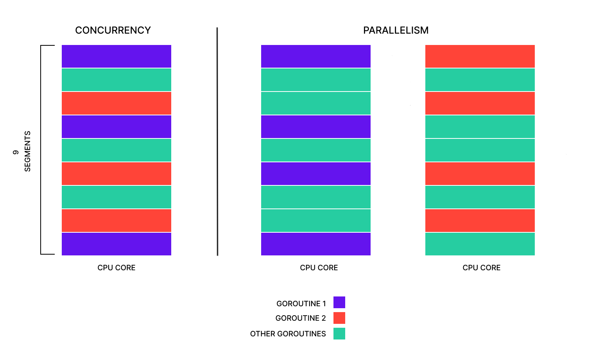

# 協程goroutine
by [@chimerakang](https://github.com/chimerakang)

---
## 介紹
Go 語言的流行功能之一是其對併發性的支持，即程式同步執行的能力。隨著電腦從更快地運行單一程式碼流轉向同時運行更多程式碼流，能夠併發運行程式碼正在成為程式設計的重要組成部分。為了更快地運行程序，程式設計師需要將程式設計為併發運行，以便程式的每個併發部分都可以獨立於其他部分運行。 Go 中的兩個功能，goroutines和Channels，一起使用時可以使併發變得更容易。 Goroutine 解決了程式中設定和運行併發程式碼的困難，而 Channel 解決了併發運行的程式碼之間安全通訊的困難。

在本教程中，您將探索 goroutine 和通道。首先，您將建立一個使用 goroutine 同時運行多個函數的程式。然後，您將向該程式添加通道以在正在運行的 goroutine 之間進行通訊。最後，您將向程式添加更多 goroutine 以模擬使用多個工作 goroutine 運行的程式。

---
## 與 Goroutine 同時運行函數
在現代電腦中，處理器或CPU被設計為同時運行盡可能多的程式碼流。這些處理器具有一個或多個“核心”，每個核心都能夠同時運行一個程式碼流。因此，程式可以同時使用的核心越多，程式運行的速度就越快。然而，為了使程式能夠利用多核心提供的速度提升，程式需要能夠拆分為多個程式碼流。將程式拆分為多個部分可能是程式設計中最具挑戰性的事情之一，但 Go 的設計目的是讓這件事變得更容易。

Go 實現此目的的一種方法是使用名為goroutine的功能。 Goroutine 是一種特殊類型的函數，可以在其他 Goroutine 運行時運行。當一個程式被設計為同時運行多個程式碼流時，該程式被設計為併發運行。通常，當一個函數被呼叫時，它會在繼續運行後的程式碼之前完全運行完畢。這被稱為在「前台」運行，因為它可以防止程式在完成之前執行任何其他操作。對於 Goroutine，函數呼叫將立即繼續運行下一個程式碼，而 Goroutine 在「後台」運行。如果程式碼在完成之前不會阻止其他程式碼運行，則該程式碼被視為在背景運行。

Goroutine 提供的強大功能是每個 Goroutine 可以同時在一個處理器核心上運作。如果你的電腦有四個處理器核心，而你的程式有四個 goroutine，則所有四個 goroutine 都可以同時運行。當多個程式碼流像這樣在不同的核心上同時運行時，稱為並行運行。

要直觀地了解併發性和並行性之間的差異，請考慮下圖。當處理器運行一個函數時，它並不總是一次從開始運行到完成。有時，當某個函數正在等待其他事情發生（例如讀取檔案）時，作業系統會在 CPU 核心上交錯其他函數、goroutines 或其他程式。該圖顯示了為併發設計的程式如何在單核和多核心上運行。它還展示了並行運行時與在單核上運行時相比，如何在同一時間幀中容納更多的 Goroutine 段（如圖所示，有 9 個垂直段）。



此圖分為兩列，標示為「併發」和「平行性」。併發列有一個高矩形，標記為 CPU 核心，分為不同顏色的堆疊部分，表示不同的功能。並行度列有兩個類似的高矩形，都標記為 CPU 核心，每個堆疊部分錶示不同的功能，只不過它只顯示 goroutine1 運行在左側核心上，goroutine2 運行在右側核心上。

圖中的左欄標記為「CONCURRENCY 併發」，顯示了圍繞併發設計的程式如何通過運行部分goroutine1，然後運行另一個函數、goroutine 或程序，然後運行goroutine2，然後goroutine1再次運行，從而在單個 CPU 核心上運行。對於用戶來說，這看起來就像程式正在同時運行所有函數或 goroutine，即使它們實際上是一個接一個地以小部分運行。

該圖右側標記為「PARALLELISM 平行性」的列顯示了相同的程式如何在具有兩個 CPU 核心的處理器上平行運行。第一個 CPU 核心顯示goroutine1與其他函數、goroutine 或程式一起運行，而第二個 CPU 核心顯示goroutine2在該核心上與其他函數或 goroutine 一起運行。有時，兩者同時運行，只是在不同的 CPU 核心上運行goroutine1。goroutine2

該圖還顯示了 Go 的另一個強大特性：可擴展性。當程式可以在從具有幾個處理器核心的小型電腦到具有數十個核心的大型伺服器的任何設備上運行並利用這些額外資源時，該程式就是可擴展的。該圖顯示，透過使用 goroutine，您的併發程式能夠在單一 CPU 核心上運行，但隨著添加更多 CPU 核心，可以並行運行更多 goroutine 以加快程式速度。

若要開始使用新的併發程序，請在您選擇的位置建立目錄。您可能已經有一個專案目錄，但在本教學中，您將建立一個名為 的目錄projects。您可以projects透過 IDE 或命令列建立該目錄。

如果您使用命令列，請先建立projects目錄並導航到該目錄：
```
mkdir projects
cd projects
```
在projects目錄中，使用mkdir命令建立程式的目錄 ( multifunc)，然後導航到該目錄：
```
mkdir multifunc
cd multifunc
```
進入目錄後，開啟一個名為using或您最喜歡的編輯器的multifunc檔案：main.go

```go
package main

import (
	"fmt"
)

func generateNumbers(total int) {
	for idx := 1; idx <= total; idx++ {
		fmt.Printf("Generating number %d\n", idx)
	}
}

func printNumbers() {
	for idx := 1; idx <= 3; idx++ {
		fmt.Printf("Printing number %d\n", idx)
	}
}

func main() {
	printNumbers()
	generateNumbers(3)
}
```
這個初始程式定義了兩個函數generateNumbers和printNumbers，然後在該函數中執行這些函數main。此generateNumbers函數將要「產生」的數字數量作為參數，在本例中為一到三，然後將每個數字列印到螢幕上。該printNumbers函數尚不接受任何參數，但它也會列印出數字一到三。

儲存main.go檔案後，使用以下命令運行它go run以查看輸出：

```
go run main.go
Printing number 1
Printing number 2
Printing number 3
Generating number 1
Generating number 2
Generating number 3
```
您將看到函數依序運行，printNumbers先運行，generateNumbers然後再運行。

現在，想像一下，printNumbers每個generateNumbers運行需要三秒鐘。當同步運行時，或像上一個範例一樣一個接一個地運行時，您的程式將需要六秒鐘的時間才能運行。首先，printNumbers跑三秒，然後generateNumbers再跑三秒。然而，在您的程式中，這兩個函數彼此獨立，因為它們不依賴另一個函數的資料來運行。您可以利用這一點，透過使用 goroutine 同時運行函數來加速這個假設的程式。當兩個函數同時運作時，理論上，程式的運行時間可以減少一半。如果printNumbers和generateNumbers函數都需要三秒鐘來運行並且兩者完全相同地啟動，則程式可以在三秒鐘內完成。 （不過，實際速度可能會因外部因素而有所不同，例如電腦有多少核心或電腦上同時運行的其他程式有多少。）

作為 goroutine 併發運行函數與同步運行函數類似。要將函數作為 goroutine 運行（而不是標準同步函數），只需go在函數呼叫之前添加關鍵字即可。

然而，為了讓程式同時運行 goroutine，您需要進行一項額外的更改。您需要添加一種方法讓您的程式等待兩個 goroutine 完成運行。如果您不等待 goroutine 完成並且main函數完成，則 goroutine 可能永遠不會運行，或者只有其中一部分可以運行但無法完整運行。

要等待函數完成，您將使用WaitGroupGo 的sync套件。該sync套件包含“同步原語”，例如WaitGroup，旨在同步程式的各個部分。在您的情況下，同步會追蹤兩個函數何時完成運行，以便您可以退出程式。

此原語的工作原理是使用、和函數WaitGroup計算需要等待的事物數量。此函數將計數增加提供給函數的數字，並將計數減少 1。然後，該函數可用於等待，直到計數達到零，這表示該函數已被呼叫足夠多次以抵消對 的呼叫。一旦計數達到零，函數將返回並且程式將繼續運行。

接下來，更新檔案中的程式碼main.go以使用關鍵字將兩個函數作為 goroutine 運行go，並將 a 添加sync.WaitGroup到程式中：

```go
package main

import (
	"fmt"
	"sync"
)

func generateNumbers(total int, wg *sync.WaitGroup) {
	defer wg.Done()

	for idx := 1; idx <= total; idx++ {
		fmt.Printf("Generating number %d\n", idx)
	}
}

func printNumbers(wg *sync.WaitGroup) {
	defer wg.Done()

	for idx := 1; idx <= 3; idx++ {
		fmt.Printf("Printing number %d\n", idx)
	}
}

func main() {
	var wg sync.WaitGroup

	wg.Add(2)
	go printNumbers(&wg)
	go generateNumbers(3, &wg)

	fmt.Println("Waiting for goroutines to finish...")
	wg.Wait()
	fmt.Println("Done!")
}
```
聲明後WaitGroup，它需要知道要等待多少事情。在啟動 goroutine 之前wg.Add(2)在函數中包含 a將告訴您等待兩個調用，然後再考慮該組已完成。如果在 goroutine 啟動之前沒有完成此操作，則事情可能會發生混亂，或者程式碼可能會出現恐慌，因為它不知道它應該等待任何呼叫。

然後，每個函數在函數完成運行後將使用defercallDone將計數減一。該函數也更新為包含對 的main調用，因此該函數將等待，直到兩個函數都調用才能繼續運行並退出程式。

儲存檔案後，像以前一樣main.go運行它：go run
```
go run main.go

Printing number 1
Waiting for goroutines to finish...
Generating number 1
Generating number 2
Generating number 3
Printing number 2
Printing number 3
Done!
```
您的輸出可能與此處列印的不同，甚至可能在每次執行程式時都會變更。當兩個函數同時運行時，輸出取決於 Go 和作業系統為每個函數運行提供的時間。有時有足夠的時間來完全運行每個函數，並且您會看到兩個函數不間斷地列印其整個序列。其他時候，您會看到像上面的輸出一樣散佈的文字。

您可以嘗試的一個實驗是刪除函數wg.Wait()中的呼叫main並再次運行該程式幾次go run。根據您的電腦的不同，您可能會看到generateNumbers和printNumbers函數的一些輸出，但也可能根本看不到它們的任何輸出。當您刪除對 的呼叫時Wait，程式將不再等待兩個函數完成運行才繼續。由於main函數在該Wait函數之後不久就結束，因此您的程式很有可能main在 goroutine 完成運行之前到達該函數的末尾並退出。發生這種情況時，您會看到列印出一些數字，但您不會看到每個函數的全部三個數字。

在本節中，您建立了一個程序，該程序使用go關鍵字同時運行兩個 goroutine 並列印一系列數字。您還使用了 async.WaitGroup讓您的程式在退出程式之前等待這些 goroutine 完成。

您可能已經注意到generateNumbers和printNumbers函數沒有傳回值。在 Go 中，goroutines 無法像標準函數那樣傳回值。您仍然可以使用go關鍵字來呼叫傳回值的函數，但這些傳回值將被丟棄，並且您將無法存取它們。那麼，當你需要從一個 goroutine 取得另一個 goroutine 的資料並且無法傳回值時，你該怎麼辦？解決方案是使用稱為「通道」的 Go 功能，它允許您將資料從一個 Goroutine 發送到另一個 Goroutine。

---
## 使用 Channel 讓 Goroutine 之間達成安全通信
併發程式設計更困難的部分之一是同時運行的程式的不同部分之間的安全通訊。如果您不小心，您可能會遇到只有併發程序才可能出現的問題。例如，當程式的兩個部分同時運行，並且一個部分嘗試更新變量，而另一部分嘗試同時讀取變量時，可能會發生資料爭用。發生這種情況時，讀取或寫入可能會無序，導致程式的一個或兩個部分使用錯誤的值。 「資料競賽」這個名稱來自於程式的兩個部分相互「競賽」存取資料。

雖然 Go 中仍然可能會遇到數據競爭等併發問題，但語言的設計目的是更容易避免這些問題。除了 goroutine 之外，通道是另一個使併發更安全、更易於使用的功能。通道可以被認為是兩個或多個不同 goroutine 之間的管道，可以透過它發送資料。一個 goroutine 將資料放入管道的一端，另一個 goroutine 取出相同的資料。確保資料從一個安全地傳輸到另一個的困難部分已為您處理。

在 Go 中建立通道類似於使用內建函數建立切片make()。通道的類型聲明使用chan關鍵字，後面接著要在通道上傳送的資料類型。例如，要建立用於傳送int值的通道，您可以使用 類型chan int。如果您想要一個發送值的通道[]byte，那就是chan []byte，如下所示：
```go
bytesChan := make(chan []byte)
```
建立通道後，您可以使用箭頭運算符在通道上傳送或接收資料<-。運算子相對於通道變數的位置<-決定了您是從通道讀取還是向通道寫入。

要寫入通道，請從通道變數開始，然後是運算<-符，然後是要寫入通道的值：
```go
intChan := make(chan int)
intChan <- 10
```
要從通道讀取值，請從要放入值的變數開始，或=為:=變數賦值，然後是<-運算符，然後是要從中讀取的通道：
```go
intChan := make(chan int)
intVar := <- intChan
```
為了讓這兩個操作保持直線，請記住箭頭<-始終指向左側（而不是->），並且箭頭指向值的去向會很有幫助。在寫入通道的情況下，箭頭將值指向通道。從通道讀取時，箭頭將通道指向變數。

與切片一樣，通道也可以使用range關鍵字 in a forloop來讀取。當使用關鍵字讀取通道時range，循環的每次迭代都會從通道讀取下一個值並將其放入循環變數中。然後它將繼續從通道讀取，直到通道關閉或for以其他方式退出循環，例如break：
```go
intChan := make(chan int)
for num := range intChan {
	// Use the value of num received from the channel
	if num < 1 {
		break
	}
}
```
在某些情況下，您可能只想允許函數讀取或寫入通道，而不是同時允許兩者。為此，您需要將<-運算子新增至chan類型聲明。與從通道讀取和寫入類似，通道類型使用箭頭<-來允許變數將通道限制為僅讀取、僅寫入或同時讀取和寫入。例如，要定義值的唯讀通道int，類型聲明將為<-chan int：
```go
func readChannel(ch <-chan int) {
	// ch is read-only
}
```
如果您希望通道是只寫的，您可以將其聲明為chan<- int：
```go
func writeChannel(ch chan<- int) {
	// ch is write-only
}
```
請注意，讀取時箭頭指向通道外，寫入時箭頭指向通道內。如果聲明沒有箭頭（如 的情況），chan int則通道可用於讀取和寫入。

最後，一旦不再使用某個通道，就可以使用內建close()函數將其關閉。此步驟至關重要，因為當創建通道然後在程式中多次閒置時，可能會導致所謂的記憶體洩漏。記憶體洩漏是指程式創建的內容耗盡了電腦上的內存，但在使用完畢後卻沒有將該內存釋放回電腦。這會導致程式隨著時間的推移慢慢（或有時不那麼慢）使用更多內存，就像漏水一樣。當使用 建立通道 時make()，電腦的一些記憶體將用於該通道，然後close()在通道上呼叫 時，該記憶體將返回給電腦以用於其他用途。

現在，更新main.go程式中的檔案以使用 `numberChan` 擔任在 goroutine 之間進行通訊。該generateNumbers函數將產生數字並將其寫入通道，同時該printNumbers函數將從通道讀取這些數字並將其列印到螢幕上。在該main函數中，您將建立一個新通道作為參數傳遞給每個其他函數，然後使用close()該通道來關閉它，因為它將不再被使用。該generateNumbers函數也不應該再是一個 goroutine，因為一旦該函數運行完畢，程式將完成產生它需要的所有數字。這樣，close()僅在兩個函數完成運行之前在通道上呼叫該函數。

```go
package main

import (
	"fmt"
	"sync"
)

func generateNumbers(total int, ch chan<- int, wg *sync.WaitGroup) {
	defer wg.Done()

	for idx := 1; idx <= total; idx++ {
		fmt.Printf("sending %d to channel\n", idx)
		ch <- idx
	}
}

func printNumbers(ch <-chan int, wg *sync.WaitGroup) {
	defer wg.Done()

	for num := range ch {
		fmt.Printf("read %d from channel\n", num)
	}
}

func main() {
	var wg sync.WaitGroup
	numberChan := make(chan int)

	wg.Add(2)
	go printNumbers(numberChan, &wg)

	generateNumbers(3, numberChan, &wg)

	close(numberChan)

	fmt.Println("Waiting for goroutines to finish...")
	wg.Wait()
	fmt.Println("Done!")
}
```
generateNumbers在和的參數中printNumbers，您將看到chan類型使用唯讀和唯寫類型。由於generateNumbers只需要能夠向通道寫入數字，因此它是一種只寫類型，箭頭<-指向Channel。printNumbers只需要能夠從Channel讀取數字，因此它是唯讀類型，箭頭<-指向遠離Channel的方向。

儘管這些類型可能是 a chan int，它允許讀取和寫入，但將它們限制為僅函數需要的類型會很有幫助，以避免意外導致程式因死鎖而停止運行。當程式的一個部分正在等待程式的另一部分執行某些操作，但程式的另一部分也在等待程式的第一部分完成時，可能會發生死鎖。由於程式的兩個部分都在互相等待，因此程式將永遠不會繼續運行，就像兩個齒輪卡住一樣。

由於 Go 中 Channel 通訊的工作方式，可能會發生死鎖。當程式的一部分正在寫入 Channel 時，它將等到程式的另一部分從該 Channel 讀取資料後再繼續。類似地，如果程式正在從 Channel 讀取數據，它將等到程式的另一部分寫入該 Channel 後才繼續。等待其他事情發生的程式的一部分被稱為阻塞，因為在其他事情發生之前它被阻止繼續運行。通道在寫入或讀取時會阻塞。因此，如果您有一個函數，您希望寫入 Channel，但意外地從 Channel 讀取數據，則您的程式可能會陷入死鎖，因為 Channel 永遠不會被寫入。確保這種情況永遠不會發生是使用 achan<- int或 a<-chan int而不僅僅是 a 的原因之一chan int。

更新後的程式碼的另一個重要方面是close()在完成寫入後用於關閉通道generateNumbers。在此程序中， close()導致for ... range循環printNumbers退出。由於使用range從通道讀取的操作會持續到其讀取的通道關閉為止，因此如果close不調用，numberChan則printNumbers永遠不會完成。如果printNumbersnever 完成，則退出時永遠不會呼叫WaitGroup的方法。如果該方法從未被 from 調用，則程式本身將永遠不會退出，因為函數中的s方法將永遠不會繼續。這是死鎖的另一個例子，因為函數正在等待永遠不會發生的事情。

go run現在，再次使用命令運行更新的程式碼main.go。
```
go run main.go
```

Output
```
sending 1 to channel
sending 2 to channel
read 1 from channel
read 2 from channel
sending 3 to channel
Waiting for functions to finish...
read 3 from channel
Done!
```
程式的輸出顯示generateNumbers函數正在產生數字 1 到 3，同時將它們寫入與 共享的通道printNumbers。一旦printNumbers收到號碼，它就會將其列印到螢幕上。generateNumbers產生所有三個數字後，它將退出，允許該main函數關閉通道並等待printNumbers完成。一旦printNumbers完成列印最後一個數字，它就會呼叫Done並WaitGroup退出程式。與先前的輸出類似，您看到的確切輸出將取決於各種外部因素，例如作業系統或 Go 運行時選擇運行特定的 goroutine，但它應該相對接近。

使用 goroutine 和通道設計程式的好處是，一旦您將程式設計為可拆分的，您就可以將其擴展到更多 goroutine。由於generateNumbers只是寫入通道，因此從該通道讀取多少其他內容並不重要。它只會將數字發送到讀取該通道的任何設備。您可以透過執行多個printNumbersgoroutine 來利用這一點，因此每個 goroutine 都會從同一通道讀取資料並同時處理資料。

現在您的程式正在使用通道進行通信，請main.go再次打開文件並更新您的程序，以便它啟動多個printNumbersgoroutine。您需要調整調用，wg.Add以便為您啟動的每個 goroutine 新增一個調用。您無需再擔心為呼叫添加 1 WaitGroup，generateNumbers因為程式在完成整個函數之前不會繼續，這與您將其作為 Goroutine 運行時不同。為了確保WaitGroup完成後計數不會減少，您應該defer wg.Done()從函數中刪除該行。接下來，加入 goroutine 的編號，以便printNumbers更容易看到每個 goroutine 如何讀取通道。增加產生的數字量也是一個好主意，這樣可以更容易看到數字的分佈：

```go
func generateNumbers(total int, ch chan<- int, wg *sync.WaitGroup) {
	for idx := 1; idx <= total; idx++ {
		fmt.Printf("sending %d to channel\n", idx)
		ch <- idx
	}
}

func printNumbers(idx int, ch <-chan int, wg *sync.WaitGroup) {
	defer wg.Done()

	for num := range ch {
		fmt.Printf("%d: read %d from channel\n", idx, num)
	}
}

func main() {
	var wg sync.WaitGroup
	numberChan := make(chan int)

	for idx := 1; idx <= 3; idx++ {
		wg.Add(1)
		go printNumbers(idx, numberChan, &wg)
	}

	generateNumbers(5, numberChan, &wg)

	close(numberChan)

	fmt.Println("Waiting for goroutines to finish...")
	wg.Wait()
	fmt.Println("Done!")
}
```
更新後，您可以再次運行您的程式。在繼續產生數字之前，您的程式應該啟動三個goroutine。您的程式現在還應該產生五個數字而不是三個，以便更容易看到數字分佈在三個goroutine 中
```
go run main.go
```

Output
```
sending 1 to channel
sending 2 to channel
sending 3 to channel
3: read 2 from channel
1: read 1 from channel
sending 4 to channel
sending 5 to channel
3: read 4 from channel
1: read 5 from channel
Waiting for goroutines to finish...
2: read 3 from channel
Done!
```
這次當您查看程式輸出時，它很可能與上面看到的輸出有很大差異。由於有三個printNumbersgoroutine 正在運行，因此存在確定哪個 goroutine 接收特定數字的機會。當一個printNumbersGoroutine 接收到一個數字時，它會花費少量時間將該數字列印到螢幕上，而另一個 Goroutine 從通道中讀取下一個數字並執行相同的操作。當 goroutine 完成列印數字的工作並準備讀取另一個數字時，它將返回並再次讀取通道以列印下一個數字。如果沒有更多的數字可以從通道中讀取，它將開始阻塞，直到可以讀取下一個數字。一旦generateNumbers完成並close()在通道上被調用，所有三個printNumbersgoroutine 將完成range循環並退出。當所有三個 goroutine 都退出並呼叫 時Done，WaitGroup的WaitGroup計數將達到零，程式將退出。您也可以嘗試增加或減少產生的 goroutine 或數字的數量，看看這對輸出有何影響。

使用 goroutine 時，避免啟動太多。理論上，一個程式可以有數百甚至數千個 goroutine。然而，根據程式運行的計算機，具有更多數量的 goroutine 實際上可能會更慢。由於 goroutine 數量較多，它有可能會遇到資源匱乏的情況。 Go 每次執行 goroutine 的一部分時，除了執行下一個函數中的程式碼所需的時間之外，還需要一點額外的時間才能再次開始運行。由於需要額外的時間，計算機在運行每個 goroutine 之間進行切換可能需要比實際運行 goroutine 本身更長的時間。當這種情況發生時，稱為資源匱乏，因為程式及其 goroutine 無法獲得運作所需的資源，或獲得的資源很少。在這些情況下，減少程式中同時運行的部分的數量可能會更快，因為這會減少在它們之間切換所需的時間，並為運行程式本身提供更多時間。記住程式運行在多少個核心上可以作為決定要使用多少個 goroutine 的良好起點。

使用 goroutine 和通道的組合可以創建非常強大的程序，能夠從小型桌上型電腦上運行擴展到大型伺服器。正如您在本節中看到的，通道可用於在少至幾個 Goroutine 到潛在數千個 Goroutine 之間進行通信，只需進行最小的更改。如果您在編寫程式時考慮到這一點，您將能夠利用 Go 中可用的併發性為使用者提供更好的整體體驗。

---
## Sleep
讓程式暫停。

這個功能是放在 package time 裡面的

```go
import "time"

time.Sleep(5 * time.Millisecond)
```
這個範例是暫停五秒鐘。

---
## Race condition
當使用併發同時執行程式，那就有可能會有同時搶奪資源的情況。比方說兩個 Thread 同時都要讀取並修改同一個變數，拿一個情境題來舉例：

如果今天同一個銀行的網路銀行有提款功能，而有人同時在兩台電腦都登入了要提款，兩台電腦都送出了提領 1000 的請求會怎樣呢？

```go
package main

import (
	"fmt"
	"sync"
	"time"
)

func withdraw() {
	balance := money
	time.Sleep(3000 * time.Millisecond)
	balance -= 1000
	money = balance
	fmt.Println("After withdrawing $1000, balace: ", money)
	wg.Done()
}

var wg sync.WaitGroup
var money int = 1500

func main() {
	fmt.Println("We have $1500")
	wg.Add(2)
	go withdraw() // first withdraw
	go withdraw() // second withdraw
	wg.Wait()
}
```
Output
```
$ go run race/race.go 
We have $1500
After withdrawing $1000, balace:  500
After withdrawing $1000, balace:  500
```
到最後大家會發現 1500 提領了兩次 1000 還剩 500？為甚麼呢？

因為在第一次提領的時候，系統先讀取餘額為 1500 元，同時第二台電腦也登入了餘額也是顯示為 1500 元，這時候就是因為兩邊同時搶著讀取餘額的原因，所以第一次提領 1000 元時回報給系統"餘額剩 500 元"，第二台領了 1000 元也回報系統"餘額剩 500 元"。

不過 Golang 的編譯器可以檢查是不是有 race condition，只要在平常執行 go run 後面加上參數 -race 即可。

```
go run -race race/race.go
```
Output
```
$ go run -race race/race.go 
We have $1500
==================
WARNING: DATA RACE
Write at 0x0001401021a0 by goroutine 8:
  main.withdraw()
      G:/GoProjects/src/go-quick-guide/demos/race/race.go:13 +0x50

Previous read at 0x0001401021a0 by goroutine 7:
  main.withdraw()
      G:/GoProjects/src/go-quick-guide/demos/race/race.go:10 +0x27

Goroutine 8 (running) created at:
  main.main()
      G:/GoProjects/src/go-quick-guide/demos/race/race.go:25 +0x9c

Goroutine 7 (running) created at:
  main.main()
      G:/GoProjects/src/go-quick-guide/demos/race/race.go:24 +0x90
==================
==================
WARNING: DATA RACE
Write at 0x0001401021a0 by goroutine 7:
  main.withdraw()
      G:/GoProjects/src/go-quick-guide/demos/race/race.go:13 +0x50

Previous read at 0x0001401021a0 by goroutine 8:
  main.withdraw()
      G:/GoProjects/src/go-quick-guide/demos/race/race.go:14 +0x96

Goroutine 7 (running) created at:
  main.main()
      G:/GoProjects/src/go-quick-guide/demos/race/race.go:24 +0x90

Goroutine 8 (running) created at:
  main.main()
      G:/GoProjects/src/go-quick-guide/demos/race/race.go:25 +0x9c
==================
After withdrawing $1000, balace:  500
After withdrawing $1000, balace:  500
Found 2 data race(s)
exit status 66
```

---
## Mutex、Lock()、Unlock()
那要如何避免這樣的情況發生呢？Mutex 可以解決上面這樣的問題。這個也是在 package sync 裏

```go
import "sync"

// declare mu as Mutex 
var mu sync.Mutex
```

當使用 mu.Lock() 的時候，之後所用到的變數就會上鎖，只有在使用中的 Thread 可以存取，其他都需要等到釋放後才能存取。

```go
mu.Lock()
```

釋放 lock 變數：

```
mu.Unlock()
```

所以我可以將剛剛 withdraw() 改良：
```go
func withdraw() {
  mu.Lock()
  balance := money
  time.Sleep(3000 * time.Millisecond)
  balance -= 1000
  money = balance
  mu.Unlock()
  fmt.Println("After withdrawing $1000, balace: ", money)
  wg.Done()
}
```

因為 Lock() 和 Unlock() 通常都會一起出現，所以有些人會這樣寫：

```go
func withdraw() {
  {
    mu.Lock()
    balance := money
    time.Sleep(3000 * time.Millisecond)
    balance -= 1000
    money = balance
    mu.Unlock()
  }
  fmt.Println("After withdrawing $1000, balace: ", money)
  wg.Done()
}
```

全部的程式碼：

```go
package main

import (
  "fmt"
  "sync"
  "time"
)

func withdraw() {
  mu.Lock()
  balance := money
  time.Sleep(3000 * time.Millisecond)
  balance -= 1000
  money = balance
  mu.Unlock()
  fmt.Println("After withdrawing $1000, balace: ", money)
  wg.Done()
}

var wg sync.WaitGroup
var money int = 1500
var mu sync.Mutex

func main() {
  fmt.Println("We have $1500")
  wg.Add(2)
  go withdraw() // first withdraw
  go withdraw() // second withdraw
  wg.Wait()
}
```

Output
```
$ go run mutex/mutex.go 
We have $1500
After withdrawing $1000, balace:  500
After withdrawing $1000, balace:  -500
```
如此一來就解決 race condition 的問題了！


---
## 結論
在本教程中，您使用go關鍵字建立了一個程式來啟動併發運行的 goroutine，這些 goroutine 在運行時會列印出數字。程式運行後，您可以int使用 建立一個新的值通道make(chan int)，然後使用該通道在一個 goroutine 中產生數字，並將它們發送到另一個 goroutine 以列印到螢幕上。最後，您同時啟動了多個「列印」goroutine，作為如何使用通道和 goroutine 來加速多核心電腦上的程式的範例。

---
[使用Channel](./channel.md)