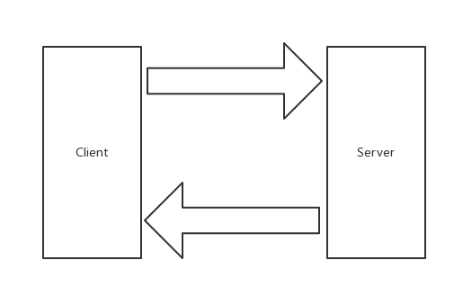

# grpc
by [@chimerakang](https://github.com/chimerakang)

---
## 介紹

本章節將使用Go 來編寫gRPC Server 和Client，讓其互相通訊。在此之上會使用到如下庫：

* google.golang.org/grpc
* github.com/golang/protobuf/protoc-gen-go

## 什麼是RPC
RPC 代指遠端過程呼叫（Remote Procedure Call），它的呼叫包含了傳輸協定和編碼（物件序號）協定等等。允許運行於一台電腦的程式呼叫另一台電腦的子程序，而開發人員無需額外地為這個交互作用編程

實際場景：
有兩台伺服器，分別是A、B。在A 上的應用程式C 想要呼叫B 伺服器上的應用程式D，它們可以直接本地呼叫嗎？ 答案是不能的，但走RPC 的話，十分方便。因此常有人稱使用RPC，就跟本地呼叫一個函數一樣簡單

### RPC 框架
我認為，一個完整的RPC 框架，應包含負載平衡、服務註冊和發現、服務治理等功能，並具有可拓展性便於流量監控系統等接入那麼它才算完整的，當然了。有些較單一的RPC 框架，透過組合多組件也能達到這個標準

你認為呢？

### 為什麼要RPC
簡單、通用、安全、效率

### RPC 可以基於HTTP 嗎
RPC 是代指遠端過程調用，是可以基於HTTP 協定的

一定會有人說效率優勢​​，我可以告訴你，那是基於HTTP/1.1 來講的，HTTP/2 優化了許多問題（當然也存在新的問題），所以你看到了本文的主題gRPC

## Protobuf
### 介紹
Protocol Buffers 是一種與語言、平台無關，可擴展的序列化結構化資料的方法，常用於通訊協議，資料儲存等等。相較於JSON、XML，它更小、更快、更簡單，因此也更受開發人員的青瞇

### 文法
```
syntax = "proto3";

service SearchService {
    rpc Search (SearchRequest) returns (SearchResponse);
}

message SearchRequest {
  string query = 1;
  int32 page_number = 2;
  int32 result_per_page = 3;
}

message SearchResponse {
    ...
}
```
1、第一行（非空的非註解行）聲明使用proto3語法。如果不聲明，將預設使用proto2語法。同時我建議用v2 還是v3，都應聲明其使用的版本

2、定義SearchServiceRPC 服務，其包含RPC 方法Search，入參為SearchRequest訊息，出參為SearchResponse訊息

3.定義SearchRequest、SearchResponse訊息，前者定義了三個字段，每一個字段包含三個屬性：類型、字段名稱、字段編號

4.Protobuf 編譯器會依照所選的語言不同，產生對應語言的Service Interface Code 和Stubs

最後，這裡只是簡單的文法介紹，詳細的請右轉Language Guide (proto3)

### 資料類型


### 相較Protobuf，為什麼不使用XML？
* 更簡單

* 資料描述檔只需原來的1/10至1/3

* 解析速度是原來的20倍至100倍

* 減少了二義性

* 產生了更容易使用的資料存取類

## gRPC
### 介紹
gRPC 是一個高效能、開源和通用的RPC 框架，面向行動和HTTP/2 設計

多語言
* C++
* C#
* Dart
* Go
* Java
* Node.js
* Objective-C
* PHP
* Python
* Ruby

### 特點
1、HTTP/2
2、Protobuf
3.客戶端、服務端基於同一份IDL
4.行動網路的良好支持
5.支援多語言

## 安裝
### gRPC
```
go get -u google.golang.org/grpc
```
### Protocol Buffers v3
```
wget https://github.com/google/protobuf/releases/download/v3.5.1/protobuf-all-3.5.1.zip
unzip protobuf-all-3.5.1.zip
cd protobuf-3.5.1/
./configure
make
make install
```
檢查是否安裝成功

```
protoc --version
```

### Protoc Plugin
```
go get -u github.com/golang/protobuf/protoc-gen-go
```
安裝環境若有問題，可參考我先前的文章《介紹與環境安裝》內有詳細介紹，不再贅述

## gRPC
本小節開始正式寫gRPC 相關的程序


### 目錄結構
```
$ tree go-grpc-example 
go-grpc-example
├── client
├── proto
│   └── search.proto
└── server.go
```
### IDL
編寫
在proto 資料夾下的search.proto 檔案中，寫入如下內容：

```
syntax = "proto3";

package proto;

service SearchService {
    rpc Search(SearchRequest) returns (SearchResponse) {}
}

message SearchRequest {
    string request = 1;
}

message SearchResponse {
    string response = 1;
}
```
### 產生
在proto 資料夾下執行如下命令：

```
$ protoc --go_out=plugins=grpc:. *.proto
```
* plugins=plugin1+plugin2：指定要載入的子插件列表

我們定義的proto 檔案是涉及了RPC 服務的，而預設是不會產生RPC 代碼的，因此需要給出plugins參數傳遞給protoc-gen-go，告訴它，請支援RPC（這裡指定了gRPC）

* --go_out=.：設定Go 程式碼輸出的目錄


此指令會載入protoc-gen-go 插件達到產生Go 程式碼的目的，產生的檔案以.pb.go 為檔案後綴

* : （冒號）

冒號充當分隔符號的作用，後面接著所需的參數集。若這處不涉及RPC，命令可簡化為：

```
$ protoc --go_out=. *.proto
```
註：建議你看看兩個指令產生的.pb.go 文件，分別有什麼差別

生成後
執行完畢指令後，將得到一個.pb.go 文件，文件內容如下：

```go
type SearchRequest struct {
    Request              string   `protobuf:"bytes,1,opt,name=request" json:"request,omitempty"`
    XXX_NoUnkeyedLiteral struct{} `json:"-"`
    XXX_unrecognized     []byte   `json:"-"`
    XXX_sizecache        int32    `json:"-"`
}

func (m *SearchRequest) Reset()         { *m = SearchRequest{} }
func (m *SearchRequest) String() string { return proto.CompactTextString(m) }
func (*SearchRequest) ProtoMessage()    {}
func (*SearchRequest) Descriptor() ([]byte, []int) {
    return fileDescriptor_search_8b45f79ee13ff6a3, []int{0}
}

func (m *SearchRequest) GetRequest() string {
    if m != nil {
        return m.Request
    }
    return ""
}
```
透過閱讀這一部分程式碼，可以知道主要涉及以下方面：

欄位名稱從小寫下劃線轉換為大寫駝峰模式（欄位匯出）

產生一組Getters 方法，能便於處理一些空指標取值的情況

ProtoMessage 方法實作proto.Message 的介面

產生Rest 方法，方便將Protobuf 結構體恢復為零值

Repeated 轉換為切片

```go
type SearchRequest struct {
    Request              string   `protobuf:"bytes,1,opt,name=request" json:"request,omitempty"`
}

func (*SearchRequest) Descriptor() ([]byte, []int) {
    return fileDescriptor_search_8b45f79ee13ff6a3, []int{0}
}

type SearchResponse struct {
    Response             string   `protobuf:"bytes,1,opt,name=response" json:"response,omitempty"`
}

func (*SearchResponse) Descriptor() ([]byte, []int) {
    return fileDescriptor_search_8b45f79ee13ff6a3, []int{1}
}

...

func init() { proto.RegisterFile("search.proto", fileDescriptor_search_8b45f79ee13ff6a3) }

var fileDescriptor_search_8b45f79ee13ff6a3 = []byte{
    // 131 bytes of a gzipped FileDescriptorProto
    0x1f, 0x8b, 0x08, 0x00, 0x00, 0x00, 0x00, 0x00, 0x02, 0xff, 0xe2, 0xe2, 0x29, 0x4e, 0x4d, 0x2c,
    0x4a, 0xce, 0xd0, 0x2b, 0x28, 0xca, 0x2f, 0xc9, 0x17, 0x62, 0x05, 0x53, 0x4a, 0x9a, 0x5c, 0xbc,
    0xc1, 0x60, 0xe1, 0xa0, 0xd4, 0xc2, 0xd2, 0xd4, 0xe2, 0x12, 0x21, 0x09, 0x2e, 0xf6, 0x22, 0x08,
    0x53, 0x82, 0x51, 0x81, 0x51, 0x83, 0x33, 0x08, 0xc6, 0x55, 0xd2, 0xe1, 0xe2, 0x83, 0x29, 0x2d,
    0x2e, 0xc8, 0xcf, 0x2b, 0x4e, 0x15, 0x92, 0xe2, 0xe2, 0x28, 0x82, 0xb2, 0xa1, 0x8a, 0xe1, 0x7c,
    0x23, 0x0f, 0x98, 0xc1, 0xc1, 0xa9, 0x45, 0x65, 0x99, 0xc9, 0xa9, 0x42, 0xe6, 0x5c, 0x6c, 0x10,
    0x01, 0x21, 0x11, 0x88, 0x13, 0xf4, 0x50, 0x2c, 0x96, 0x12, 0x45, 0x13, 0x85, 0x98, 0xa3, 0xc4,
    0x90, 0xc4, 0x06, 0x16, 0x37, 0x06, 0x04, 0x00, 0x00, 0xff, 0xff, 0xf3, 0xba, 0x74, 0x95, 0xc0,
    0x00, 0x00, 0x00,
}
```
而這一部分程式碼主要是圍繞著fileDescriptor進行，在這裡fileDescriptor_search_8b45f79ee13ff6a3表示一個編譯後的proto 文件，而每一個方法都包含Descriptor 方法，代表著這一個方法在 中fileDescriptor具體的Message Field

## Server
這一小節將編寫gRPC Server 的基礎模板，完成一個方法的呼叫。對server.go 寫入如下內容：

```go
package main

import (
    "context"
    "log"
    "net"

    "google.golang.org/grpc"

    pb "github.com/chimerakang/go-grpc-example/proto"
)

type SearchService struct{}

func (s *SearchService) Search(ctx context.Context, r *pb.SearchRequest) (*pb.SearchResponse, error) {
    return &pb.SearchResponse{Response: r.GetRequest() + " Server"}, nil
}

const PORT = "9001"

func main() {
    server := grpc.NewServer()
    pb.RegisterSearchServiceServer(server, &SearchService{})

    lis, err := net.Listen("tcp", ":"+PORT)
    if err != nil {
        log.Fatalf("net.Listen err: %v", err)
    }

    server.Serve(lis)
}
```
* 建立gRPC Server 對象，你可以理解為它是Server 端的抽象對象

* 將SearchService（其包含需要被呼叫的服務端介面）註冊到gRPC Server 的內部註冊中心。這樣可以在接受到請求時，透過內部的服務發現，發現該服務端介面並轉接進行邏輯​​處理

* 建立Listen，監聽TCP 端口

* gRPC Server 開始lis.Accept，直到Stop 或GracefulStop

## Client
接下來編寫gRPC Go Client 的基礎模板，開啟client/client.go 文件，寫入以下內容：

```go
package main

import (
    "context"
    "log"

    "google.golang.org/grpc"

    pb "github.com/chimerakang/go-grpc-example/proto"
)

const PORT = "9001"

func main() {
    conn, err := grpc.Dial(":"+PORT, grpc.WithInsecure())
    if err != nil {
        log.Fatalf("grpc.Dial err: %v", err)
    }
    defer conn.Close()

    client := pb.NewSearchServiceClient(conn)
    resp, err := client.Search(context.Background(), &pb.SearchRequest{
        Request: "gRPC",
    })
    if err != nil {
        log.Fatalf("client.Search err: %v", err)
    }

    log.Printf("resp: %s", resp.GetResponse())
}
```
* 創建與給定目標（服務端）的連接交互

* 建立SearchService 的客戶端對象

* 發送RPC 請求，等待同步回應，得到回呼後回傳回應結果

* 輸出響應結果

## 驗證
### 啟動Server
```
$ pwd
$GOPATH/github.com/chimerakang/go-grpc-example
$ go run server.go
```

### 啟動Client
```
$ pwd             
$GOPATH/github.com/chimerakang/go-grpc-example/client
$ go run client.go 
$ resp: gRPC Server
```
總結
在本章節，我們分別對Protobuf、gRPC Client/Server 都進行了介紹。希望你結合文中講述內容再寫一個Demo 進行深入了解，一定會更棒

---
## Next: [TLS 證書認證](./grpc2.md)