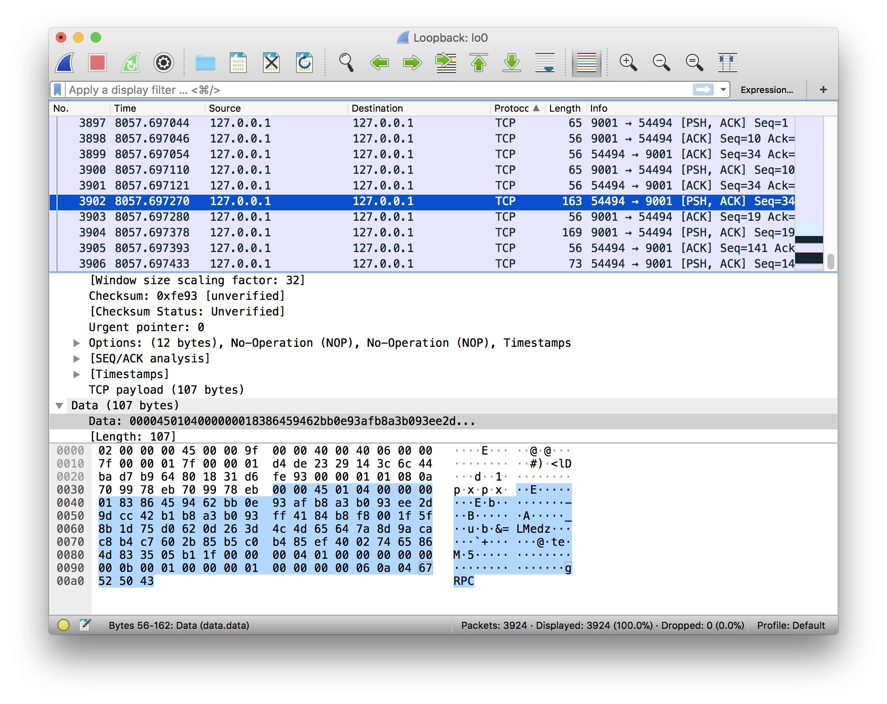
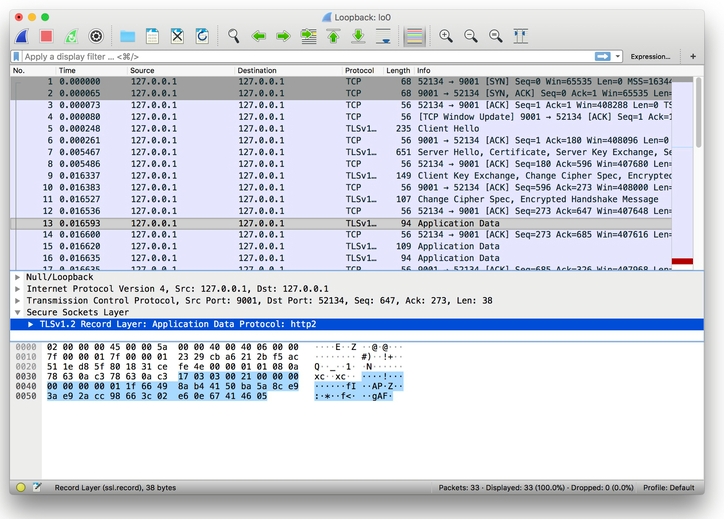

# TLS 證書認證

by [@chimerakang](https://github.com/chimerakang)

---
## 介紹
在前面的章節裡，我們介紹了gRPC 的四種API 使用方式。是不是很簡單呢😀

此時有一個安全問題，先前的例子中gRPC Client/Server 都是明文傳輸的，會不會有被竊聽的風險呢？

從結論上來講，是有的。在明文通訊的情況下，你的請求就是裸奔的，有可能被第三方惡意竄改或偽造為「非法」的數據

### 抓個封包

[](../images/grpc-3.jpg)

嗯，明文傳輸無誤。這是有問題的，接著將改造我們的gRPC，以便於解決這個問題

## 證書生成
### 私鑰
```
openssl ecparam -genkey -name secp384r1 -out server.key
```
### 自簽公鑰
```
openssl req -new -x509 -sha256 -key server.key -out server.pem -days 3650
```
### 填寫資訊
```
Country Name (2 letter code) []:
State or Province Name (full name) []:
Locality Name (eg, city) []:
Organization Name (eg, company) []:
Organizational Unit Name (eg, section) []:
Common Name (eg, fully qualified host name) []:go-grpc-example
Email Address []:
```
### 生成完畢
產生憑證結束後，將憑證相關檔案放到conf/ 下，目錄結構：

```
go-grpc-example
├── client
├── conf
│   ├── server.key
│   └── server.pem
├── proto
└── server
    ├── simple_server
    └── stream_server
```    
由於本文偏向gRPC，詳解可參考《製作證書》。後續番外可能會展開細節描述👌

## 為什麼之前不需要證書
在simple_server 中，為什麼「啥事都沒幹」就能在不需要憑證的情況下運作呢？

### Server
```go
grpc.NewServer()
```
在服務端顯然沒有傳入任何DialOptions

### Client
```go
conn, err := grpc.Dial(":"+PORT, grpc.WithInsecure())
```
在客戶端留意到grpc.WithInsecure()方法

```
func WithInsecure() DialOption {
    return newFuncDialOption(func(o *dialOptions) {
        o.insecure = true
    })
}
```
在方法內可以看到WithInsecure傳回一個DialOption，並且它最終會透過讀取設定的值來停用安全傳輸

那麼它「最終」又是在哪裡處理的呢，我們把視線移到grpc.Dial()方法內

```go
func DialContext(ctx context.Context, target string, opts ...DialOption) (conn *ClientConn, err error) {
    ...

    for _, opt := range opts {
        opt.apply(&cc.dopts)
    }
    ...

    if !cc.dopts.insecure {
        if cc.dopts.copts.TransportCredentials == nil {
            return nil, errNoTransportSecurity
        }
    } else {
        if cc.dopts.copts.TransportCredentials != nil {
            return nil, errCredentialsConflict
        }
        for _, cd := range cc.dopts.copts.PerRPCCredentials {
            if cd.RequireTransportSecurity() {
                return nil, errTransportCredentialsMissing
            }
        }
    }
    ...

    creds := cc.dopts.copts.TransportCredentials
    if creds != nil && creds.Info().ServerName != "" {
        cc.authority = creds.Info().ServerName
    } else if cc.dopts.insecure && cc.dopts.authority != "" {
        cc.authority = cc.dopts.authority
    } else {
        // Use endpoint from "scheme://authority/endpoint" as the default
        // authority for ClientConn.
        cc.authority = cc.parsedTarget.Endpoint
    }
    ...
}
```

## gRPC
接下來我們將正式開始編碼，在gRPC Client/Server 上實作TLS 憑證認證的支援🤔

### TLS Server
```go
package main

import (
    "context"
    "log"
    "net"

    "google.golang.org/grpc"
    "google.golang.org/grpc/credentials"

    pb "github.com/chimerakang/go-grpc-example/proto"
)

...

const PORT = "9001"

func main() {
    c, err := credentials.NewServerTLSFromFile("../../conf/server.pem", "../../conf/server.key")
    if err != nil {
        log.Fatalf("credentials.NewServerTLSFromFile err: %v", err)
    }

    server := grpc.NewServer(grpc.Creds(c))
    pb.RegisterSearchServiceServer(server, &SearchService{})

    lis, err := net.Listen("tcp", ":"+PORT)
    if err != nil {
        log.Fatalf("net.Listen err: %v", err)
    }

    server.Serve(lis)
}
```

* credentials.NewServerTLSFromFile：根據服務端輸入的憑證檔案和金鑰建構TLS 憑證

```go
func NewServerTLSFromFile(certFile, keyFile string) (TransportCredentials, error) {
    cert, err := tls.LoadX509KeyPair(certFile, keyFile)
    if err != nil {
        return nil, err
    }
    return NewTLS(&tls.Config{Certificates: []tls.Certificate{cert}}), nil
}
```
* grpc.Creds()：傳回一個ServerOption，用於設定伺服器連線的憑證。用於`grpc.NewServer(opt ...ServerOption)`為gRPC Server 設定連線選項

```go
func Creds(c credentials.TransportCredentials) ServerOption {
    return func(o *options) {
        o.creds = c
    }
}
```
經過以上兩個簡單步驟，gRPC Server 就建立起需憑證認證的服務啦🤔

### TLS Client
```go
package main

import (
    "context"
    "log"

    "google.golang.org/grpc"
    "google.golang.org/grpc/credentials"

    pb "github.com/chimerakang/go-grpc-example/proto"
)

const PORT = "9001"

func main() {
    c, err := credentials.NewClientTLSFromFile("../../conf/server.pem", "go-grpc-example")
    if err != nil {
        log.Fatalf("credentials.NewClientTLSFromFile err: %v", err)
    }

    conn, err := grpc.Dial(":"+PORT, grpc.WithTransportCredentials(c))
    if err != nil {
        log.Fatalf("grpc.Dial err: %v", err)
    }
    defer conn.Close()

    client := pb.NewSearchServiceClient(conn)
    resp, err := client.Search(context.Background(), &pb.SearchRequest{
        Request: "gRPC",
    })
    if err != nil {
        log.Fatalf("client.Search err: %v", err)
    }

    log.Printf("resp: %s", resp.GetResponse())
}
```
* credentials.NewClientTLSFromFile()：根據客戶端輸入的憑證檔案和金鑰建構TLS 憑證。 serverNameOverride 為服務名稱

```go
func NewClientTLSFromFile(certFile, serverNameOverride string) (TransportCredentials, error) {
    b, err := ioutil.ReadFile(certFile)
    if err != nil {
        return nil, err
    }
    cp := x509.NewCertPool()
    if !cp.AppendCertsFromPEM(b) {
        return nil, fmt.Errorf("credentials: failed to append certificates")
    }
    return NewTLS(&tls.Config{ServerName: serverNameOverride, RootCAs: cp}), nil
}
```
* `grpc.WithTransportCredentials()`：傳回一個配置連線的DialOption 選項。用於`grpc.Dial(target string, opts ...DialOption)` 設定連線選項

```go
func WithTransportCredentials(creds credentials.TransportCredentials) DialOption {
    return newFuncDialOption(func(o *dialOptions) {
        o.copts.TransportCredentials = creds
    })
}
```
## 驗證
### 請求
重新啟動server.go 和執行client.go，得到回應結果

```
$ go run client.go
$ resp: gRPC Server
```
### 抓個封包


成功。

## 總結
在這個章節我們實作了gRPC TLS Client/Servert，你以為大功告成了嗎？我不😤

## 問題
你仔細再看看，Client 是基於Server 端的憑證和服務名稱來建立請求的。這樣的話，你就需要將Server 的憑證透過各種手段給到Client 端，否則是無法完成這項任務的

問題也來了，你無法保證你的「各種手段」是安全的，畢竟現在的網路環境是很危險的，萬一被...

我們將在下一章解決這個問題，保證其可靠性

---
## Next: [基於CA 的TLS 憑證認證](./grpc3.md)