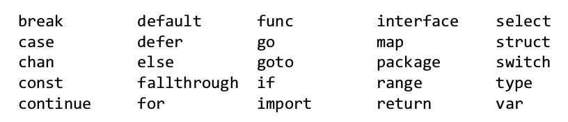
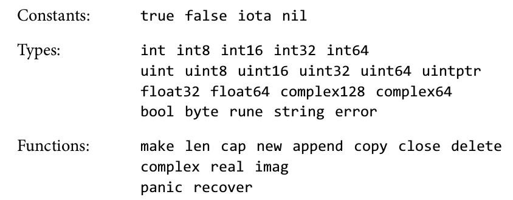
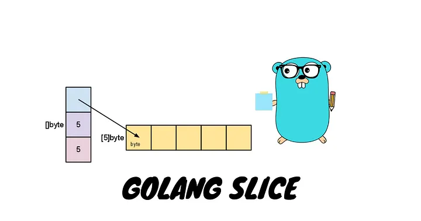
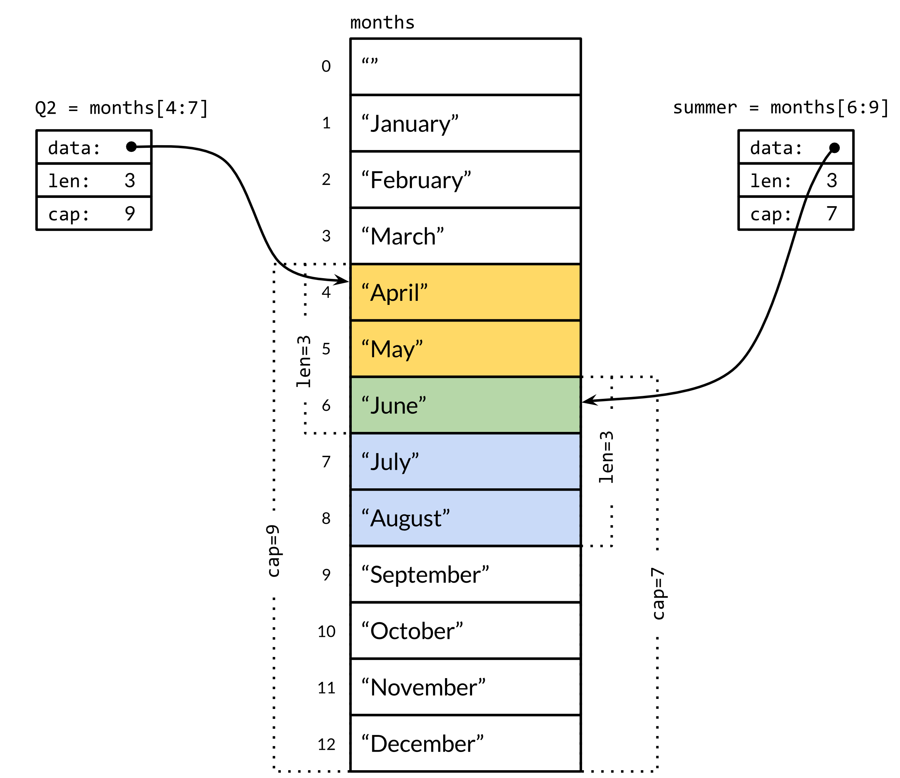
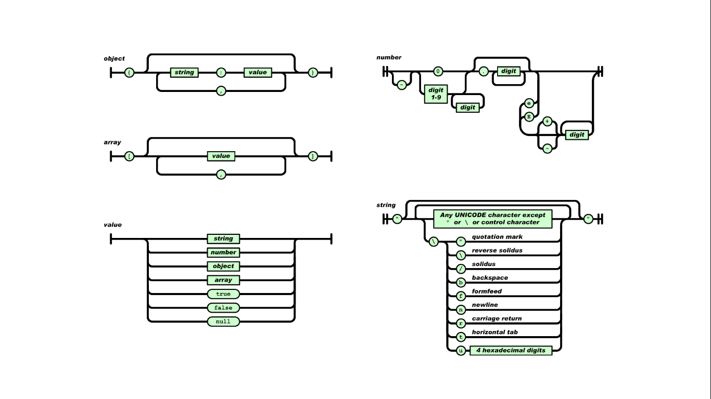

# Go 入門指南

by [@chimerakang](https://github.com/chimerakang)

---
## 內容概要

* 變數
* 基本類型
* 控制結構
* 函數func
* [協程goroutine](./goroutine.md)
* [管道channel](./channel.md)
* [套件package](./package.md)
* 複合類型
* 結構struct
* 方法method
* [介面interface](./interface.md)
* [流程控制](./flow-1.md)
* [網頁web](./web-1.md)
* [資料庫](./database-1.md)
---

## 變數= 名稱+ 類型[+ 初始值]

```go
var i int // declare but not assigned, 0 by default
var j int = 1 // declare and assigned
var k float64 = 3.3 // declare k as float64 variable

// infer type by value
var isprime = false // bool

// declare more
var a, b, c int = 3, 4, 5

// declare and assigned
k := 2
x, y := 320, 240
```

---

## 關鍵字



### 預定義的名稱



---


## 基本類型

* 數值類型
* 布林類型
* 字串
* 常數
* 指標

---

## 基本類型

* 數值類型
	* 整型
		* `int`, `int8`, `int16`, `int32`, `int64`
		* `uint`, `uint8`, `uint16`, `uint32`, `uint64`
	* 浮點型
		* `float32`
		* `float64`	

---

* 布林類型
	* `bool`, `true`, `false`
* 字串
	* `string`
	* UTF-8
* 常數
	* `const`
* 指標
	* 有取地址操作符（`&`）
	* 也用成員運算子（`.`），自動解引用，（for struct）
	* 無解引用操作符（`*`和`->`），（for struct）

---

## 基本類型

```go
	var number uint32 = 0x12345678
	var number uint64 = 0x1234567812345678

	var r float32 = 5.0
	var pi float64 = 3.141592653525
	

	var name string = "Brian W. Kernighan"
```


demo: [basic-types.go](https://github.com/chimerakang/go-quick-guide/demos/basic-types/basic-types.go)

---

## 控制結構

* `for`
	* 沒有`while`
	* 有`break`/`continue`
* `if`/`else`
  * 條件式必須是`bool`值
  * 條件表達式前可以定義變量，作用域等同`if`/`else`
* `switch`/`case`
  * 變數在`case`上
  * 字串在`case`上
  * 多個值在一個`case`上
  * type switch

demo: 
[if.go](https://github.com/chimerakang/go-quick-guide/demos/if/if.go) 
[for.go](https://github.com/chimerakang/go-quick-guide/demos/for/for.go) 
[switch.go](https://github.com/chimerakang/go-quick-guide/demos/switch/switch.go)

---

## 函數`func`

* 支援參數（如`fmt.Printf`）
* 支援多重回傳值（`return a, b, c`）
* 第一類值（first-class value）
	* 賦給變數
	* 作函數的參數、回傳值

---

## 函數`func`

* 匿名函數
	* 允許直接呼叫（`func () { /* ... */ } ()`）
	* 允許巢狀定義（在匿名函數中定義函數）
		* 引用外部函數的變數（閉包）
* 延遲呼叫`defer`/`recover`
* 內建函數
	* `make`/`new`/`len`/`cap`/`append`/`copy`/`close`/`delete`
	* `complex`/`real`/`imag` | `panic`/`recover`

demo: [func.go](https://github.com/chimerakang/go-quick-guide/demos/func/func.go)

---

## 協程goroutine

協程（coroutine），輕量級線程

* 更小的記憶體消耗
* 更快的創建時間
* 更短的程式碼
	* `go funcName(args)`
	* `go func(parameters) { /* */ } (arguments)`

---

## 管道channel

輕量級管道（`pipe`）

* CSP, Communicating Sequential Processes
	* 也叫actor 模式
	* vs shared memory multi-thread
* 類似Java的阻塞佇列（生產者-消費者佇列）
	* 滿時阻塞push的線程
	* 空時阻塞pop的線程
* 第一類值（first-class value）

demo: [producer-consumer.go](https://github.com/chimerakang/go-quick-guide/demos/producer-consumer/producer-consumer.go)

---

## 套件package

* 模組化modularity
* 名稱空間name space
	* 避免名稱衝突
	* 隱藏部分名稱
* `main`套件的`main`函數是程式入口
* 宣告
	* `package main`

---

## 導入import

* 宣告將要使用套件中的符號（函數、變數等）
* 兩種語法
	* 單一導入

		```go
		import "fmt"
		import "math"
		```

	* 多個導入

		```go
		import (
			"fmt"
			"math"
		)
		```

---

## 複合型別

* 陣列array
* 切片slice
* 映射map
* 結構struct
* JSON

---

### 陣列array

* 相同類型的定長(fixed-length)元素序列
* 類型： [N]T
* 創建：

   ```go
   var a [3]int
   b := [...]int{1, 2, 3}
   c := [3]int{1, 2, 3}
   ```

* 訪問：
	* `a[i]`
* 迭代：
	* range based for
	* `for i, v := range a { /* ... */ }`

[詳細介紹陣列](./array.md)
demo: [arrays.go](https://github.com/chimerakang/go-quick-guide/demos/arrays/arrays.go)

---

### 切片（類型） slice



---

* 相同類型的**變長**(variable-length)元素序列
* 與數組的重要區別：不持有內存
* 通常是數組的一部分
* 類型：[]T
* 創建：
   ```go
   // create a slice using `make`
   s := make([]string, 3)

   // create a slice from slice-literal
   t := []string {"s", "l", "i", "c", "e"}

   // from slice operation result
   st := t[2:]
   ```
* 訪問、迭代與數組相同

---

#### 切片運算子slice operator

* 可用於array或slice
* 結果為slice
* 文法:
	* `s[i:j]`, `s[i:]`, `s[:j]`, `s[:]`


```go
months := [...]string{"January", /* ... */, "December"}
Q2 := months[4:7]
summer := months[6:9]
```

[詳細介紹slice](./slice.md)
demo: 
[slices.go](https://github.com/chimerakang/go-quick-guide/demos/slices/slices.go) 
[slice-as-args.go](https://github.com/chimerakang/go-quick-guide/demos/slice-as-args/slice-as-args.go)

---



---

### 映射`map`

* hash表，鍵值映射
* 類型： map[K]V
* 創建：
	```go
	// create from map literal
	n := map[string]int {"foo": 1, "bar": 2}

	// use make create map
	m := make(map[string]int) // map[string]int{}
	```
* 讀取/更新： `v = m[key]`, `m[key] = newValue`
* 迭代： `for k, v := range m { /* ... */ }`
	* 格式同數組、切片的迭代
* 刪除： `delete(m, key)`
	* map特有

demo: [map.go](https://github.com/chimerakang/go-quick-guide/demos/map/map.go)

---

### 結構`struct`

* 支援抽象（Abstraction）
	* 聚合了0或多個變數
	* 可以聚合其他`struct`
* 支援封裝（Encapsulation）
	* 類似Java/C++/C#中的`private`
	* 首字母大寫的標識符會匯出到套件（`package`）外
* 結構指針
	* 無解引用操作符（`->`）
	* 也用成員運算子（`.`），自動解引用
* 不支援繼承（Inheritance）、多型式（Polymorphism）
	* OOP語言四大特性，Java/C++/Python/...

demo: [struct.go](https://github.com/chimerakang/go-quick-guide/demos/struct/struct.go)

---
## JSON



---


* JSON, JavaScript Object Notation
	* http://json.org/
	* vs XML, ASN.1, ProtoBuf
* 標準庫支持
	* `encoding/json`
	* 編碼：`json.Marshal`/`json.MarshalIndent`
	* 解碼：`json.Unmarshal`
* 反射
	* 透過名稱取得變數類型、值等信息

demo: [json.go](https://github.com/chimerakang/go-quick-guide/demos/json/json.go)

---

## 含式 method

vs C++/Java的方法
* 類似
	* 和相關struct的資料成員名在同一個名稱空間
* 區別
	* method和struct是分開定義的、不耦合
* receiver
	* 不只是struct，可以是其他類型
* method value
	* 一個綁定了receiver的method、是個函數

demo: [method.go](https://github.com/chimerakang/go-quick-guide/demos/method/method.go)

---

## 介面interface

vs Java的interface

* 抽像一類struct
* 類似
  * 方法集合
  * 沒有數據
  * 可以複合其他interface（類似Java的介面繼承）
* 區別
	* 符合Satisfies（類似Java的實作`implements`）
		* struct有interface聲明的所有方法
		* 才可與將`struct`賦值給`interface` (類似)
	* 沒有實際類型依賴（Java的`B implements A`，有依賴）

demo: [interface.go](https://github.com/chimerakang/go-quick-guide/demos/interface/interface.go)

---

trick: any

```go
var any interface{}

any = true
any = 12.3
any = 1234
any = "hello"
any = new(bytes.Buffer)
any = map[string]int{"one": 1}
```

## 流程控制
[流程控制1](./flow-1.md)

---
## Next
[入門-2](./introduce-2.md)

---
## 引用

1. Go 官網：https://golang.org/
2. A Tour of Go: https://tour.golang.org/
3. Go 指南(Tour中文版): https://tour.go-zh.org/list
4. Go by example: https://gobyexample.com/
5. 《Go in Action》: http://www.salttiger.com/go-in-action/
6. 《The Go Programming Language》: http://www.salttiger.com/the-go-programming-language/