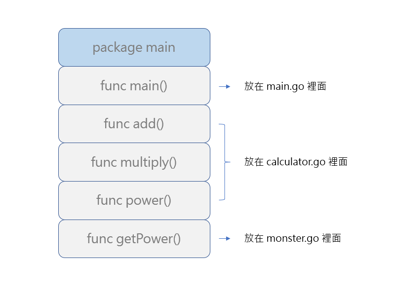
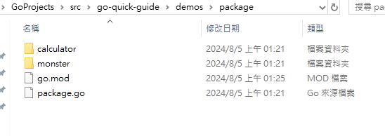
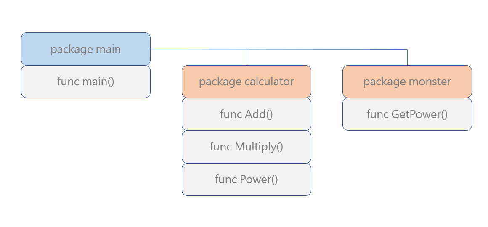

# 套件 package 

by [@chimerakang](https://github.com/chimerakang)

---

## 介紹
在 1.13 版本中，Go 的作者添加了一種管理 Go 專案所依賴的庫的新方法，稱為Go 模組。增加 Go 模組是為了滿足不斷增長的需求，使開發人員更容易維護其依賴項的各種版本，並為開發人員在電腦上組織專案的方式增加更多靈活性。 Go 模組通常由一個專案或函式庫組成，並包含一組隨後一起發布的 Go 套件。 Go 模組透過允許使用者將專案程式碼放在他們選擇的目錄中並為每個模組指定依賴項的版本，解決了GOPATH原始系統的許多問題。

在本教程中，您將創建自己的公共 Go 模組並為新模組添加一個套件。此外，您還可以將其他人的公共模組新增至您自己的專案中，以及將該模組的特定版本新增至您的專案。

在 Golang 當中，我們可以把常用的一套流程組合成一個 func（函式），每當我們需要使用的時候就呼叫它，例如：

```go
package main

import "fmt"

func add(x, y int) int {
    return x + y
}

func multiply(x, y int) int {
    return x * y
}

func power(x, y int) int {
    result := 1
    for i := 0; i < y; i++ {
        result *= x
    }
    return result
}

func main() {
    fmt.Println(power(3, 7))
}
```
由於這些是函式的基本用法，就不多講。今天來講講在 Golang 裡 package 的引用和建立吧！

性質相近的函式，該怎麼分類和引用？
我們可以把程式碼分成好幾個 go 檔案，把同類的函式丟到同一個 go 的原始碼檔案裡面，以此初步分類。比方說：資料夾裡目前有一個裝有 main() 函式的 main.go 和一個裝有 add、multiply、power 函式的 calculator.go，這樣我們在開發的時候就可以很快地找到這些專門用來計算數值的函式。

然而對於一個有規模的程式來說，僅僅這麼做還是遠遠不夠的，畢竟整個程式裡面可能會有各式各樣的不同函式，一旦多起來仍然會混雜在一起，就好像即使我們把上千個學生按照編號分班，一旦把他們通通塞到體育館裡面，看起來還是雜亂無章。

舉個例子，假設你正在利用 Golang 開發某個遊戲的核心，你也許正好使用到一個計算次方用的函數 power(x, y)，又有另一個函數叫做 getPower(monsterID) 用來取得怪物的力量數值。倘若你只是把它們分別放到 calculator.go 和 monster.go，這些函式實際上仍然都隸屬於 package main 底下：



在呼叫函式的時候，這些函式也可能因為名字長得太像，讓人容易混淆、難以閱讀：
```go
func main() {
    monsterID := 5
    monsterPower := getPower(monsterID)
    monsterPowerEx := power(monsterPower, 2)
    fmt.Printf("%d 號怪物的力量是 %d, 進化之後力量變成 %d!\n", monsterID, monsterPower, monsterPowerEx)
}
```
這種時候，我們就需要使用更上一層的 package，來把它們真正地分門別類——在 Golang 裡，一堆語句組合起來可以封裝成一個 func，那麼當遇到很多個相關的結構、變數、常數、函數，我們可以再進一步封裝成一個 package。因此，我們的初步想法是把跟怪物相關的封裝成一個 package、把跟數值計算相關的封裝成一個 package。

封裝成 package 的方法很簡單，我們只需要在程式底下建立資料夾，然後把同類的 go 原始碼檔案放進去就可以了：



注意，如果你的專案底下沒有 go.mod 這個檔案，代表你遺漏了 go module 的初始化步驟，這會導致你的專案原始碼沒辦法正常獨立編譯。在你的資料夾裡面執行這條指令就可以替你的專案建立 go module 並取名為 package-sample：

```
$ go mod init package-sample
go: creating new go.mod: module package-sample
go: to add module requirements and sums:
        go mod tidy
$ go mod tidy
```
程式的結構就變成了這個樣子：



---
## 將包添加到您的模組
與標準 Go 包類似，模組可以包含任意數量的包和子包，也可能完全不包含任何包和子包。對於本範例，您將在目錄mypackage中建立一個名為的套件mymodule。

mkdir透過在目錄中執行mymodule帶有參數的命令來建立這個新包mypackage：

mkdir mypackage
這將建立新目錄mypackage作為該目錄的子包mymodule：

└── projects
    └── mymodule
        └── mypackage
        └── main.go
        └── go.mod
使用該cd命令將目錄變更為新mypackage目錄，然後使用nano或您喜歡的文字編輯器建立檔案mypackage.go。該檔案可以具有任何名稱，但使用與套件相同的名稱可以更輕鬆地找到套件的主檔案：
```go
cd mypackage
nano mypackage.go
```
在該mypackage.go文件中，新增一個名為的函數，該函數將在呼叫時PrintHello列印訊息：
```
Hello, Modules! This is mypackage speaking!
```

```go
package mypackage

import "fmt"

func PrintHello() {
	fmt.Println("Hello, Modules! This is mypackage speaking!")
}
```
由於您希望該PrintHello函數可以從另一個套件中使用，因此P函數名稱中的大寫字母很重要。大寫字母表示該函數已匯出並且可供任何外部程式使用。有關 Go 中包可見性如何工作的更多信息，了解 Go 中的包可見性包含更多詳細信息。

現在您已經建立了mypackage包含匯出函數的包，您將需要import從mymodule包中取得它才能使用它。這與導入其他套件（例如fmt先前的套件）的方式類似，只不過這次您將在導入路徑的開頭包含模組的名稱。main.go從目錄中開啟檔案並透過新增下面突出顯示的行mymodule來新增呼叫：PrintHello

```go
package main

import (
	"fmt"

	"mymodule/mypackage"
)

func main() {
	fmt.Println("Hello, Modules!")

	mypackage.PrintHello()
}
```
如果您仔細查看該import語句，您將看到新的導入以 開頭mymodule，它與您在檔案中設定的模組名稱相同go.mod。接下來是路徑分隔符號和要導入的包，mypackage在本例中：

"mymodule/mypackage"
將來，如果您在裡面新增包mypackage，您也可以以類似的方式將它們新增至匯入路徑的末端。例如，如果您有另一個名為extrapackageinside 的套件mypackage，則該套件的匯入路徑將為mymodule/mypackage/extrapackage。

go run像以前一樣使用main.go目錄運行更新的模組mymodule：

go run main.go
當您再次運行模組時，您將看到Hello, Modules!先前的訊息以及從 new 函數列印的mypackage新訊息PrintHello：

```
Hello, Modules!
Hello, Modules! This is mypackage speaking!
```
mypackage現在，您已經透過建立一個用函數呼叫的目錄來為初始模組新增了一個新套件PrintHello。然而，隨著模組功能的擴展，開始在您自己的模組中使用其他人的模組可能會很有用。在下一部分中，您將新增一個遠端模組作為您的模組的依賴項。

---
## 新增遠端模組作為依賴項
Go 模組從版本控制儲存庫（通常是 Git 儲存庫）分發。當您想要新增模組作為您自己的模組的依賴項時，您可以使用儲存庫的路徑來引用您想要使用的模組。當 Go 看到這些模組的導入路徑時，它可以根據這個儲存庫路徑推斷在哪裡遠端找到它。

對於此範例，您將對庫的依賴項新增github.com/spf13/cobra至模組。 Cobra 是一個用於建立控制台應用程式的熱門程式庫，但我們不會在本教程中討論這個問題。

與建立mymodule模組時類似，您將再次使用該go工具。但是，這一次，您將從目錄中運行該go get命令mymodule。運行go get並提供您要添加的模組。在這種情況下，您將得到github.com/spf13/cobra：
```
go get github.com/spf13/cobra
```
當您執行此命令時，該go工具將從您指定的路徑中尋找 Cobra 儲存庫，並透過查看儲存庫的分支和標籤來確定哪個版本的 Cobra 是最新的。然後，它將下載該版本，並透過將模組名稱和版本添加到go.mod檔案中以供將來參考來追蹤它選擇的版本。

現在，開啟目錄go.mod中的檔案mymodule以查看在新增依賴項時該go工具如何更新檔案。go.mod下面的範例可能會根據已發佈的 Cobra 的當前版本或您正在使用的 Go 工具的版本進行更改，但更改的整體結構應該類似：

```
module mymodule

go 1.16

require (
	github.com/inconshreveable/mousetrap v1.0.0 // indirect
	github.com/spf13/cobra v1.2.1 // indirect
	github.com/spf13/pflag v1.0.5 // indirect
)
```
require新增了使用該指令的新部分。該指令告訴 Go 您想要哪個模組，例如github.com/spf13/cobra，以及您新增的模組的版本。有時require指令也會包含// indirect註解。此註釋表示，在新增指令時require，該模組未在任何模組的來源檔案中直接引用。require文件中還添加了一些額外的行。這些行是 Cobra 所依賴的其他模組，確定的 Go 工具也應該被引用。

您可能還注意到運行命令後go.sum在目錄中創建了一個新檔案。這是 Go 模組的另一個重要文件，包含 Go 用於記錄特定雜湊值和依賴項版本的資訊。這可以確保依賴項的一致性，即使它們安裝在不同的電腦上。mymodulego run

下載依賴項後，您將需要main.go使用一些最小的 Cobra 程式碼更新檔案以使用新的依賴項。使用下面的 Cobra 程式碼更新目錄main.go中的檔案以使用新的依賴項：mymodule

```go
package main

import (
	"fmt"
    
	"github.com/spf13/cobra"

	"mymodule/mypackage"
)

func main() {
	cmd := &cobra.Command{
		Run: func(cmd *cobra.Command, args []string) {
			fmt.Println("Hello, Modules!")

			mypackage.PrintHello()
		},
	}

	fmt.Println("Calling cmd.Execute()!")
	cmd.Execute()
}
```
此程式碼建立一個包含現有「Hello」語句的函數cobra.Command的結構Run，然後將透過呼叫cmd.Execute().現在，運行更新後的程式碼：

go run main.go
您將看到以下輸出，它看起來與您之前看到的類似。不過，這一次，它使用了新的依賴項，如下列所示Calling cmd.Execute()!：
```
Calling cmd.Execute()!
Hello, Modules!
Hello, Modules! This is mypackage speaking!
```
使用go get新增最新版本的遠端依賴項（例如github.com/sp13/cobra此處）可以更輕鬆地使用最新的錯誤修復來更新依賴項。但是，有時您可能更願意使用特定版本的模組、儲存庫標籤或儲存庫分支。在下一部分中，go get當您需要該選項時，您將用來引用這些版本。

---
## 使用特定版本的模組
由於 Go 模組是從版本控制儲存庫分發的，因此它們可以使用版本控制功能，例如標籤、分支甚至提交。您可以使用@模組路徑末尾的符號以及您想要使用的版本在依賴項中引用這些內容。早些時候，當您安裝最新版本的 Cobra 時，您可以利用此功能，但不需要將其明確添加到命令中。工具go知道，如果未使用 提供特定版本@，則應使用特殊版本latest。該latest版本實際上並不在存儲庫中，my-tag或者my-branch可能是。它作為助手內建在該go工具中，因此您無需自己搜尋最新版本。

例如，當您最初新增依賴項時，您也可以使用以下命令來獲得相同的結果：
```
go get github.com/spf13/cobra@latest
```
現在，假設您正在使用一個正在開發的模組。對於此範例，將其稱為your_domain/sammy/awesome.此模組中新增了一個新功能awesome，並且工作正在名為 的分支中完成new-feature。要將此分支新增為您自己的模組的依賴項，您需要提供go get模組路徑，後面跟著符號@，然後是分支的名稱：
```
go get your_domain/sammy/awesome@new-feature
```
執行此命令將導致go連接到your_domain/sammy/awesome儲存庫，下載new-feature分支目前最新提交的分支，並將該資訊新增至檔案go.mod。

不過，分支並不是使用該@選項的唯一方式。此語法可用於標籤，甚至可用於儲存庫的特定提交。例如，有時您正在使用的庫的最新版本可能會有一個損壞的提交。在這些情況下，引用損壞的提交之前的提交可能會很有用。

以模組的 Cobra 依賴項為例，假設您需要引用 commit 07445eaof ，github.com/spf13/cobra因為它有一些您需要的更改，並且由於某種原因您無法使用其他版本。在這種情況下，您可以在符號後面提供提交哈希，@就像分支或標籤一樣。go get在您的目錄中執行mymodule帶有模組和版本的命令來下載新版本：
```
go get github.com/spf13/cobra@07445ea
```
如果您再次開啟模組的go.mod文件，您將看到該行go get已更新以引用您指定的提交：requiregithub.com/spf13/cobra

```
module mymodule

go 1.21

require (
	github.com/inconshreveable/mousetrap v1.0.0 // indirect
	github.com/spf13/cobra v1.1.2-0.20210209210842-07445ea179fc // indirect
	github.com/spf13/pflag v1.0.5 // indirect
)
```
由於提交是一個特定的時間點，與標籤或分支不同，Go 在require指令中包含附加信息，以確保將來使用正確的版本。如果您仔細查看該版本，您會發現它確實包含您提供的提交哈希：。v1.1.2-0.20210209210842-07445ea179fc

Go 模組也使用此功能來支援發布不同版本的模組。當Go模組發布新版本時，會在儲存庫中新增一個標籤，以版本號作為標籤。如果您想使用特定版本，可以查看儲存庫中的標籤清單來尋找您要尋找的版本。如果您已經知道版本，則可能不需要搜尋標籤，因為版本標籤的命名是一致的。

回傳以 Cobra 為例，假設您要使用 Cobra 版本 1.1.1。您可以查看 Cobra 儲存庫，並看到它有一個名為v1.1.1等的標籤。要使用此標記版本，您可以@在go get命令中使用該符號，就像使用非版本標記或分支一樣。現在，透過執行以下go get命令來更新模組以使用 Cobra 1.1.1 ：v1.1.1
```
go get github.com/spf13/cobra@v1.1.1
```
現在，如果您打開模組的go.mod文件，您將看到go get已更新的require行以github.com/spf13/cobra引用您提供的版本：
```
module mymodule

go 1.21

require (
	github.com/inconshreveable/mousetrap v1.0.0 // indirect
	github.com/spf13/cobra v1.1.1 // indirect
	github.com/spf13/pflag v1.0.5 // indirect
)
```
最後，如果您使用的是庫的特定版本（例如07445ea提交版本或v1.1.1早期版本），但您確定更願意開始使用最新版本，則可以使用特殊latest版本來實現此目的。若要將模組更新至最新版本的 Cobra，go get請使用模組路徑和latest版本再次執行：
```
go get github.com/spf13/cobra@latest
```
此命令完成後，go.mod檔案將更新為與引用特定版本的 Cobra 之前一樣。根據您的 Go 版本和當前最新版本的 Cobra，您的輸出可能看起來略有不同，但您仍然應該看到github.com/spf13/cobra該部分中的行require再次更新到最新版本：
```
module mymodule

go 1.16

require (
	github.com/inconshreveable/mousetrap v1.0.0 // indirect
	github.com/spf13/cobra v1.2.1 // indirect
	github.com/spf13/pflag v1.0.5 // indirect
)
```
該go get命令是一個功能強大的工具，您可以使用它來管理go.mod文件中的依賴項，而無需手動編輯它。正如您在本節中看到的，使用@帶有模組名稱的字元可讓您使用模組的特定版本，從發布版本到特定儲存庫提交。它甚至可以用於傳回latest依賴項的版本。結合使用這些選項可以確保您的程式在未來的穩定性。

---
## 結論
在本教程中，您建立了一個帶有子包的 Go 模組，並在模組中使用了該套件。您還為您的模組添加了另一個模組作為依賴項，並探索如何以各種方式引用模組版本。