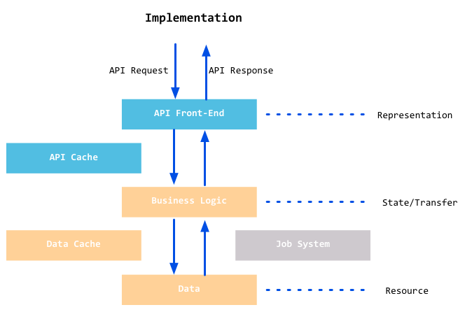
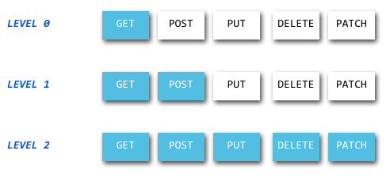

# Restful api 
by [@chimerakang](https://github.com/chimerakang)

---
## 簡介

RESTful，是目前最為流行的一種網際網路軟體架構。因為它結構清晰、符合標準、易於理解、擴充套件方便，所以正得到越來越多網站的採用。本小節我們將來學習它到底是一種什麼樣的架構？以及在 Go 裡面如何來實現它。

## 什麼是 REST
REST(REpresentational State Transfer)這個概念，首次出現是在 2000 年 Roy Thomas Fielding（他是 HTTP 規範的主要編寫者之一）的博士論文中，它指的是一組架構約束條件和原則。滿足這些約束條件和原則的應用程式或設計就是 RESTful 的。

要理解什麼是 REST，我們需要理解下面幾個概念:

* 資源（Resources） REST 是"表現層狀態轉化"，其實它省略了主語。"表現層"其實指的是"資源"的"表現層"。
那麼什麼是資源呢？就是我們平常上網存取的一張圖片、一個文件、一個視訊等。這些資源我們透過 URI 來定位，也就是一個 URI 表示一個資源。

* 表現層（Representation）
資源是做一個具體的實體資訊，他可以有多種的展現方式。而把實體展現出來就是表現層，例如一個 txt 文字資訊，他可以輸出成 html、json、xml 等格式，一個圖片他可以 jpg、png 等方式展現，這個就是表現層的意思。
URI 確定一個資源，但是如何確定它的具體表現形式呢？應該在 HTTP 請求的頭資訊中用 Accept 和 Content-Type 欄位指定，這兩個欄位才是對"表現層"的描述。

* 狀態轉化（State Transfer）
存取一個網站，就代表了客戶端和伺服器的一個互動過程。在這個過程中，肯定涉及到資料和狀態的變化。而 HTTP 協議是無狀態的，那麼這些狀態肯定儲存在伺服器端，所以如果客戶端想要通知伺服器端改變資料和狀態的變化，肯定要透過某種方式來通知它。
客戶端能通知伺服器端的手段，只能是 HTTP 協議。具體來說，就是 HTTP 協議裡面，四個表示操作方式的動詞：GET、POST、PUT、DELETE。它們分別對應四種基本操作：GET 用來取得資源，POST 用來建立資源（也可以用於更新資源），PUT 用來更新資源，DELETE 用來刪除資源。

綜合上面的解釋，我們總結一下什麼是 RESTful 架構：

1. 每一個 URI 代表一種資源；

2. 客戶端和伺服器之間，傳遞這種資源的某種表現層；

3. 客戶端透過四個 HTTP 動詞，對伺服器端資源進行操作，實現"表現層狀態轉化"。

Web 應用要滿足 REST 最重要的原則是 : 客戶端和伺服器之間的互動在請求之間是無狀態的，即從客戶端到伺服器的每個請求都必須包含理解請求所必需的資訊。如果伺服器在請求之間的任何時間點重啟，客戶端不會得到通知。此外此請求可以由任何可用伺服器回答，這十分適合雲端計算之類別的環境。因為是無狀態的，所以客戶端可以快取資料以改進效能。

另一個重要的 REST 原則是系統分層，這表示元件無法了解除了與它直接互動的層次以外的元件。透過將系統知識限制在單個層，可以限制整個系統的複雜性，從而促進了底層的獨立性。

下圖即是 REST 的架構圖：

當 REST 架構的約束條件作為一個整體應用時，將產生一個可以擴充套件到大量客戶端的應用程式。它還降低了客戶端和伺服器之間的互動延遲。統一介面簡化了整個系統架構，改進了子系統之間互動的可見性。REST 簡化了客戶端和伺服器的實現，而且對於使用 REST 開發的應用程式更加容易擴充套件。

下圖展示了 REST 的擴充套件性：

## RESTful 的實現
Go 沒有為 REST 提供直接支援，但是因為 RESTful 是基於 HTTP 協議實現的，所以我們可以利用net/http套件來自己實現，當然需要針對 REST 做一些改造，REST 是根據不同的 method 來處理相應的資源，目前已經存在的很多自稱是 REST 的應用，其實並沒有真正的實現 REST，我暫且把這些應用根據實現的 method 分成幾個級別，請看下圖：

---
## Next : [RESTful API (todolist)](./restful-2.md)

