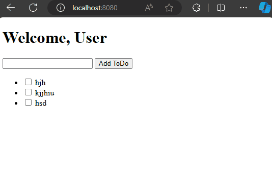
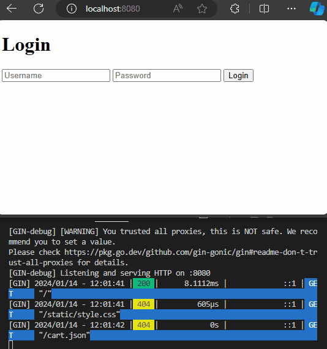
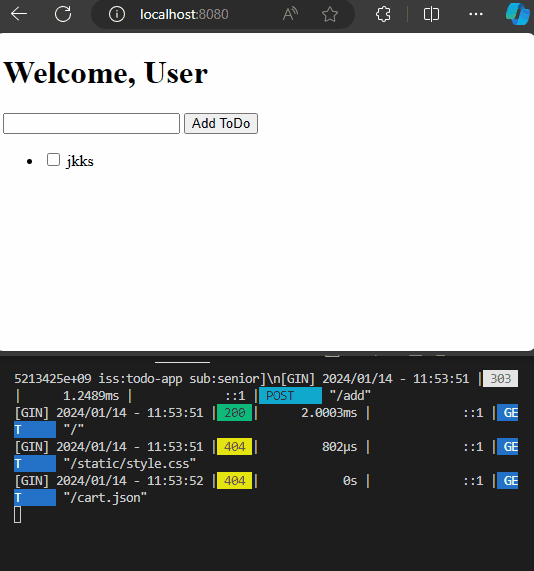
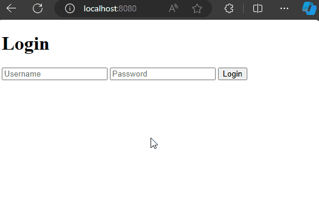

# Todolist with Gin
by [@chimerakang](https://github.com/chimerakang)

---
## 簡介
我們接下來要將之前的todolist做延伸擴充，之前已經使用`RESTful API`開發相對應的程式碼，只是用我們自己開發的`goo`框架，其實`goo`大部分的結構是參照另外一個框架:`Gin`所做的精簡版，同時為了盡可能地簡潔明了這個框架中的許多部分實現的功能都很簡單，但是盡可能地體現一個框架核心的設計原則。例如`Router`的設計，雖然支援的動態路由規則有限，但為了效能考慮匹配演算法是用`Trie tree`實現的，`Router`最重要的指標之一便是效能。

## 重新製作todolist
接下來要加入幾個新功能讓todo可以更加安全:

* 改用`Gin`重新開發
* 加入身分認證
* 增加`router`的作用

## 身分認證
身分認證問題一直會是一個很大的挑戰，但是我們的目標是讓事情變得簡單，並專注於提供一種簡單的方法來幫助您了解在應用程式中如何處理身分認證的問題，因此我們會使用 `JWT` 身份驗證方法。

### 甚麼是JWT
[JWT 或 JSON Web Token](https://jwt.io/)是緊湊且獨立的資料結構，用於在各方之間安全地傳輸資訊。 JWT 指定令牌類型(*token*)，包含相關實體的聲明，並透過加密簽章確保完整性。

### JWT的結構
JWT 由三個部分組成：標頭、負載和簽名。

1. Header 標頭
標頭通常由兩部分組成：令牌的類型（JWT）和所使用的簽章演算法（例如 HMAC SHA256 或 RSA）。
例如：
    ```go
    {
        "alg": "HS256",
        "typ": "JWT"
    }
    ```

2. Payload 有效載荷
有效負載包含聲明*claims*。聲明(*claims*)是關於實體（通常是使用者）和附加資料的聲明。聲明(*claims*)分為三種類型：註冊(*registered*)、公共(*public*)和私人(*private*)。註冊的聲明包括標準字段，例如發行者 ( iss)、主題 ( sub)、受眾 ( aud)、到期時間 ( exp) 和發行時間 ( iat)。
例如：
    ```go
    {
        "sub": "1234567890",
        "name": "John Doe",
        "iat": 1516239022
    }
    ```
3. Signature 簽名
簽章是透過組合編碼標頭、編碼有效負載、秘密和指定的簽章演算法來創建的。它確保了*token*的完整性和真實性。
範例（使用 HMAC SHA256）：
    ```go
    HMACSHA256(
        base64UrlEncode(header) + "." +
        base64UrlEncode(payload),
        secret)
    ```
現在，我們準備使用 `JWT` 來增強應用程式的安全性。

---
## 擴充todolist
為了示範 JWT 身份驗證，我們將使用基於角色的存取控制 ([RBAC](https://www.upguard.com/blog/rbac))來擴充之前建立的待辦事項清單應用程式。我們將引入兩種不同的角色：`senior`和`employee`。這些角色將作為在我們的應用程式中管理使用者存取和權限的基礎。

* senior：snior擁有更高的權限，可以執行將待辦事項新增至清單等操作。
* employee：employee的存取權限受到更多限制，無法新增新的待辦事項。
角色通常在使用者身份驗證期間分配並嵌入到 JWT 聲明中。

現在，讓我們深入了解有趣的部分 - 使用強大的`Gin` 框架重新開發我們的 ToDo 應用程式。本節將引導您完成這些步驟

### 專案結構
在`main.go`，首先導入必要的套件並定義我們的Todo結構：
```go
package main

import (
	"net/http"
	"strconv"
	"github.com/gin-gonic/gin"
)

type Todo struct {
	Text string
	Done bool
}

var todos []Todo
var loggedInUser string
```
在這裡，我們設定了基本的 ToDo 結構，並創建了一個全域變數來儲存 ToDo 專案 ( todos) 和目前登入的使用者 ( loggedInUser)。

### 初始化Gin router 並定義主路由
現在，初始化我們的 Gin 路由器，設定靜態檔案服務，並定義渲染 ToDo 清單的主路由：

[todo source code](../demos/restful/todo1/main.go)
```go
// Add routes for the ToDo App
func main() {
	router := gin.Default()

	router.Static("/static", "./static")
	router.LoadHTMLGlob("templates/*")

	router.GET("/", func(c *gin.Context) {
		c.HTML(http.StatusOK, "index.html", gin.H{
			"Todos":    todos,
			"LoggedIn": loggedInUser != "",
			"Username": loggedInUser,
		})
	})

	router.POST("/add", func(c *gin.Context) {
		text := c.PostForm("todo")
		todo := Todo{Text: text, Done: false}
		todos = append(todos, todo)
		c.Redirect(http.StatusSeeOther, "/")
	})

	router.POST("/toggle", func(c *gin.Context) {
		index := c.PostForm("index")
		toggleIndex(index)
		c.Redirect(http.StatusSeeOther, "/")
	})

	router.Run(":9999")
}

func toggleIndex(index string) {
	i, _ := strconv.Atoi(index)
	if i >= 0 && i < len(todos) {
		todos[i].Done = !todos[i].Done
	}
}
```
在這裡，我們建立一個 Gin 路由器，將其配置為提供靜態檔案並載入 HTML 模板。主路由 ( /) 呈現`index.html`模板，傳遞 ToDo 項目、登入狀態和使用者名稱。此外，我們還處理新待辦事項的新增並切換其完成狀態。

### 建立 HTML 模板
[index.html](../demos/restful/todo1/templates/index.html)在資料夾中建立檔案templates：
```
<!DOCTYPE html>
<html lang="en">
<head>
    <meta charset="UTF-8">
    <meta name="viewport" content="width=device-width, initial-scale=1.0">
    <link rel="stylesheet" href="/static/style.css">
    <title>ToDo List</title>
</head>
<body>
    <h1>Welcome, User</h1>

    <!-- Form for adding new ToDo items -->
    <form action="/add" method="post">
        <input type="text" name="todo" required>
        <button type="submit">Add ToDo</button>
    </form>

    <!-- ToDo list -->
    <ul>
        {{ range $index, $todo := .Todos }}
            <li>
                <form action="/toggle" method="post" style="display:inline;">
                    <input type="hidden" name="index" value="{{ $index }}">
                    <input type="checkbox" {{ if $todo.Done }}checked{{ end }} onchange="this.form.submit()">
                </form>
                {{ if $todo.Done }}
                    <del>{{ $todo.Text }}</del>
                {{ else }}
                    {{ $todo.Text }}
                {{ end }}
            </li>
        {{ end }}
    </ul>

</body>
</html>
```

此 HTML 範本包括用於新增待辦事項項目的表單和用於顯示現有項目的清單。此範本使用 Go 模板語法來循環切片Todos並動態渲染每個項目。

現在就這樣了！您已經設定了基本結構並新增了顯示和新增待辦事項項目的功能。運行該應用程序，您應該能夠在 處看到正在運行的待辦事項清單`http://localhost:8080`。


### golang-jwt 入門
要將 JWT 身份驗證新增到我們的 ToDo 應用程式中，我們將使用Golang-jwt 程式庫。該`golang-jwt`套件簡化了 Go 應用程式中 JWT 的實現，提供了一套方便的功能，抽象化了與令牌創建、驗證和管理相關的複雜性。

要將` Golang-jwt `合併到我們的 Go 專案中，我們可以使用以下命令輕鬆安裝它：
```
go get -u github.com/golang-jwt/jwt/v5
```
此命令取得必要的依賴項，並使` Golang-jwt `可以輕鬆整合到我們的 ToDo 應用程式中。現在我們準備好深入研究 JWT 令牌(*token*)的創建以及添加代表用戶資訊和角色的聲明。

### 建立 JWT 令牌(*token*)並新增聲明(*claims*)
現在，讓我們透過新增 JWT 身份驗證來增強我們的 ToDo 應用程式。在本節中，我們將重點放在建立 JWT 令牌並新增聲明來表示使用者資訊和角色。

#### 設定密鑰
要開始建立 JWT 令牌(*token*)，我們首先匯入所需的套件並設定密鑰。金鑰對於簽署和驗證 JWT 都至關重要。這是程式碼:
```go
// Import the required packages
import (
	"fmt"
	"time"
	"net/http"
	"strconv"
	"github.com/gin-gonic/gin"
	"github.com/golang-jwt/jwt/v5"
)
// Add a new global variable for the secret key
var secretKey = []byte("your-secret-key")

// Function to create JWT tokens with claims
func createToken(username string) (string, error) {
	// ... (Code for creating JWT tokens and adding claims will go here)
}
```
在這一部分中，我們導入 JWT 和 Gin 所需的套件。我們還創建一個全域變量`secretKey`，它代表用於令牌簽名和驗證的[秘密加密金鑰](https://www.cloudflare.com/zh-tw/learning/ssl/what-is-a-cryptographic-key/)。

#### 建立帶有聲明的 token 
現在，讓我們繼續處理負責建立 *JWT token* 和新增*claim*的程式碼：
```go
// Function to create JWT tokens with claims
func createToken(username string) (string, error) {
    // Create a new JWT token with claims
    claims := jwt.NewWithClaims(jwt.SigningMethodHS256, jwt.MapClaims{
        "sub": username,                    // Subject (user identifier)
        "iss": "todo-app",                  // Issuer
        "aud": getRole(username),           // Audience (user role)
        "exp": time.Now().Add(time.Hour).Unix(), // Expiration time
        "iat": time.Now().Unix(),                 // Issued at
    })

    // Print information about the created token
    fmt.Printf("Token claims added: %+v\n", claims)
    return tokenString, nil
}
```
在這裡，我們定義了該`createToken`函數。它採用 `ausername`作為輸入，並產生帶有特定聲明的 JWT token，例如主題 ( sub)、發行者 ( iss)、受眾 ( aud)、過期時間 ( exp) 和發佈時間 ( iat)。

現在，讓我們新增`getRole`函數，該函數有助於根據使用者名稱確定使用者的角色：
```go
func getRole(username string) string {
    if username == "senior" {
        return "senior"
    }
    return "employee"
}
```
這個簡單的函數檢查使用者名稱是否為`senior`並傳回角色`senior`，否則預設為`employee`。它將在`createToken`函數中用於設定 JWT 的受眾聲明。

透過這三個部分，您已經為在應用程式中建立帶有聲明的 JWT 令牌奠定了基礎。此 createToken函數可用於產生具有特定使用者資訊的令牌。

建立令牌後，下一步是在身份驗證過程中出現令牌時對它們進行簽署。

### 簽署 JWT token
為了確保token的完整性和真實性，我們需要使用我們的金鑰對其進行簽署。簽名過程由包內部處理jwt。這是程式碼：
```go
// Sign the previously created token
func createToken(username string) (string, error) {
    // ... (previous code)

    tokenString, err := claims.SignedString(secretKey)
    if err != nil {
        return "", err
    }

    // ... (previous code)
}
```
在這一部分中，我們添加了在新增聲明後使用我們的金鑰對 JWT 令牌進行簽署的程式碼。然後返回簽名的令牌。

#### 更新登入路由以包含令牌創建
現在，讓我們修改文件`/login`中的路由`main.go`以包括令牌建立和發送：
```go
// Create route for user authentication
router.POST("/login", func(c *gin.Context) {
    username := c.PostForm("username")
    password := c.PostForm("password")

    // Dummy credential check
    if (username == "employee" && password == "password") || (username == "senior" && password == "password") {
        tokenString, err := createToken(username)
        if err != nil {
            c.String(http.StatusInternalServerError, "Error creating token")
            return
        }

        loggedInUser = username
        fmt.Printf("Token created: %s\n", tokenString)
        c.SetCookie("token", tokenString, 3600, "/", "localhost", false, true)
        c.Redirect(http.StatusSeeOther, "/")
    } else {
        c.String(http.StatusUnauthorized, "Invalid credentials")
    }
})
```
在這裡，我們更新了`/login`路徑以包含該`createToken`功能。驗證使用者名稱和密碼（在本例中使用虛擬憑證）後，如果成功，我們將建立 JWT 令牌並將其設定為回應中的 `cookie`。

#### 更新登入表單的 HTML 模板
最後，更新文件中的登入表單index.html以包含使用者名稱和密碼欄位：
```
{{ if not .LoggedIn }}
<h1>Login</h1>
<!-- Login form -->
<form action="/login" method="post">
    <input type="text" name="username" placeholder="Username" required>
    <input type="password" name="password" placeholder="Password" required>
    <button type="submit">Login</button>
</form>
{{ else }}
<!-- ... (previous code) -->
{{ end }}
```

此修改包括用於在登入表單中輸入使用者名稱和密碼的欄位。該資訊將被傳送到伺服器進行身份驗證。


### 驗證 JWT token
在本節中，我們將實作一個中間件函數來驗證傳入的 JWT token。此驗證步驟在處理需要身份驗證的請求之前確保token的完整性和真實性。

#### 新增用於驗證token的中間件
首先，我們建立一個用於驗證` JWT token` 的中間件函數：
```go
// Function to verify JWT tokens
func authenticateMiddleware(c *gin.Context) {
    // Retrieve the token from the cookie
    tokenString, err := c.Cookie("token")
    if err != nil {
        fmt.Println("Token missing in cookie")
        c.Redirect(http.StatusSeeOther, "/login")
        c.Abort()
        return
    }

    // Verify the token
    token, err := verifyToken(tokenString)
    if err != nil {
        fmt.Printf("Token verification failed: %v\\n", err)
        c.Redirect(http.StatusSeeOther, "/login")
        c.Abort()
        return
    }

    // Print information about the verified token
    fmt.Printf("Token verified successfully. Claims: %+v\\n", token.Claims)

    // Continue with the next middleware or route handler
    c.Next()
}
```
此處，`authenticateMiddleware`函數從 cookie 中檢索 JWT token，嘗試使用該`verifyToken`函數對其進行驗證，如果token遺失或驗證失敗，則重定向到登入頁面。

如果令牌成功驗證，則會列印有關令牌聲明的信息，並且中間件允許請求繼續到下一個處理程序。

#### 將中間件新增至受保護的路由
接下來，讓我們將 套用於`authenticateMiddleware`需要驗證的路由，例如新增和切換 ToDo 項目：
```go
// Apply middleware to routes that require authentication
router.POST("/add", authenticateMiddleware, func(c *gin.Context) {
	// ... (previous code)
})

router.POST("/toggle", authenticateMiddleware, func(c *gin.Context) {
	// ... (previous code)
})
```
透過將中間件套用至這些路由，我們確保僅在成功驗證傳入令牌的情況下才會處理新增或切換待辦事項項目的請求。

#### 驗證 token
現在，讓我們定義`verifyToken`實作驗證token的函數：
```go
// Function to verify JWT tokens
func verifyToken(tokenString string) (*jwt.Token, error) {
    // Parse the token with the secret key
    token, err := jwt.Parse(tokenString, func(token *jwt.Token) (interface{}, error) {
        return secretKey, nil
    })

    // Check for verification errors
    if err != nil {
        return nil, err
    }

    // Check if the token is valid
    if !token.Valid {
        return nil, fmt.Errorf("invalid token")
    }

    // Return the verified token
    return token, nil
}
```
函數使用`jwt.Parse`解析 `JWT token` ，並使用我們的金鑰進行驗證。它檢查驗證錯誤和`token`有效性。如果`token`有效，則傳回經過驗證的`token`。



透過這些修改，您已成功實現驗證`token`中間件並將其應用於 ToDo 應用程式中需要身份驗證的路由。現在，您可以新增基於角色的權限來增強應用程式的安全性和功能。

### 基於角色的權限
在本節中，我們將向 ToDo 應用程式引入基於角色的存取控制` (RBAC) `，從而根據指派的角色增強使用者互動。我們的 ToDo 應用程式現在將有兩個不同的角色：`senior`和`employee`。

`senior`將享受更高的特權，包括能夠將新的待辦事項添加到清單中。另一方面，`employee`的存取權限將受到更多限制，並且無法新增新的待辦事項項目。

這種實作確保了客製化的使用者體驗，並為每個角色分配了特定的權限，使我們的應用程式更加通用和安全。

更新[main.go](../demos/restful/todo2/main.go)檔案以包含基於角色的權限的必要變更：
```go
router.GET("/", func(c *gin.Context) {
    c.HTML(http.StatusOK, "index.html", gin.H{
        "Todos":    todos,
        "LoggedIn": loggedInUser != "",
        "Username": loggedInUser,
        "Role":     getRole(loggedInUser),
    })
})

router.GET("/logout", func(c *gin.Context) {
	loggedInUser = ""
	c.SetCookie("token", "", -1, "/", "localhost", false, true)
	c.Redirect(http.StatusSeeOther, "/")
})
```
在上面的程式碼中，我們更新了主路由 ( / ) 以將使用者的角色包含在 HTML 模板資料中。此外，我們還新增了一個用於登出的新路由 ( /logout )，該路由會清除已登入的使用者並重定向到主頁。

更新[index.html](../demos/restful/todo2/templates/index.html)檔案以根據使用者的角色有條件地顯示用於新增待辦事項項目的表單：
```
{{ if .LoggedIn }}
<h1>Welcome, {{ .Username }}</h1>
<a href="/logout">Logout</a>

{{ if eq .Role "senior" }}
<!-- Form for seniors to add new ToDo items -->
<form action="/add" method="post">
    <input type="text" name="todo" required>
    <button type="submit">Add ToDo</button>
</form>
{{ else }}
<p>Employees can't add todos.</p>
{{ end }}

<!-- ToDo list -->
<ul>
        {{ range $index, $todo := .Todos }}
            <li>
                <form action="/toggle" method="post" style="display:inline;">
                    <input type="hidden" name="index" value="{{ $index }}">
                    <input type="checkbox" {{ if $todo.Done }}checked{{ end }} onchange="this.form.submit()">
                </form>
                {{ if $todo.Done }}
                    <del>{{ $todo.Text }}</del>
                {{ else }}
                    {{ $todo.Text }}
                {{ end }}
            </li>
        {{ end }}
    </ul>

{{ end }}
```
現在，只有senior會看到該表單，而employ將只會看到一條訊息，表明他們無法添加待辦事項。使用者的角色是從 Golang 程式碼提供的資料中檢索的。


透過這些更新，ToDo 應用程式強制執行基於角色的權限，僅允許senior添加新的 ToDo 項目。

---
## 最後
我們已經在 Golang ToDo 應用程式中成功實作了 JWT 身份驗證。我們介紹了 JWT、基於角色的授權、令牌創建、簽署和驗證的基礎知識。

了解這些概念對於建立具有用戶身份驗證的安全且可擴展的應用程式至關重要。

---
## Next: [Swagger](./restful-3.md)