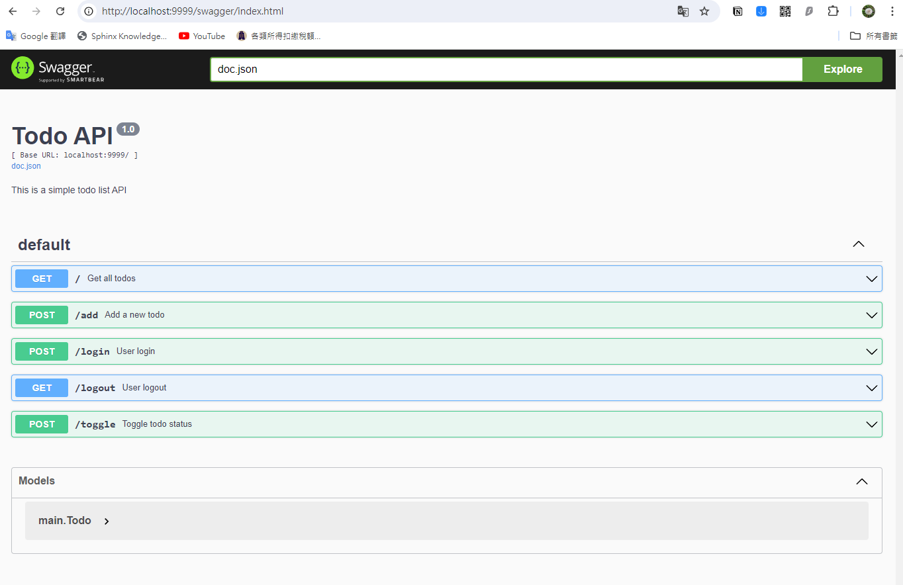

# Swagger 自動生成API文檔
by [@chimerakang](https://github.com/chimerakang)

---
## 簡介
當開發RESTful API時，有效的文檔是極其重要的，它可以幫助開發者快速理解和使用API。Swagger是一個強大的工具，用於自動生成和維護API文檔。

## 為什麼選擇Swagger？
* 標準化: Swagger遵循OpenAPI規範，這是一個業界標準。
* 交互性: Swagger UI允許用戶直接從文檔中測試API，無需其他工具。

## 如何整合Gin和Swagger？
安裝必要的套件
首先，我們需要安裝swag CLI工具和Gin的Swagger中間件。
```
go install github.com/swaggo/swag/cmd/swag@latest
go get -u github.com/swaggo/gin-swagger
go get -u github.com/swaggo/files
```

## 使用Swag初始化
在你的主程式路徑執行以下命令：
```
swag init
```
這將生成docs目錄，其中包含Swagger的文檔資料。

## 將Swagger UI加入Gin
接下來,我們需要修改程式碼以包含`Swaggo`注釋和設置。

## Swagger 註解

### API Info

|註解|	描述|
| -- | -----|
|title|	必須簡單API專案的標題或主要的業務功能|
|version| 必須目前這專案/API的版本|
|description|	簡單描述|
|tersOfService|	服務條款|
|contact.name|	作者名稱|
|contact.url|	作者blog|
|contact.email|	作者email|
|license.name|	必須許可證名稱|
|license.url|	許可證網址|
|host|	服務名稱或者是ip|
|BasePath|	基本URL路徑, (/api/v1, /v2…)|
|schemes|	提供的協定, (http, https)|

### API 功能註解
|註解|	描述|
|--|---|
|summary|	描述該API|
|tags|	歸屬同一類的API的tag|
|accept|	request的context-type|
|produce|	response的context-type|
|param|	參數按照 參數名 參數類型 參數的資料類型 是否必須 註解 (中間都要空一格)|
|header|	response header return code 參數類型 資料類型 註解|
|router|	path httpMethod|


## 最後這裡是修改後的代碼:
[source code](../demos/restful/todo3/main.go)
```go
package main

// Import the required packages
import (
	"fmt"
	"net/http"
	"strconv"
	"time"

	"github.com/gin-gonic/gin"
	"github.com/golang-jwt/jwt/v5"

	_ "gin-to-do/docs"

	swaggerFiles "github.com/swaggo/files"
	ginSwagger "github.com/swaggo/gin-swagger"
)

var secretKey = []byte("your-secret-key")

type Todo struct {
	Text string
	Done bool
}

var todos []Todo
var loggedInUser string

// @title Todo API
// @version 1.0
// @description This is a simple todo list API
// @host localhost:9999
// @BasePath /
func main() {
	router := gin.Default()

	router.Static("/static", "./static")
	router.LoadHTMLGlob("templates/*")

	router.GET("/", getTodos)
	router.POST("/add", authenticateMiddleware, addTodo)
	router.POST("/toggle", authenticateMiddleware, toggleTodo)
	router.GET("/logout", logout)
	router.POST("/login", login)

	// Swagger documentation route
	router.GET("/swagger/*any", ginSwagger.WrapHandler(swaggerFiles.Handler))

	router.Run(":9999")
}

// @Summary Get all todos
// @Description Get a list of all todos
// @Produce json
// @Success 200 {array} Todo
// @Router / [get]
func getTodos(c *gin.Context) {
	c.HTML(http.StatusOK, "index.html", gin.H{
		"Todos":    todos,
		"LoggedIn": loggedInUser != "",
		"Username": loggedInUser,
		"Role":     getRole(loggedInUser),
	})
}

// @Summary Add a new todo
// @Description Add a new todo to the list
// @Accept x-www-form-urlencoded
// @Produce html
// @Param todo formData string true "Todo text"
// @Success 303 {string} string "See Other"
// @Failure 400 {object} object{error=string} "Bad Request"
// @Router /add [post]
func addTodo(c *gin.Context) {
	text := c.PostForm("todo")
	if text == "" {
		c.JSON(http.StatusBadRequest, gin.H{"error": "Todo text cannot be empty"})
		return
	}
	todo := Todo{Text: text, Done: false}
	todos = append(todos, todo)
	c.Redirect(http.StatusSeeOther, "/")
}

// @Summary Toggle todo status
// @Description Toggle the done status of a todo
// @Accept json
// @Produce json
// @Param index formData string true "Index of the todo"
// @Success 303 {string} string "See Other"
// @Router /toggle [post]
func toggleTodo(c *gin.Context) {
	index := c.PostForm("index")
	toggleIndex(index)
	c.Redirect(http.StatusSeeOther, "/")
}

func toggleIndex(index string) {
	i, _ := strconv.Atoi(index)
	if i >= 0 && i < len(todos) {
		todos[i].Done = !todos[i].Done
	}
}

// @Summary User logout
// @Description Logout the current user
// @Produce json
// @Success 303 {string} string "See Other"
// @Router /logout [get]
func logout(c *gin.Context) {
	loggedInUser = ""
	c.SetCookie("token", "", -1, "/", "localhost", false, true)
	c.Redirect(http.StatusSeeOther, "/")
}

// @Summary User login
// @Description Authenticate a user and set a JWT token
// @Accept json
// @Produce json
// @Param username formData string true "Username"
// @Param password formData string true "Password"
// @Success 303 {string} string "See Other"
// @Failure 401 {string} string "Unauthorized"
// @Router /login [post]
func login(c *gin.Context) {
	username := c.PostForm("username")
	password := c.PostForm("password")
	fmt.Printf("username:%s, password:%s\n", username, password)

	if (username == "employee" && password == "password") ||
		(username == "senior" && password == "password") {
		tokenString, err := createToken(username)
		if err != nil {
			c.JSON(http.StatusInternalServerError, gin.H{"error": "Error creating token"})
			return
		}

		loggedInUser = username

		// Set cookie
		c.SetCookie("token", tokenString, 3600, "/", "localhost", false, true)
		fmt.Printf("Token created: %s\n", tokenString)
		c.Redirect(http.StatusSeeOther, "/")
	} else {
		c.JSON(http.StatusUnauthorized, gin.H{"error": "Invalid credentials"})
	}
}

// Function to create JWT tokens with claims
func createToken(username string) (string, error) {
	// Create a new JWT token with claims
	claims := jwt.NewWithClaims(jwt.SigningMethodHS256, jwt.MapClaims{
		"sub": username,                         // Subject (user identifier)
		"iss": "todo-app",                       // Issuer
		"aud": getRole(username),                // Audience (user role)
		"exp": time.Now().Add(time.Hour).Unix(), // Expiration time
		"iat": time.Now().Unix(),                // Issued at
	})

	tokenString, err := claims.SignedString(secretKey)
	if err != nil {
		return "", err
	}

	// Print information about the created token
	fmt.Printf("Token claims added: %+v\n", claims)
	return tokenString, nil
}

func getRole(username string) string {
	if username == "senior" {
		return "senior"
	}
	return "employee"
}

// Function to verify JWT tokens
func authenticateMiddleware(c *gin.Context) {
	// Retrieve the token from the cookie
	tokenString, err := c.Cookie("token")
	if err != nil {
		fmt.Println("Token missing in cookie")
		c.Redirect(http.StatusSeeOther, "/login")
		c.Abort()
		return
	}

	// Verify the token
	token, err := verifyToken(tokenString)
	if err != nil {
		fmt.Printf("Token verification failed: %v\\n", err)
		c.Redirect(http.StatusSeeOther, "/login")
		c.Abort()
		return
	}

	// Print information about the verified token
	fmt.Printf("Token verified successfully. Claims: %+v\\n", token.Claims)

	// Continue with the next middleware or route handler
	c.Next()
}

// Function to verify JWT tokens
func verifyToken(tokenString string) (*jwt.Token, error) {
	// Parse the token with the secret key
	token, err := jwt.Parse(tokenString, func(token *jwt.Token) (interface{}, error) {
		return secretKey, nil
	})

	// Check for verification errors
	if err != nil {
		return nil, err
	}

	// Check if the token is valid
	if !token.Valid {
		return nil, fmt.Errorf("invalid token")
	}

	// Return the verified token
	return token, nil
}

```

執行程式後，可以連線到 `/swagger/index.html`就可以看到輸出的結果如下:
