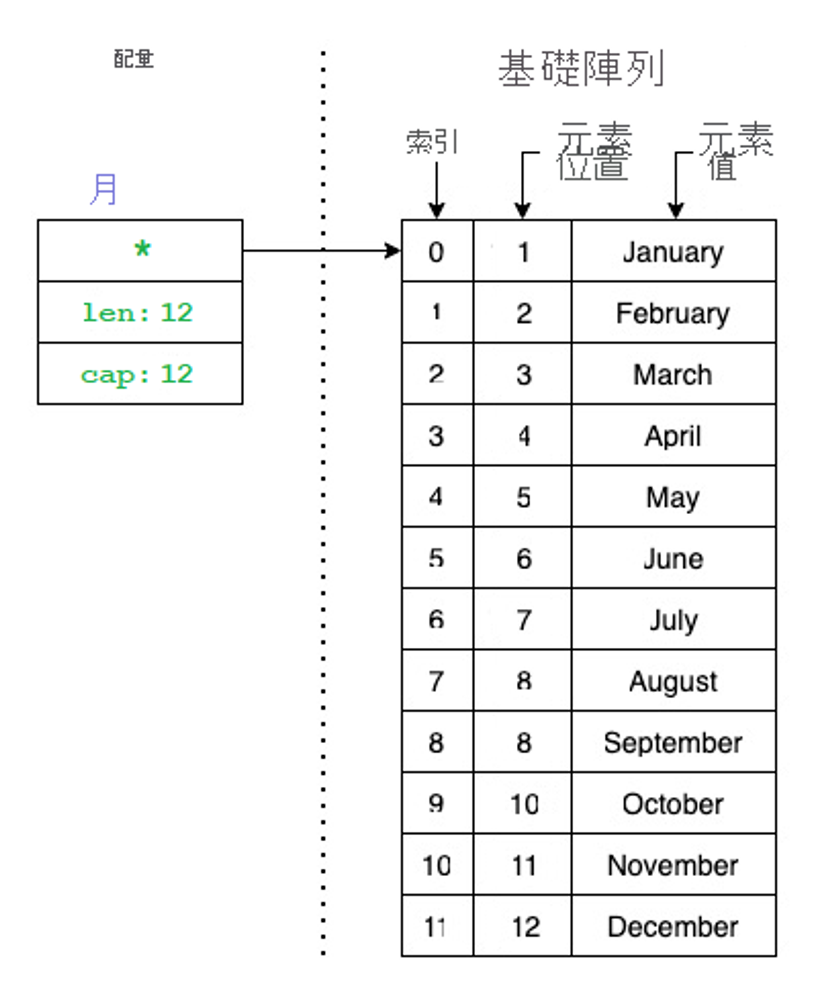
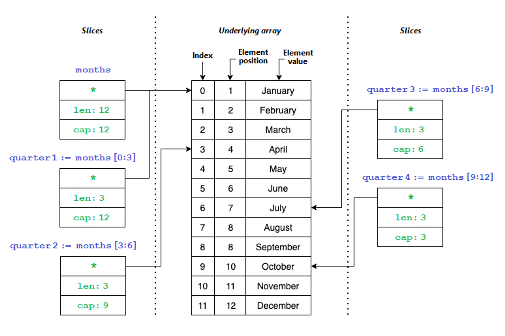

# Slice 切片
by [@chimerakang](https://github.com/chimerakang)


---

## 介紹

我們已在上一節中探索 array，並了解 array 是 slice 和對應的基礎。 您馬上就會了解其原因。 就像array 一樣，slice 是 Go 的資料類型，其代表相同類型元素的序列。 但是，其與陣列之間更顯著的差異在於 slice 大小是動態的，而不是固定的

slice 是位於 array 或另一個 slice 之中的資料結構。 我們會以「基礎陣列」的名稱來稱呼原始的 array 或 slice。 使用 slice 時，您可以存取整個基礎陣列，或是只存取元素的子序列。

一個 slice 只有三個元件：

- **針對基礎陣列第一個可連線元素的指標**。 這個元素並不一定是陣列的第一個元素 `array[0]`。
- **Slice的長度(len)**。 slice的元素數目。
- **Slice的容量(cap)**。 slice開頭和基礎陣列結尾之間的元素數目。

下圖會說明配量：



請注意，slice 只是基礎陣列的子集。 讓我們看看如何在程式碼中呈現上圖。

## 針對配量進行宣告及初始化

若要宣告 slice，您會利用與宣告陣列相同的方式來進行。 例如，下列程式碼代表您在配量影像中看到的內容：

```go
package main

import "fmt"

func main() {
    months := []string{"January", "February", "March", "April", "May", "June", "July", "August", "September", "October", "November", "December"}
    fmt.Println(months)
    fmt.Println("Length:", len(months))
    fmt.Println("Capacity:", cap(months))
}
```

執行程式碼時，您會看到下列輸出：

```
[January February March April May June July August September October November December]
Length: 12
Capacity: 12

```

請注意，目前 slice 與 array 之間的差異並不大。 您可以用相同方式來宣告這兩者。 若要從 slice 取得資訊，您可以使用內建函式 `len()` 和 `cap()`。 我們將繼續使用這些函式，來確認 slice 可以有來自基礎陣列的元素子序列。

## Slice 運算

Go 支援 Slice 運算子 `s[i:p]`，其中：

- `s` 代表 array。
- `i` 代表針對要新增至新 slice 之基礎陣列 (或另一個 slice ) 中第一個元素的指標。 變數 `i` 會對應到陣列 `array[i]` 中位於索引位置 `i` 的元素。 請記住，此元素並不一定是基礎陣列的第一個元素 `array[0]`。
- `p` 代表建立新 slice 時要使用之基礎陣列中的元素數目，以及元素位置。 變數 `p` 會對應到基礎陣列中的最後一個元素，其可在新 slice 中使用。 基礎陣列中位於 `p` 的元素可在 `array[i+1]` 的位置上找到。 請注意，此元素不一定是基礎陣列的最後一個元素 `array[len(array)-1]`。

因此，slice 只能參考元素的子集。

讓我們假設您想要使用四個變數來個別代表一年的每一季，而且您有一個具有 12 個元素的配量 `months`。 下圖說明如何將slice `months` 分成四個新的 `quarter` 配量：



若要以程式碼表示您在上圖中看到的內容，您可以使用下列程式碼：

```go
package main

import "fmt"

func main() {
    months := []string{"January", "February", "March", "April", "May", "June", "July", "August", "September", "October", "November", "December"}
    quarter1 := months[0:3]
    quarter2 := months[3:6]
    quarter3 := months[6:9]
    quarter4 := months[9:12]
    fmt.Println(quarter1, len(quarter1), cap(quarter1))
    fmt.Println(quarter2, len(quarter2), cap(quarter2))
    fmt.Println(quarter3, len(quarter3), cap(quarter3))
    fmt.Println(quarter4, len(quarter4), cap(quarter4))
}
```

當您執行程式碼時，會取得下列輸出：

```
[January February March] 3 12
[April May June] 3 9
[July August September] 3 6
[October November December] 3 3

```

請注意，slice 的長度相同，但容量不同。 讓我們探索 `quarter2` 這個 slice。 當您宣告時，便表示您希望 slice 從位置編號三開始，而最後一個元素則位於位置編號六。 配量的長度為三個元素，但容量為九個，因為基礎陣列有更多可用的元素或位置，但 slice 看不到。 例如，若您嘗試列印類似 `fmt.Println(quarter2[3])` 的內容，您將會收到下列錯誤：`panic: runtime error: index out of range [3] with length 3`。

slice 的容量只會告訴您可以擴充 slice 的長度。 基於這個原因，您可以從 `quarter2` 建立擴充的slice，如下列範例所示：

```go
package main

import "fmt"

func main() {
    months := []string{"January", "February", "March", "April", "May", "June", "July", "August", "September", "October", "November", "December"}
    quarter2 := months[3:6]
    quarter2Extended := quarter2[:4]
    fmt.Println(quarter2, len(quarter2), cap(quarter2))
    fmt.Println(quarter2Extended, len(quarter2Extended), cap(quarter2Extended))
}
```

當您執行上述程式碼時，會得到如下的輸出：

```
[April May June] 3 9
[April May June July] 4 9

```

請注意，當您宣告 `quarter2Extended` 變數時，不需要指定初始位置 (`[:4]`)。 如果您那麼做，Go 會假設您想要 slice 的第一個位置。 您可以針對最後一個位置 (`[1:]`) 執行相同動作。 Go 假設您想要參考直到 slice 的最新位置 (`len()-1`) 為止的所有元素。

## 附加項目

我們已探索 slice 的運作方式，以及其與 array 的相似之處。 現在讓我們探索其與陣列有何差異。 第一個差異是 slice 的大小不是固定的，而是動態的。 建立 slice 之後，您可以在其中新增更多元素，而且 slice 將會擴充。 您很快就會看到基礎陣列會發生什麼事。

為了將元素新增至 slice，Go 提供了 `append(slice, element)` 內建函式。 您會將要修改的 slice 及要附加為值的元素傳遞給該函式。 然後，`append` 函式會傳回您存放在變數中的新 slice。 其可以是您正在變更之 slice 的相同變數。

讓我們看看附加程序在程式碼中的樣子：

```go
package main

import "fmt"

func main() {
    var numbers []int
    for i := 0; i < 10; i++ {
        numbers = append(numbers, i)
        fmt.Printf("%d\tcap=%d\t%v\n", i, cap(numbers), numbers)
    }
}
```

當您執行上述程式碼時，應會看到下列輸出：

```
0       cap=1   [0]
1       cap=2   [0 1]
2       cap=4   [0 1 2]
3       cap=4   [0 1 2 3]
4       cap=8   [0 1 2 3 4]
5       cap=8   [0 1 2 3 4 5]
6       cap=8   [0 1 2 3 4 5 6]
7       cap=8   [0 1 2 3 4 5 6 7]
8       cap=16  [0 1 2 3 4 5 6 7 8]
9       cap=16  [0 1 2 3 4 5 6 7 8 9]

```

這個輸出很有趣。 尤其是呼叫 `cap()` 函式所傳回的內容。 一切看起來都很正常，直到第三次反覆運算為止，其中容量變更為 4，而 slice 中只有三個元素。 在第五次反覆運算中，容量再次變化為 8，並在第九次變化為 16。

您是否注意到來自容量輸出的模式？ 「當 slice 沒有足夠容量可容納更多元素時，Go 會將其容量加倍」。 其會以新的容量建立新的基礎陣列。 您不需要執行任何動作，系統便會自動增加容量。 Go 會自動加以執行。但是必須特別小心。在某些情況下，slice 的容量可能會比其所需的還多，而您將會浪費記憶體。

## 移除項目

您可能正在思考要如何移除元素？ Go 並沒有內建函式可從 slice 中移除元素。 您可以使用我們先前涵蓋的 slice 運算子 `s[i:p]`，只使用您需要的元素來建立新 slice

例如，下列程式碼會從 slice 中移除元素：

```go
package main

import "fmt"

func main() {
    letters := []string{"A", "B", "C", "D", "E"}
    remove := 2

	if remove < len(letters) {

		fmt.Println("Before", letters, "Remove ", letters[remove])

		letters = append(letters[:remove], letters[remove+1:]...)

		fmt.Println("After", letters)
	}

}
```

當您執行上述程式碼時，會得到如下的輸出：

```
Before [A B C D E] Remove  C
After [A B D E]

```

此程式碼會從 slice 中移除元素。 其會使用 slice 中的下一個元素來取代要移除的元素，或者，如果您要移除的是最後一個元素，則其不會取代任何元素。

另一種方法是建立新的 slice 複本。 我們將在下一節了解如何建立 slice 的複本。

## 建立 Slice 的複本

Go 具有內建 `copy(dst, src []Type)` 函式，可用來建立 slice 的複本。 您會傳送目的地 slice 和來源 slice。 例如，您可以建立 slice 的複本，如下列範例所示：

```go
slice2 := make([]string, 3)
copy(slice2, letters[1:4])

```

您為什麼需要建立複本？ 當您變更 slice 中的元素時，也會變更基礎陣列。 參考相同基礎陣列的任何其他 slice 都會受到影響。 讓我們在程式碼中查看此程序，然後透過建立 slice 的複本來修正此問題。

使用下列程式碼來確認 slice 會指向某個陣列，而您在 slice 中所做的每個變更都會影響基礎陣列。

```go
package main

import "fmt"

func main() {
    letters := []string{"A", "B", "C", "D", "E"}
    fmt.Println("Before", letters)

    slice1 := letters[0:2]
    slice2 := letters[1:4]

    slice1[1] = "Z"

    fmt.Println("After", letters)
    fmt.Println("Slice2", slice2)
}
```

當您執行上述程式碼時，會看到下列輸出：

```
Before [A B C D E]
After [A Z C D E]
Slice2 [Z C D]

```

請注意我們對 `slice1` 所做的變更會如何影響 `letters` 陣列和 `slice2`。 您可以在輸出中看到字母 B 已由 Z 取代，而且其會影響指向 `letters` 陣列的每一個項目。

若要修正此問題，您必須建立 slice 複本，其會在幕後建立新的基礎陣列。 您可以使用以下程式碼：

```go
package main

import "fmt"

func main() {
    letters := []string{"A", "B", "C", "D", "E"}
    fmt.Println("Before", letters)

    slice1 := letters[0:2]

    slice2 := make([]string, 3)
    copy(slice2, letters[1:4])

    slice1[1] = "Z"

    fmt.Println("After", letters)
    fmt.Println("Slice2", slice2)
}
```

當您執行上述程式碼時，會看到下列輸出：

```
Before [A B C D E]
After [A Z C D E]
Slice2 [B C D]

```

請注意 `slice1` 中的變更會對基礎陣列造成影響，但不會影響新的 `slice2`。

---
## Next
[Map(映射)](./map.md)
