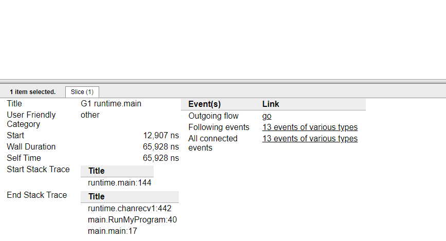
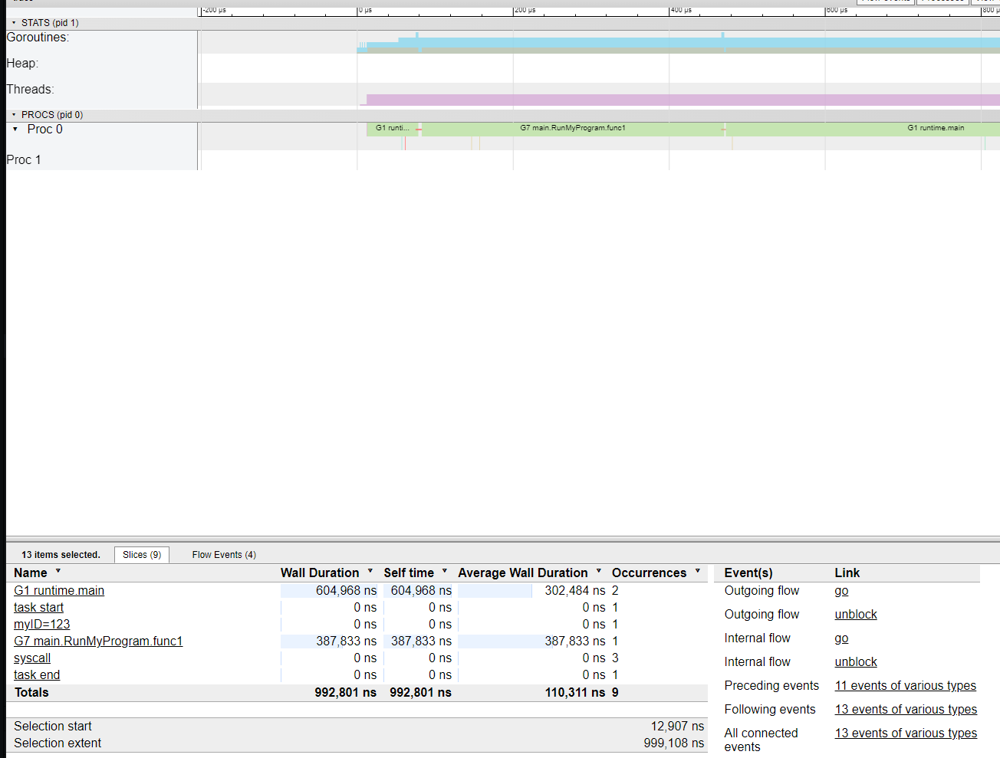
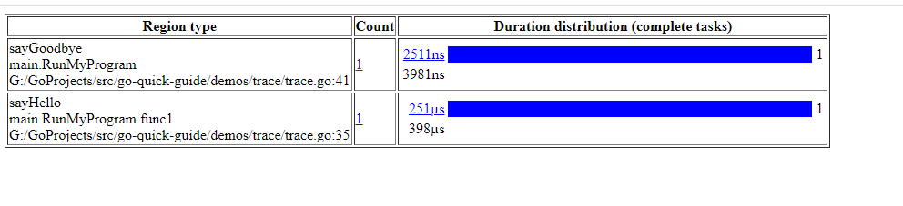
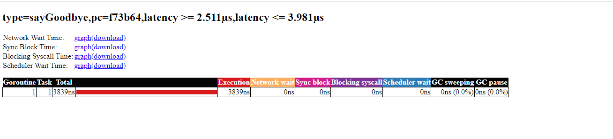
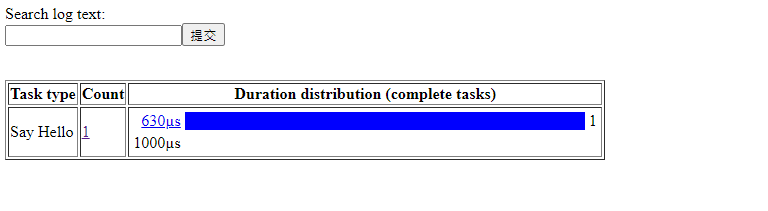
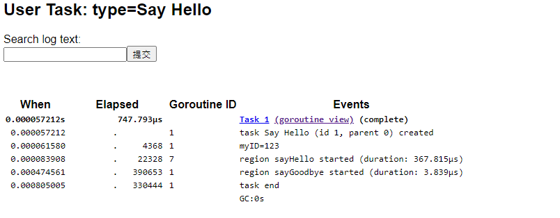

# User-defined runtime/trace
by [@chimerakang](https://github.com/chimerakang)

---

為go開發人員提供了一個強大的工具，以診斷延遲問題，並檢視我們建立的所有goroutine會發生什麼。
自golang版本1.11以來，執行時/跟蹤允許我們在程式上新增註釋，以記錄事件
使用者註釋有三種型別：`log`, `regions`, `tasks`

## Log 日誌訊息
```go 
func main() {
  f, _ := os.Create("trace.out")
  defer f.Close()
  trace.Start(f)
  defer trace.Stop()
  RunMyProgram()
}
func RunMyProgram() {
  ctx := context.Background()
  myID := "123"
  trace.Log(ctx, "myID", myID)
  fmt.Println("Hello Trace"0)
}
```

如果我們執行這個小程式，它將建立一個trace.out檔案，我們將能夠開啟：
```
go tool trace trace.out
```
一旦它打開了，如果你：
* 點選 “View Trace”
* 然後點選 main goroutine
* 在下面的選項中，單擊Link下“13 events of various types”


你就可以看到你的日誌。


---
## Task / Region 任務和區域
任務在 `context`（如開放跟蹤的跨度）上執行（在同一`context`中完成的所有區域和日誌都將與任務相關聯）
區域是一個程式區域（與其呼叫goroutine相關聯），其執行時間間隔被跟蹤。 當您宣告一個區域時，如果上下文攜帶任務，則該區域與該任務相關聯。
```
func RunMyProgram() {
  ctx := context.Background()
  myID := "123"
  
  ctx, task := trace.NewTask(ctx, "Say Hello")
  defer task.End()
  //Log Something on the Task
  trace.Log(ctx, "myID", myID)
  saidHello := make(chan bool)
  //Say Hello in a goroutine using WithRegion
  go func() {
    trace.WithRegion(ctx, "sayHello", sayHello)
    saidHello <- true
  }()
  //another way to create a region
  <-saidHello
  trace.StartRegion(ctx, "sayGoodbye").End()
  sayGoodBye()
}
func sayHello() { fmt.Println("Hello Trace") }
func sayGoodBye() { fmt.Println("goodbye") }
```
完成後，執行並開啟跟蹤。
```
go tool trace trace.out
```
如果您現在進入“User-defined regions”，您將看到您的區域資訊。



對於更復雜的程式，您可以獲得很多有用的資訊（不在我們的簡單程式中），但您可以看到以下資訊：



如果您返回並開啟“user-defined tasks”，您將看到您的任務



開啟它，您將看到您的日誌和附加到任務的區域。


---

有用的連結：
https://golang.org/doc/go1.11#trace
https://golang.org/pkg/runtime/trace