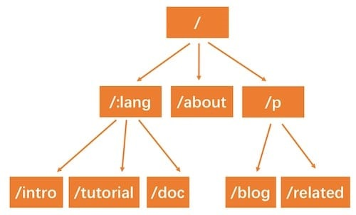

# 前綴樹路由 Router
by [@chimerakang](https://github.com/chimerakang)

---
## 摘要

* 使用Trie 樹實作動態路由(dynamic route)解析。
* 支援兩種模式:name和*filepath。

## Trie 樹簡介
之前，我們用了一個非常簡單的`map`結構儲存路由表，使用`map`儲存鍵`key/value`，索引非常高效，但是有一個弊端，`key/value`的儲存的方式，只能用來索引靜態路由。那如果我們想支援類似`/hello/:name`這樣的動態路由呢？所謂動態路由，即一條路由規則可以符合某一類型而非某一條固定的路由。例如`/hello/:name`，可以匹配`/hello/gootutu`、`hello/jack`等。

動態路由有很多種實作方式，支援的規則、效能等有很大的差異。例如開源的路由實作`gorouter`支援在路由規則中嵌入正規表示式，例如`/p/[0-9A-Za-z]+`，即路徑中的參數僅符合數字和字母；另一個開源實作`httprouter`就不支援正規表示式。著名的Web開源框架`gin`在早期的版本，並沒有實現自己的路由，而是直接使用了`httprouter`，後來不知道什麼原因，放棄了`httprouter`，自己實現了一個版本。


實作動態路由最常用的資料結構，稱為前綴樹(Trie樹)。看到名字你大概也能知道前綴樹長啥樣了：每個節點的所有的子節點都擁有相同的前綴。這種結構非常適用於路由匹配，例如我們定義瞭如下路由規則：

* /:lang/doc
* /:lang/tutorial
* /:lang/intro
* /about
* /p/blog
* /p/related

我們用前綴樹來表示，是這樣的。




HTTP請求的路徑恰好是由`/`分隔的多段構成的，因此，每一段可以作為前綴樹的一個節點。我們透過樹狀結構查詢，如果中間某一層的節點都不符合條件，那就表示沒有符合到的路由，查詢結束。

接下來我們實現的動態路由具備以下兩個功能。

* 參數匹配:。例如`/p/:lang/doc`，可以匹配`/p/c/doc和/p/go/doc`。
* 通用`*`。例如*/static/*filepath*，可以匹配*/static/fav.ico*，也可以匹配`/static/js/jQuery.js`，這種模式常用於靜態伺服器，能夠遞歸地匹配子路徑。

---
## Trie 樹實現
首先我們要設計樹節點上應該要儲存那些資訊。
```go
type node struct { 
	pattern   string  // 待匹配路由，例如/p/:lang
 	part      string  // 路由中的一部分，例如:lang
 	children []*node // 子節點，例如[doc, tutorial, intro]
 	isWild    bool  // 是否精確匹配，part 含有: 或* 時為true
 }
```
與普通的樹不同，為了實現動態路由匹配，加上了`isWild`這個參數。即當我們匹配`/p/go/doc/`這個路由時，第一層節點，`p`精準匹配到了`p`，第二層節點，`go`模糊匹配到`:lang`，那麼將會把`lang`這個參數賦值為`go`，繼續下一層匹配。我們將匹配的邏輯，包裝為一個輔助函數。

```go

// 第一個符合成功的節點，用於插入
func  (n *node)  matchChild (part string ) *node { 
    for _, child := range n.children { 
        if child.part == part || child.isWild { 
            return child 		
        } 	
    } 
    return nil 
} 

// 所有匹配成功的節點，用於查找
func (n *node) matchChildren (part string ) []*node { 	
    nodes := make ([]*node, 0 ) 
    for _, child := range n.children { 
        if child.part == part || child.isWild {
            nodes = append (nodes, child) 		
        } 	
    } 
    return nodes 
}		
```
對於路由來說，最重要的當然是註冊與匹配了。開發服務時，註冊路由規則，映射handler；訪問時，匹配路由規則，查找到對應的handler。因此，Trie 樹需要支援節點的插入與查詢。插入功能很簡單，遞歸查找每一層的節點，如果沒有匹配到當前`part`的節點，則新建一個，有一點需要注意，`/p/:lang/doc`只有在第三層節點，即`doc`節點，`pattern`才會設定為`/p/:lang/doc`。`p`和`:lang`節點的pattern屬性皆為空。因此，當配對結束時，我們可以使用`n.pattern == ""`來判斷路由規則是否匹配成功。例如，`/p/python`雖能成功匹配到`:lang`，但`:lang`的`pattern`值為空，因此匹配失敗。查詢功能，同樣也是遞歸查詢每一層的節點，退出規則是，匹配到了`*`，匹配失敗，或者匹配到了第`len(parts)`層節點。
```go
func (n *node) insert(pattern string, parts []string, height int) {
	if len(parts) == height {
		n.pattern = pattern
		return
	}

	part := parts[height]
	child := n.matchChild(part)
	if child == nil {
		child = &node{part: part, isWild: part[0] == ':' || part[0] == '*'}
		n.children = append(n.children, child)
	}
	child.insert(pattern, parts, height+1)
}

func (n *node) search(parts []string, height int) *node {
	if len(parts) == height || strings.HasPrefix(n.part, "*") {
		if n.pattern == "" {
			return nil
		}
		return n
	}

	part := parts[height]
	children := n.matchChildren(part)

	for _, child := range children {
		result := child.search(parts, height+1)
		if result != nil {
			return result
		}
	}

	return nil
}
```
---
## 路由器
Trie 樹的插入與查找都成功實現了，接下來我們將Trie 樹應用到路由中去吧。我們使用roots 來儲存每種請求方式的Trie 樹根節點。使用handlers 儲存每種請求方式的HandlerFunc 。 getRoute 函數中，也解析了`:`和`*`兩個匹配符的參數，並傳回一個map 。例如`/p/go/doc`符合到`/p/:lang/doc`，解析結果為：`{lang: "go"}`，`/static/css/gootutu.css`符合到`/static/*filepath`，解析結果為`{filepath: "css/gootutu.css"}`。
```go
type router struct {
	roots    map[string]*node
	handlers map[string]HandlerFunc
}

// roots key eg, roots['GET'] roots['POST']
// handlers key eg, handlers['GET-/p/:lang/doc'], handlers['POST-/p/book']
    
func newRouter() *router {
	return &router{
		roots:    make(map[string]*node),
		handlers: make(map[string]HandlerFunc),
	}
}

// Only one * is allowed
func parsePattern(pattern string) []string {
	vs := strings.Split(pattern, "/")

	parts := make([]string, 0)
	for _, item := range vs {
		if item != "" {
			parts = append(parts, item)
			if item[0] == '*' {
				break
			}
		}
	}
	return parts
}

func (r *router) addRoute(method string, pattern string, handler HandlerFunc) {
	parts := parsePattern(pattern)

	key := method + "-" + pattern
	_, ok := r.roots[method]
	if !ok {
		r.roots[method] = &node{}
	}
	r.roots[method].insert(pattern, parts, 0)
	r.handlers[key] = handler
}

func (r *router) getRoute(method string, path string) (*node, map[string]string) {
	searchParts := parsePattern(path)
	params := make(map[string]string)
	root, ok := r.roots[method]

	if !ok {
		return nil, nil
	}

	n := root.search(searchParts, 0)

	if n != nil {
		parts := parsePattern(n.pattern)
		for index, part := range parts {
			if part[0] == ':' {
				params[part[1:]] = searchParts[index]
			}
			if part[0] == '*' && len(part) > 1 {
				params[part[1:]] = strings.Join(searchParts[index:], "/")
				break
			}
		}
		return n, params
	}

	return nil, nil
}
```
---
## Context與handle的變化
在HandlerFunc 中，希望能夠存取解析的參數，因此，需要對Context 物件增加一個屬性和方法，來提供對路由參數的存取。我們將解析後的參數儲存到`Params`中，透過`c.Param("lang")`的方式取得對應的值。
### context.go
```go
type Context struct {
	// origin objects
	Writer http.ResponseWriter
	Req    *http.Request
	// request info
	Path   string
	Method string
	Params map[string]string
	// response info
	StatusCode int
}

func (c *Context) Param(key string) string {
	value, _ := c.Params[key]
	return value
}
```
### router.go
```go
func (r *router) handle(c *Context) {
	n, params := r.getRoute(c.Method, c.Path)
	if n != nil {
		c.Params = params
		key := c.Method + "-" + n.pattern
		r.handlers[key](c)
	} else {
		c.String(http.StatusNotFound, "404 NOT FOUND: %s\n", c.Path)
	}
}
```

`router.go`的變化比較小，比較重要的一點是，在呼叫匹配到的`handler`前，將解析出來的路由參數賦值給了`c.Params`。這樣就能夠在`handler`中，透過`Context`物件存取到具體的值了。


---
## 使用新框架
看看使用的範例。
```go
func main() {
	r := goo.New()
	r.GET("/", func(c *goo.Context) {
		c.HTML(http.StatusOK, "<h1>Hello Goo</h1>")
	})

	r.GET("/hello", func(c *goo.Context) {
		// expect /hello?name=gootutu
		c.String(http.StatusOK, "hello %s, you're at %s\n", c.Query("name"), c.Path)
	})

	r.GET("/hello/:name", func(c *goo.Context) {
		// expect /hello/gootutu
		c.String(http.StatusOK, "hello %s, you're at %s\n", c.Param("name"), c.Path)
	})

	r.GET("/assets/*filepath", func(c *goo.Context) {
		c.JSON(http.StatusOK, goo.H{"filepath": c.Param("filepath")})
	})

	r.Run(":9999")
}
```
使用curl工具，測試結果。
```
$ curl http://localhost:9999/hello/gootutu
hello gootutu, you're at /hello/gootutu

$ curl http://localhost:9999/assets/css/gootutu.css
{"filepath":"css/gootutu.css"}
```

---
## Next
[網頁-分組控制](./web-4.md)