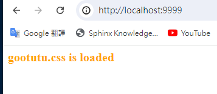

# 模板 HTML Template
by [@chimerakang](https://github.com/chimerakang)

---
## 摘要

* 實作靜態資源服務(Static Resource)。
* 支援HTML模板渲染。

---
## 服務端渲染
現在越來越流行前後端分離的開發模式，即Web 後端提供RESTful 接口，返回結構化的資料(通常為JSON 或XML)。前端使用AJAX 技術請求到所需的數據，並利用JavaScript 進行渲染。 Vue/React 等前端框架持續火熱，這種開發模式前後端解耦，優點非常突出。後端童鞋專心解決資源利用，並發，資料庫等問題，只需要考慮資料如何產生；前端童鞋專注於介面設計實現，只需要考慮拿到資料後如何渲染即可。使用JSP 寫過網站的童鞋，應該能感受到前後端耦合的痛苦。 JSP 的表現力肯定是遠不如Vue/React 等專業做前端渲染的框架的。而且前後端分離在目前還有另一個不可忽視的優勢。因為後端只關注數據，所以介面回傳值是結構化的，與前端解耦。同一套後端服務能夠同時支撐小程式、行動APP、PC端Web 頁面，以及對外提供的介面。隨著前端工程化的不斷發展，Webpack，gulp 等工具層出不窮，前端技術越來越自成系統了。

但前後分離的一大問題在於，頁面是在客戶端渲染的，例如瀏覽器，這對爬蟲來說並不友善。 Google 爬蟲已經能夠爬取渲染後的網頁，但短期內爬取服務端直接渲染的HTML 頁面仍是主流。

今天的內容便是介紹Web 框架如何支援服務端渲染的場景。

## 靜態檔案(Serve Static Files)
網頁的三劍客，JavaScript、CSS 和HTML。要做到服務端渲染，第一步就是要支援JS、CSS 等靜態檔案。還記得我們之前設計動態路由的時候，支援通用字元符號`*`來匹配多層子路徑。例如路由規則`/assets/*filepath`，可以符合`/assets/`開頭的所有的位址。例如`/assets/js/gooktutu.js`，匹配後，參數`filepath`就賦值為`js/gooktutu.js`。

那如果我麼將所有的靜態檔案放在`/usr/web`目錄下，那麼`filepath`的值就是該目錄下檔案的相對位址。映射到真實的文件後，將文件傳回，靜態伺服器就實現了。

找到文件後，如何返回這一步，`net/http`庫已經實現了。因此，goo 框架要做的，只是解析請求的位址，映射到伺服器上檔案的真實位址，交給`http.FileServer`處理就好了。

### 更新goo.go
```go
// create static handler
func (group *RouterGroup) createStaticHandler(relativePath string, fs http.FileSystem) HandlerFunc {
	absolutePath := path.Join(group.prefix, relativePath)
	fileServer := http.StripPrefix(absolutePath, http.FileServer(fs))
	return func(c *Context) {
		file := c.Param("filepath")
		// Check if file exists and/or if we have permission to access it
		if _, err := fs.Open(file); err != nil {
			c.Status(http.StatusNotFound)
			return
		}

		fileServer.ServeHTTP(c.Writer, c.Req)
	}
}

// serve static files
func (group *RouterGroup) Static(relativePath string, root string) {
	handler := group.createStaticHandler(relativePath, http.Dir(root))
	urlPattern := path.Join(relativePath, "/*filepath")
	// Register GET handlers
	group.GET(urlPattern, handler)
}
```
我們給`RouterGroup`增加了2個方法，`Static`這個方法是暴露給使用者的。使用者可以將磁碟上的某個資料夾root對應到路由`relativePath`。例如：
```go
r := goo.New() 
r.Static( "/assets" , "/usr/gooktutu/blog/static" ) 
// 或相對路徑 r.Static("/assets", "./static")
 r.運行（"：9999"）
 ```

用戶訪問`localhost:9999/assets/js/gooktutu.js`，最終返回`/usr/gooktutu/blog/static/js/gooktutu.js`。

## HTML 範本渲染
Go語言內建了`text/template`和`html/template2`個模板標準庫，其`中html/template`為HTML 提供了較完整的支援。包括普通變數渲染、列表渲染、物件渲染等。 goo 框架的模板渲染直接使用了`html/template`提供的能力。
```go
Engine struct {
	*RouterGroup
	router        *router
	groups        []*RouterGroup     // store all groups
	htmlTemplates *template.Template // for html render
	funcMap       template.FuncMap   // for html render
}

func (engine *Engine) SetFuncMap(funcMap template.FuncMap) {
	engine.funcMap = funcMap
}

func (engine *Engine) LoadHTMLGlob(pattern string) {
	engine.htmlTemplates = template.Must(template.New("").Funcs(engine.funcMap).ParseGlob(pattern))
}
```
首先為Engine 範例添加了`*template.Template`和`template.FuncMap`對象，前者將所有的模板加載進內存，後者是所有的自定義模板渲染函數。

另外，給使用者分別提供了設定自訂渲染函數`funcMap`和載入模板的方法。

接下來，對原來的`(*Context).HTML()`方法做了一些小修改，使之支援根據模板檔名選擇模板進行渲染。

### 修正context.go
```go
type Context struct {
    // ...
	// engine pointer
	engine *Engine
}

func (c *Context) HTML(code int, name string, data interface{}) {
	c.SetHeader("Content-Type", "text/html")
	c.Status(code)
	if err := c.engine.htmlTemplates.ExecuteTemplate(c.Writer, name, data); err != nil {
		c.Fail(500, err.Error())
	}
}
```

我們在`Context`中新增了成員變量`engine *Engine`，這樣就能夠透過Context 存取Engine 中的HTML 範本。實例化Context 時，還需要給`c.engine`賦值。

### 修正goo.go
```go
func (engine *Engine) ServeHTTP(w http.ResponseWriter, req *http.Request) {
	// ...
	c := newContext(w, req)
	c.handlers = middlewares
	c.engine = engine
	engine.router.handle(c)
}
```	

### 測試Demo
最終的目錄結構
```
---goo/ 
---static/ 
   |---css/ 
        |---gooktutu.css 
   |---file1.txt 
---templates/ 
   |---arr.tmpl 
   |---css.tmpl 
   | ---custom_func.tmpl 
---main.go
```

``` go
<!-- templates/css.tmpl -->
<html>
    <link rel="stylesheet" href="/assets/css/gootutu.css">
    <p>gootutu.css is loaded</p>
</html>
```      
    
### main.go
```go
type student struct {
	Name string
	Age  int8
}

func FormatAsDate(t time.Time) string {
	year, month, day := t.Date()
	return fmt.Sprintf("%d-%02d-%02d", year, month, day)
}

func main() {
	r := goo.New()
	r.Use(goo.Logger())
	r.SetFuncMap(template.FuncMap{
		"FormatAsDate": FormatAsDate,
	})
	r.LoadHTMLGlob("templates/*")
	r.Static("/assets", "./static")

	stu1 := &student{Name: "Gootutu", Age: 20}
	stu2 := &student{Name: "Jack", Age: 22}
	r.GET("/", func(c *goo.Context) {
		c.HTML(http.StatusOK, "css.tmpl", nil)
	})
	r.GET("/students", func(c *goo.Context) {
		c.HTML(http.StatusOK, "arr.tmpl", goo.H{
			"title":  "goo",
			"stuArr": [2]*student{stu1, stu2},
		})
	})

	r.GET("/date", func(c *goo.Context) {
		c.HTML(http.StatusOK, "custom_func.tmpl", goo.H{
			"title": "goo",
			"now":   time.Date(2019, 8, 17, 0, 0, 0, 0, time.UTC),
		})
	})

	r.Run(":9999")
}
```

打開browser，訪問主頁，模板正常渲染，CSS 靜態檔案載入成功。



---
## Next
[網頁-表單](./web-8.md)