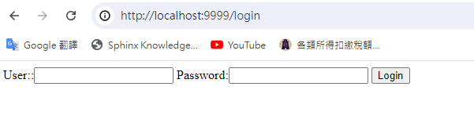

# 表單 Form
by [@chimerakang](https://github.com/chimerakang)

---

## 處理表單的輸入
先來看一個表單提交的例子，我們有如下的表單內容，命名成檔案 login.gtpl(放入當前建立專案的目錄裡面)
```
Copy
<html>
<head>
<title></title>
</head>
<body>
<form action="/login" method="post">
    Username:<input type="text" name="username">
    Password:<input type="password" name="password">
    <input type="submit" value="Login">
</form>
</body>
</html>
```
上面提交表單到伺服器的`/login`，當用戶輸入資訊點選登入之後，會跳轉到伺服器的路由 login 裡面，我們首先要判斷這個是什麼方式傳遞過來，POST 還是 GET 呢？

http 套件裡面有一個很簡單的方式就可以取得，我們在前面 web 的例子的基礎上來看看怎麼處理 login 頁面的 form 資料

```go
package main

import (
	"fmt"
	"goo"
	"html/template"
	"net/http"
	"time"
)

type student struct {
	Name string
	Age  int8
}

func FormatAsDate(t time.Time) string {
	year, month, day := t.Date()
	return fmt.Sprintf("%d-%02d-%02d", year, month, day)
}

func login(c *goo.Context) {
	fmt.Println("method:", c.Method) //取得請求的方法
	if c.Method == "GET" {
		c.HTML(http.StatusOK, "login.tmpl", nil)
	} else {
		//請求的是登入資料，那麼執行登入的邏輯判斷
		fmt.Println("username:", c.PostForm("username"))
		fmt.Println("password:", c.PostForm("password"))
	}
}

func main() {
	r := goo.New()
	r.Use(goo.Logger())
	r.SetFuncMap(template.FuncMap{
		"FormatAsDate": FormatAsDate,
	})
	r.LoadHTMLGlob("templates/*")
	r.Static("/assets", "./static")

	stu1 := &student{Name: "gootutu", Age: 20}
	stu2 := &student{Name: "Jack", Age: 22}
	r.GET("/", func(c *goo.Context) {
		c.HTML(http.StatusOK, "css.tmpl", nil)
	})
	r.GET("/students", func(c *goo.Context) {
		c.HTML(http.StatusOK, "arr.tmpl", goo.H{
			"title":  "goo",
			"stuArr": [2]*student{stu1, stu2},
		})
	})

	r.GET("/date", func(c *goo.Context) {
		c.HTML(http.StatusOK, "custom_func.tmpl", goo.H{
			"title": "goo",
			"now":   time.Date(2019, 8, 17, 0, 0, 0, 0, time.UTC),
		})
	})

	r.GET("/login", login)
	r.POST("/login", login)

	r.Run(":9999")
}

```

`login `函式中我們根據*c.Method*來判斷是顯示登入介面還是處理登入邏輯。當 GET 方式請求時顯示登入介面，其他方式請求時則處理登入邏輯，如查詢資料庫、驗證登入資訊等。

當我們在瀏覽器裡面開啟`http://localhost:9999/login`的時候，出現如下介面




如果你看到一個空頁面，可能是你寫的 `login.tmpl` 檔案中有錯誤，請根據控制檯中的日誌進行修復。


接著開始測試，直接在網頁上輸入資料。伺服器端的輸出如下：

```
$ go run web10.go
2024/08/12 17:36:27 Route  GET - /assets/*filepath
2024/08/12 17:36:27 Route  GET - /
2024/08/12 17:36:27 Route  GET - /students
2024/08/12 17:36:27 Route  GET - /date
2024/08/12 17:36:27 Route  GET - /login
2024/08/12 17:36:27 Route POST - /login
method: POST
username: test
password: 123456
2024/08/12 17:36:42 [0] /login in 999.5µs
```

`request.Form`是一個 `url.Values` 型別，裡面儲存的是對應的類似` key=value `的資訊，下面展示了可以對 form 資料進行的一些操作:

```go
v := url.Values{}
v.Set("name", "Ava")
v.Add("friend", "Jess")
v.Add("friend", "Sarah")
v.Add("friend", "Zoe")
// v.Encode() == "name=Ava&friend=Jess&friend=Sarah&friend=Zoe"
fmt.Println(v.Get("name"))
fmt.Println(v.Get("friend"))
fmt.Println(v["friend"])
```

---

## 驗證表單的輸入
開發 Web 的一個原則就是，不能信任使用者輸入的任何資訊，所以驗證和過濾使用者的輸入資訊就變得非常重要，我們經常會在微博、新聞中聽到某某網站被入侵了，存在什麼漏洞，這些大多是因為網站對於使用者輸入的資訊沒有做嚴格的驗證引起的，所以為了編寫出安全可靠的 Web 程式，驗證表單輸入的意義重大。

我們平常編寫 Web 應用主要有兩方面的資料驗證，一個是在頁面端的 js 驗證(目前在這方面有很多的外掛函式庫，比如 ValidationJS 外掛)，一個是在伺服器端的驗證，我們這小節講解的是如何在伺服器端驗證。

### 必填欄位
你想要確保從一個表單元素中得到一個值，例如前面小節裡面的使用者名稱，我們如何處理呢？Go 有一個內建函式 len 可以取得字串的長度，這樣我們就可以透過 len 來取得資料的長度，例如：

```go
if len(c.PostForm("username")==0{
    //為空的處理
}
```

對不同型別的表單元素的留空有不同的處理，對於空文字框、空文字區域以及檔案上傳，元素的值為空值，而如果是未選中的複選框和單選按鈕，則根本不會在標單中產生相應條目，如果我們用上面例子中的方式去取得資料時程式就會報錯。所以我們需要透過`c.PostForm`來取得值，因為如果欄位不存在，透過該方式取得的是空值。

### 數字
你想要確保一個表單輸入框中取得的只能是數字，例如，你想透過表單取得某個人的具體年齡是 50 歲還是 10 歲，而不是像“一把年紀了”或“年輕著呢”這種描述

如果我們是判斷正整數，那麼我們先轉化成 int 型別，然後進行處理
```
getint,err:=strconv.Atoi(c.PostForm("age"))
if err!=nil{
    //數字轉化出錯了，那麼可能就不是數字
}

//接下來就可以判斷這個數字的大小範圍了
if getint > 100 {
    // too old
}
```
還有一種方式就是正則匹配的方式

```go
if m, _ := regexp.MatchString("^[0-9]+$", c.PostForm("age")); !m {
    return false
}
```
對於效能要求很高的使用者來說，這是一個老生常談的問題了，他們認為應該儘量避免使用正則表示式，因為使用正則表示式的速度會比較慢。但是在目前機器效能那麼強勁的情況下，對於這種簡單的正則表示式效率和型別轉換函式是沒有什麼差別的。如果你對正則表示式很熟悉，而且你在其它語言中也在使用它，那麼在 Go 裡面使用正則表示式將是一個便利的方式。

    Go 實現的正則是RE2，所有的字元都是 UTF-8 編碼的。

### 中文
有時候我們想透過表單元素取得一個使用者的中文名字，但是又為了保證取得的是正確的中文，我們需要進行驗證，而不是使用者隨便的一些輸入。對於中文我們目前有兩種方式來驗證，可以使用 `unicode` 套件提供的 `func Is(rangeTab *RangeTable, r rune) bool `來驗證，也可以使用正則方式來驗證，這裡使用最簡單的正則方式，如下程式碼所示

```go
if m, _ := regexp.MatchString("^\\p{Han}+$", c.PostForm("realname")); !m {
    return false
}
```
### 英文
我們期望透過表單元素取得一個英文值，例如我們想知道一個使用者的英文名，應該是 astaxie，而不是 asta 謝。

我們可以很簡單的透過正則驗證資料：

```go
if m, _ := regexp.MatchString("^[a-zA-Z]+$", c.PostForm("engname")); !m {
    return false
}
```

### 電子郵件地址
你想知道使用者輸入的一個 Email 地址是否正確，透過如下這個方式可以驗證：

```go
if m, _ := regexp.MatchString(`^([\w\.\_]{2,10})@(\w{1,}).([a-z]{2,4})$`, c.PostForm("email")); !m {
    fmt.Println("no")
}else{
    fmt.Println("yes")
}
```

### 手機號碼
你想要判斷使用者輸入的手機號碼是否正確，透過正則也可以驗證：

```go
if m, _ := regexp.MatchString(`^(1[3|4|5|8][0-9]\d{4,8})$`, c.PostForm("mobile")); !m {
    return false
}
```

### 下拉選單
如果我們想要判斷表單裡面 `<select>` 元素產生的下拉選單中是否有被選中的專案。有些時候黑客可能會偽造這個下拉選單不存在的值傳送給你，那麼如何判斷這個值是否是我們預設的值呢？

我們的 select 可能是這樣的一些元素

```go
<select name="fruit">
<option value="apple">apple</option>
<option value="pear">pear</option>
<option value="banana">banana</option>
</select>
```
那麼我們可以這樣來驗證

```go
slice:=[]string{"apple","pear","banana"}

v := c.PostForm("fruit")
for _, item := range slice {
    if item == v {
        return true
    }
}

return false
```

### 單選按鈕
如果我們想要判斷 radio 按鈕是否有一個被選中了，我們頁面的輸出可能就是一個男、女性別的選擇，但是也可能一個 15 歲大的無聊小孩，一手拿著 http 協議的書，另一隻手透過 telnet 客戶端向你的程式在傳送請求呢，你設定的性別男值是 1，女是 2，他給你傳送一個 3，你的程式會出現異常嗎？因此我們也需要像下拉選單的判斷方式類似，判斷我們取得的值是我們預設的值，而不是額外的值。

```go
<input type="radio" name="gender" value="1">男
<input type="radio" name="gender" value="2">女
```
那我們也可以類似下拉選單的做法一樣
```go

slice:=[]string{"1","2"}

for _, v := range slice {
    if v == c.PostForm("gender") {
        return true
    }
}
return false
```

### 複選框
有一項選擇興趣的複選框，你想確定使用者選中的和你提供給使用者選擇的是同一個型別的資料。

```go
<input type="checkbox" name="interest" value="football">足球
<input type="checkbox" name="interest" value="basketball">籃球
<input type="checkbox" name="interest" value="tennis">網球
```
對於複選框我們的驗證和單選有點不一樣，因為接收到的資料是一個 slice

```go
slice:=[]string{"football","basketball","tennis"}
a:=Slice_diff(r.Form["interest"],slice)
if a == nil{
    return true
}

return false
```
上面這個函式 Slice_diff 套件含在我開源的一個函式庫裡面(操作 slice 和 map 的函式庫)，https://github.com/astaxie/beeku

### 日期和時間
你想確定使用者填寫的日期或時間是否有效。例如 ，使用者在日程表中安排 8 月份的第 45 天開會，或者提供未來的某個時間作為生日。

Go 裡面提供了一個 time 的處理套件，我們可以把使用者的輸入年月日轉化成相應的時間，然後進行邏輯判斷

```go
t := time.Date(2009, time.November, 10, 23, 0, 0, 0, time.UTC)
fmt.Printf("Go launched at %s\n", t.Local())
```
取得 time 之後我們就可以進行很多時間函式的操作。具體的判斷就根據自己的需求調整。

### 身份證號碼
如果我們想驗證表單輸入的是否是身份證，透過正則也可以方便的驗證，但是身份證有 15 位和 18 位，我們兩個都需要驗證

```go
//驗證 15 位身份證，15 位的是全部數字
if m, _ := regexp.MatchString(`^(\d{15})$`, c.PostForm("usercard")); !m {
    return false
}

//驗證 18 位身份證，18 位前 17 位為數字，最後一位是校驗位，可能為數字或字元 X。
if m, _ := regexp.MatchString(`^(\d{17})([0-9]|X)$`, c.PostForm("usercard")); !m {
    return false
}
```
上面列出了我們一些常用的伺服器端的表單元素驗證，希望透過這個引匯入門，能夠讓你對 Go 的資料驗證有所了解，特別是 Go 裡面的正則處理。

---
## Next
[網頁-練習todo](./web-9.md)